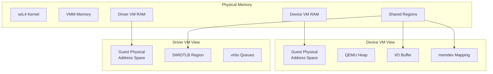
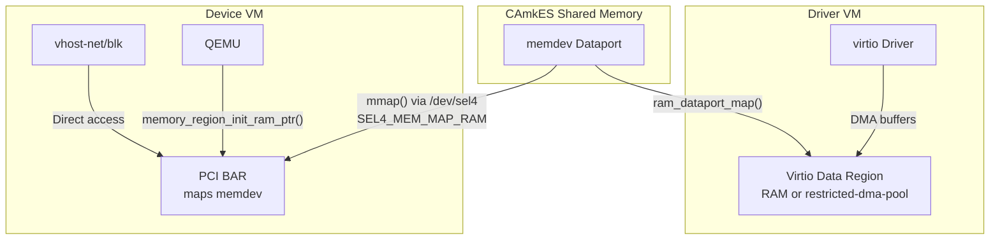
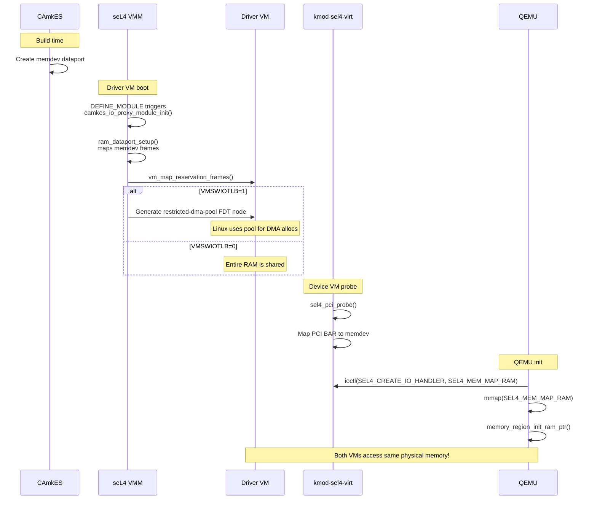
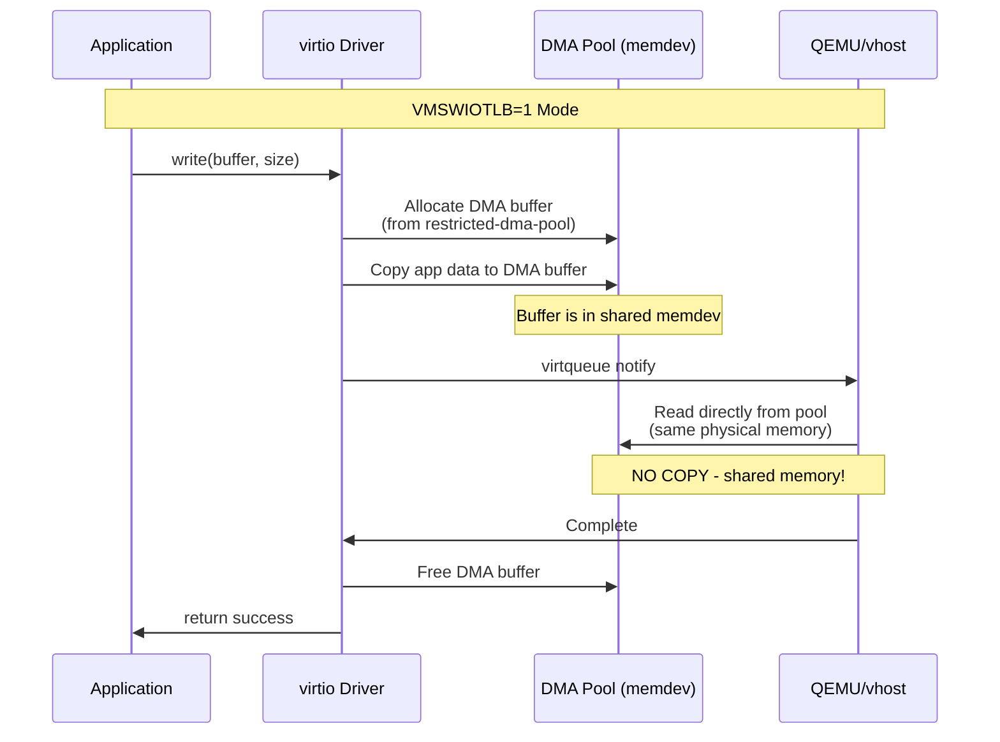

# Memory Model

This document describes the memory architecture for the TII seL4 virtio virtualization platform, including shared memory regions, SWIOTLB, and large page support.

## Overview

The memory model enables secure communication between VMs while maintaining isolation:



## Shared Memory Regions

### CAmkES Dataports

Communication between VMs uses CAmkES dataports—shared memory regions with explicit permissions:

| Dataport | Size | Purpose |
|----------|------|---------|
| `iobuf` | 4KB × 2 | RPC message queues |
| `memdev` | Variable | SWIOTLB / device data |

### iobuf Dataport

The `iobuf` dataport contains RPC queues for control messages:

```
┌─────────────────────────────────────────────┐
│                 iobuf (8KB)                  │
├─────────────────────────────────────────────┤
│  Page 0 (4KB): driver_rpc_req queue         │
│    - Request messages from VMM to QEMU      │
├─────────────────────────────────────────────┤
│  Page 1 (4KB): driver_rpc_resp queue        │
│    - Response messages from QEMU to VMM     │
│    - device_event queue (async events)      │
└─────────────────────────────────────────────┘
```

### memdev Dataport

The `memdev` dataport provides shared data memory:

```
┌─────────────────────────────────────────────┐
│              memdev (Variable)               │
├─────────────────────────────────────────────┤
│  SWIOTLB bounce buffer region               │
│    - DMA data for virtio operations         │
│    - Mapped to both device and driver VMs   │
│    - Size configured at build time          │
└─────────────────────────────────────────────┘
```

## Zero-Copy Architecture

### Overview

The TII platform achieves **zero-copy** data transfer between driver and device VMs in **both** configuration modes. This is possible because the virtio data region is always a CAmkES shared memory dataport accessible by both VMs.

### How Zero-Copy Works



The key insight: **The memdev dataport is shared physical memory accessible by both VMs - data written by one VM is immediately visible to the other without copying.**

### Configuration Modes

Both modes are zero-copy for VM-to-VM data transfer. The `VMSWIOTLB` flag controls how much memory is shared:

#### Mode 1: Full RAM Sharing (VMSWIOTLB=0)

```c
// In devices.camkes
#define VM0_VM1_VIRTIO_DATA_BASE    VM1_RAM_BASE   // 0x48000000
#define VM0_VM1_VIRTIO_DATA_SIZE    VM1_RAM_SIZE   // 128MB
```

- memdev dataport covers the **entire driver VM RAM**
- No `restricted-dma-pool` FDT node generated (see `fdt_node_generate_swiotlb()`)
- Any buffer in driver VM RAM is directly accessible by device VM
- Maximum performance, lower isolation

**Comment from vm.h**:
```c
/* guest RAM is mapped from virtio buffer dataport, hence we do not
 * allocate untyped_mmios for it, nor do we increase simple_untyped24_pool. */
```

#### Mode 2: Dedicated DMA Pool (VMSWIOTLB=1)

```c
// In devices.camkes
#define VM0_VM1_VIRTIO_DATA_BASE    VM1_RAM_BASE + VM1_RAM_SIZE
#define VM0_VM1_VIRTIO_DATA_SIZE    0x800000    // 8 MB
```

- memdev dataport is a separate 8MB region after driver VM RAM
- `restricted-dma-pool` FDT node IS generated
- Linux allocates DMA buffers **from this shared pool**
- Buffers are in shared region from allocation - **still zero-copy!**
- Stronger isolation (only DMA region shared, not all RAM)

### Why Both Modes Are Zero-Copy

The `restricted-dma-pool` mechanism in Linux (used in VMSWIOTLB=1) ensures DMA buffers are allocated **from** the shared region:

```dts
// Generated FDT node
swiotlb@50000000 {
    compatible = "restricted-dma-pool";
    reg = <0x0 0x50000000 0x0 0x800000>;
};
```

When a virtio driver requests a DMA buffer:
1. Linux allocates from the `restricted-dma-pool` region
2. This region IS the memdev dataport (shared with device VM)
3. Data written to the buffer is immediately visible to device VM
4. **No copy between VMs** - same physical memory

### FDT Generation Logic

From `src/fdt.c:286-295`:
```c
int fdt_node_generate_swiotlb(fdt_node_t *node, void *fdt)
{
    fdt_dataport_t *dataport = container_of(node, fdt_dataport_t, node);

    // Skip FDT node if entire RAM is shared (VMSWIOTLB=0)
    if (dataport->gpa == guest_ram_base && dataport->size == guest_ram_size) {
        return 0;
    }

    // Generate restricted-dma-pool node (VMSWIOTLB=1)
    return fdt_node_generate_dataport(node, fdt);
}
```

### Data Flow Comparison

**Traditional SWIOTLB (external device, with copying):**
```
App Buffer → Copy → SWIOTLB Bounce → Device DMA → Copy → Device Buffer
```

**TII Architecture (both modes - zero-copy between VMs):**
```
VMSWIOTLB=0: App Buffer (in RAM) ══════════════════╗
                                                   ║ Same physical
VMSWIOTLB=1: App Buffer → DMA Pool (in memdev) ════╣ memory (memdev)
                                                   ║
Device VM: vhost/QEMU reads directly ══════════════╝
```

### Memory Mapping Sequence



### vhost Zero-Copy Path

With vhost acceleration, zero-copy applies to the entire data path:

```
┌────────────────────────────────────────────────────────────────────┐
│ Driver VM                                                          │
│  ┌──────────────────────────────────────────────────────────────┐ │
│  │ DMA Buffer (in memdev region - shared memory)                │ │
│  └──────────────────────────────────────────────────────────────┘ │
│                              │                                      │
│                              │ virtio driver writes data            │
│                              ▼                                      │
└────────────────────────────────────────────────────────────────────┘
                               │
                               │ (Same physical memory - NO COPY)
                               │
┌────────────────────────────────────────────────────────────────────┐
│ Device VM Kernel (vhost-net/vhost-blk)                             │
│  ┌──────────────────────────────────────────────────────────────┐ │
│  │ PCI BAR mmap @ same physical address                         │ │
│  │ vhost reads data directly - ZERO COPY                        │ │
│  └──────────────────────────────────────────────────────────────┘ │
└────────────────────────────────────────────────────────────────────┘
```

### Trade-offs and Security Implications

| Aspect | VMSWIOTLB=0 (Full RAM) | VMSWIOTLB=1 (DMA Pool) |
|--------|------------------------|------------------------|
| Zero-copy | ✓ Yes | ✓ Yes |
| vhost acceleration | ✓ Yes | ✓ Yes |
| ioeventfd/irqfd | ✓ Yes | ✓ Yes |
| Shared memory | Entire RAM (~128MB) | DMA pool only (~8MB) |
| Isolation | ✗ None | ✓ Strong |
| Performance | Slightly better (no pool alloc) | Excellent |
| Use case | Trusted workloads | Security-sensitive |

> **Note**: vhost acceleration (ioeventfd for doorbells, irqfd for MSI interrupts) works identically in both modes. The VMSWIOTLB flag only controls **what memory is shared**, not **how it's accessed**. You get full KVM-like vhost performance with strong isolation by using `VMSWIOTLB=1`.

### Memory Isolation (VMSWIOTLB=1)

A critical security benefit of `VMSWIOTLB=1` mode is **memory isolation**:

```
┌─────────────────────────────────────────────────────────────────┐
│ Driver VM Memory Layout (VMSWIOTLB=1)                           │
├─────────────────────────────────────────────────────────────────┤
│                                                                 │
│  ┌───────────────────────────────────────────────────────────┐ │
│  │ Driver VM RAM (0x48000000 - 0x50000000)                   │ │
│  │                                                           │ │
│  │  • Application code and data                              │ │
│  │  • Kernel memory                                          │ │
│  │  • User processes                                         │ │
│  │                                                           │ │
│  │  ██████████████████████████████████████████████████████   │ │
│  │  ▲ NOT visible to Device VM - ISOLATED                    │ │
│  └───────────────────────────────────────────────────────────┘ │
│                                                                 │
│  ┌───────────────────────────────────────────────────────────┐ │
│  │ DMA Pool / SWIOTLB (0x50000000 - 0x50800000)              │ │
│  │                                                           │ │
│  │  • Only DMA buffers allocated here                        │ │
│  │  • Shared with Device VM (memdev dataport)                │ │
│  │                                                           │ │
│  │  ░░░░░░░░░░░░░░░░░░░░░░░░░░░░░░░░░░░░░░░░░░░░░░░░░░░░░░   │ │
│  │  ▲ Visible to Device VM - SHARED (zero-copy)              │ │
│  └───────────────────────────────────────────────────────────┘ │
│                                                                 │
└─────────────────────────────────────────────────────────────────┘
```

**Security properties of VMSWIOTLB=1:**

1. **Device VM cannot access driver VM's private memory** - only the DMA pool is shared
2. **Full Device VM compromise is contained** - even if the entire Device VM guest operating system is compromised (kernel at EL1, not just userspace), it cannot read driver VM's kernel memory, application data, or credentials
3. **Minimal attack surface** - only explicitly shared DMA buffers cross the VM boundary
4. **Defense in depth** - combines seL4's capability-based isolation with memory compartmentalization
5. **Hardware-enforced by seL4** - the isolation is enforced at the hypervisor level via capabilities, not by software in Device VM

> **Strong Isolation Guarantee**: The memory isolation is enforced by seL4's capability system and CAmkES dataport configuration. Device VM's kernel simply does not have physical mappings to driver VM's private RAM. This is not a software policy that can be bypassed—it's a hardware-enforced boundary via stage-2 page tables controlled by seL4.

**Contrast with VMSWIOTLB=0:**

In full RAM sharing mode, device VM (including its kernel) can read **any** memory in driver VM, including:
- Kernel data structures
- Application heap and stack
- Cryptographic keys
- User credentials

This mode should only be used when device VM is fully trusted.

### Source Files

| File | Role |
|------|------|
| `configurations/tii/vm.h:85-97` | VMSWIOTLB configuration macros |
| `templates/seL4VirtIODriverVM.template.c:53-63` | FDT swiotlb node definition |
| `templates/seL4VirtIODriverVM.template.c:85-101` | `ram_dataport_setup()` |
| `src/fdt.c:286-295` | `fdt_node_generate_swiotlb()` |
| `src/ram_dataport.c` | Maps dataport frames to guest |
| `sources/kmod-sel4-virt/pci/sel4_pci.c:219` | Device VM RAM mapping |
| `sources/qemu-sel4-virtio/accel/sel4/sel4-all.c:522` | QEMU RAM setup |

---

## SWIOTLB Details

### Linux restricted-dma-pool

When `VMSWIOTLB=1`, Linux's `restricted-dma-pool` mechanism ensures DMA buffers come from the shared region:

1. FDT declares a `restricted-dma-pool` memory region
2. virtio devices reference this pool via `memory-region` property
3. Linux's DMA subsystem allocates buffers from this pool
4. All DMA buffers are automatically in the shared memdev dataport

### Memory Flow



> **Note**: The only copy is from application buffer to DMA buffer within the driver VM. The VM-to-VM transfer is zero-copy because both VMs share the memdev dataport.

### Configuration

SWIOTLB size is configured in the guest kernel:

```bash
# Kernel command line
swiotlb=65536  # 256MB (65536 × 4KB pages)
```

CAmkES configuration:
```camkes
vm1.vm_virtio_drivers = [{
    id: 0,
    data_base: "0x50000000",  // SWIOTLB base in guest
    data_size: "0x10000000",  // 256MB
    ...
}];
```

## Large Page Support

### 2MB Large Pages

TII modifications enable 2MB large page mappings for improved performance:

| Page Size | TLB Entries | Coverage |
|-----------|-------------|----------|
| 4KB | 512 | 2MB |
| 2MB | 512 | 1GB |

### Implementation

Large pages are enabled via CAmkES configuration:

```camkes
configuration {
    vm1.guest_large_pages = true;
    vm1.large_page_region_start = 0x48000000;
    vm1.large_page_region_end = 0x50000000;
}
```

Key files:
- `projects/sel4_projects_libs/libsel4vm/src/guest_ram.c` - Large page detection
- `projects/sel4_projects_libs/libsel4vmmplatsupport/src/drivers/cross_vm_connection.c` - Dataport large pages

### Benefits

1. **Reduced TLB pressure**: Fewer TLB misses for large memory regions
2. **Improved DMA performance**: Contiguous physical pages for DMA
3. **Lower overhead**: Fewer page table entries to manage

## Guest RAM Mapping

### RAM Reservation API

The VMM provides APIs for managing guest RAM:

```c
// Reserve RAM region for later mapping
int vm_ram_reserve(vm_t *vm, uintptr_t base, size_t size);

// Reserve at specific guest physical address
int vm_ram_reserve_at(vm_t *vm, uintptr_t gpa, size_t size);

// Touch (map) RAM region
int vm_ram_touch(vm_t *vm, uintptr_t addr, size_t size,
                 vm_ram_touch_callback_fn callback, void *cookie);
```

### Memory Layout Example

Typical driver VM memory layout:

```
Guest Physical Address Space (Driver VM)
┌──────────────────────────────────────────┐ 0x00000000
│  Reserved (DTB, initrd)                  │
├──────────────────────────────────────────┤ 0x40000000
│  Guest RAM                               │
│  (Linux kernel, userspace)               │
├──────────────────────────────────────────┤ 0x48000000
│  Large Page Region                       │
│  (2MB pages for performance)             │
├──────────────────────────────────────────┤ 0x50000000
│  SWIOTLB Bounce Buffer                   │
│  (shared with device VM)                 │
├──────────────────────────────────────────┤ 0x60000000
│  PCI MMIO Window                         │
│  (virtio device BARs)                    │
├──────────────────────────────────────────┤ 0x70000000
│  PCI ECAM Config Space                   │
└──────────────────────────────────────────┘
```

## PCI Memory Windows

### MMIO Regions

Virtio devices expose MMIO regions via PCI BARs:

| Region | Size | Purpose |
|--------|------|---------|
| BAR0 | 4KB+ | Device configuration |
| BAR1 | Variable | Virtqueue memory |
| BAR2 | Optional | MSI-X table |

### Address Space

PCI memory window configuration (RPi4):

```c
// From libsel4vmmplatsupport/plat_include/bcm2711/sel4vmmplatsupport/plat/vpci.h
#define PCI_MEM_WINDOW_BASE  0x50000000
#define PCI_MEM_WINDOW_SIZE  0x20000000  // 512MB
```

## Memory Isolation

### Capability-Based Protection

seL4 capabilities ensure memory isolation:

1. **VM RAM**: Each VM has exclusive capabilities to its RAM
2. **Shared regions**: Explicit capability grants for dataports
3. **MMIO**: VMM holds capabilities, grants on fault

### Access Control

```
Device VM Capabilities:
├── Own RAM (read/write)
├── iobuf dataport (read/write)
└── memdev dataport (read/write)

Driver VM Capabilities:
├── Own RAM (read/write)
├── SWIOTLB region (read/write, shared via memdev)
└── PCI MMIO (trapped by VMM)
```

## Performance Considerations

### Cache Coherency

For correct DMA operation:
- ARM D-cache cleaning before DMA read
- ARM D-cache invalidation after DMA write
- TII kernel includes ARM reference D-cache implementation

### Memory Bandwidth

Optimize for:
1. **Contiguous allocations**: Use large pages where possible
2. **Minimize copies**: Direct SWIOTLB access from QEMU
3. **Cache-friendly access**: Sequential access patterns

## Related Documentation

- [RPC Protocol](rpc-protocol.md) - Message queues in iobuf
- [Virtio Architecture](virtio-architecture.md) - SWIOTLB usage
- [seL4 Kernel Modifications](../integration/kernel-modifications.md) - D-cache cleaning
