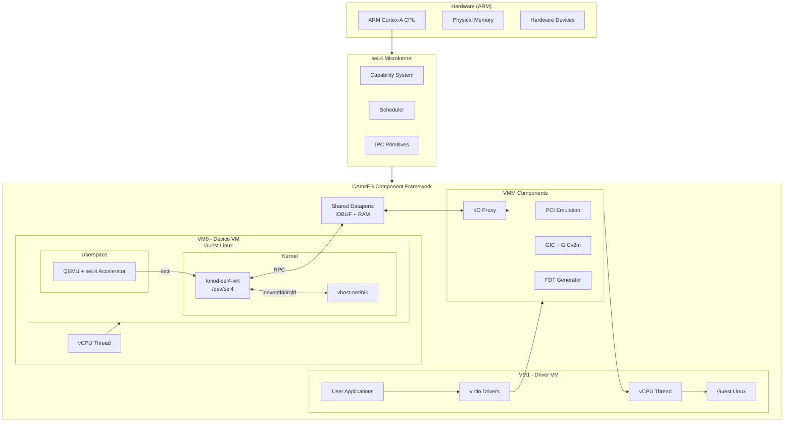
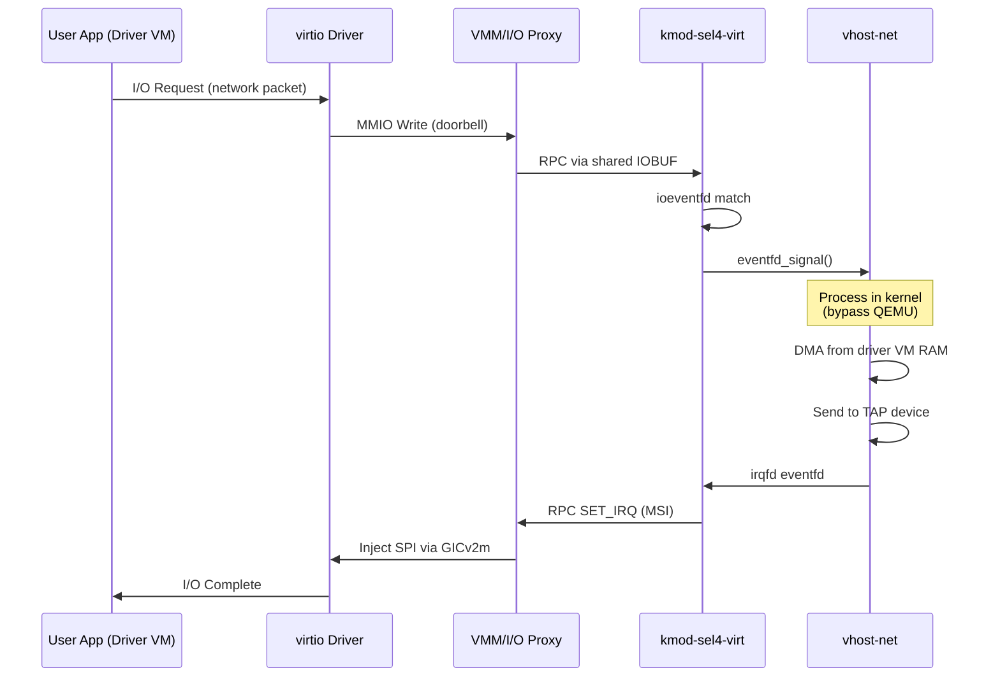
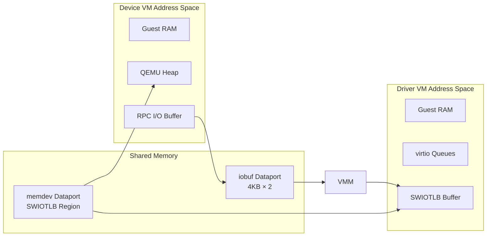

# System Architecture Overview

This document describes the high-level architecture of the TII seL4 Virtio Virtualization Platform.

## Architecture Diagram



## Component Overview

### seL4 Microkernel

The seL4 microkernel provides:

- **Capability-based access control**: All system resources are accessed through capabilities, ensuring strong isolation
- **Formal verification**: Mathematical proof of correctness for the kernel
- **Hypervisor support**: ARM virtualization extensions (VHE) for running guest VMs
- **IPC primitives**: Fast inter-process communication for component interaction

### CAmkES Framework

CAmkES (Component Architecture for Micro-kernel-based Embedded Systems) provides:

- **Component model**: Structured way to define and connect system components
- **Dataports**: Shared memory regions between components
- **Events**: Asynchronous notification mechanism
- **RPC interfaces**: Synchronous procedure calls between components

### Virtual Machine Components

Each guest VM consists of:

| Component | Description |
|-----------|-------------|
| vCPU Thread | seL4 thread running the virtual CPU |
| Guest RAM | Memory region mapped to guest physical address space |
| VMM Module | Handles VM faults, device emulation, interrupts |
| I/O Proxy | Forwards I/O requests to backend VMs |

## Data Flow

### Virtio Request Flow

When an application in a driver VM performs I/O through a virtio device:



> **Note**: With vhost acceleration, QEMU is only involved in control plane setup (device configuration, feature negotiation). The data plane (packet processing) runs entirely in kernel via vhost-net, with notifications handled by kmod-sel4-virt's ioeventfd/irqfd.

### Memory Architecture



## Security Model

### Isolation Guarantees

1. **VM Isolation**: Each VM runs in its own address space, enforced by seL4 capabilities
2. **Memory Protection**: Guest VMs cannot access each other's RAM directly
3. **Controlled Communication**: All inter-VM communication goes through explicit CAmkES interfaces
4. **Minimal TCB**: The VMM runs in userspace, reducing the trusted computing base

### Trust Boundaries

```
┌─────────────────────────────────────────────────────────────┐
│                    Trusted Computing Base                    │
│  ┌─────────────────────────────────────────────────────┐    │
│  │                  seL4 Microkernel                    │    │
│  │           (formally verified, ~10K LOC)              │    │
│  └─────────────────────────────────────────────────────┘    │
└─────────────────────────────────────────────────────────────┘

┌─────────────────────────────────────────────────────────────┐
│                    Userspace Components                      │
│  ┌───────────────┐  ┌───────────────┐  ┌───────────────┐    │
│  │   VMM/CAmkES  │  │   Device VM   │  │   Driver VM   │    │
│  │  (privileged) │  │   (Linux +    │  │   (Linux +    │    │
│  │               │  │    QEMU)      │  │  applications)│    │
│  └───────────────┘  └───────────────┘  └───────────────┘    │
└─────────────────────────────────────────────────────────────┘
```

### Attack Surface

| Component | Attack Surface | Mitigation |
|-----------|---------------|------------|
| seL4 Kernel | Syscall interface | Formal verification |
| VMM | VM faults, MMIO | Capability-based access |
| Device VM | RPC messages from driver VMs | Input validation |
| Driver VM | virtio device interface | Standard Linux drivers |

## Flexible VM Topology

A key architectural differentiator of the TII seL4 platform is its support for **arbitrary VM topologies**. Unlike traditional hypervisors with fixed host-guest hierarchies, VMs in this system are peers that can form any relationship graph.

### Any-to-Any Relationships

The system supports:
- **Multiple device VMs serving one driver VM** (e.g., separate network and storage backends)
- **One device VM serving multiple driver VMs** (e.g., shared storage)
- **Chain topologies** where VM A is device for VM B, which is device for VM C
- **Mesh topologies** for complex peer-to-peer services

```
Traditional Hypervisor (KVM, pKVM):      seL4 Flexible Topology:
┌─────────────────────────────┐          ┌─────────────────────────────────────┐
│         Host (TCB)          │          │        seL4 (minimal TCB)           │
│  ┌─────┐ ┌─────┐ ┌─────┐   │          │                                     │
│  │ VM1 │ │ VM2 │ │ VM3 │   │          │  ┌─────┐ virtio-net  ┌─────┐       │
│  └──┬──┘ └──┬──┘ └──┬──┘   │          │  │ VM1 │◄───────────►│ VM2 │       │
│     │       │       │       │          │  └──┬──┘             └──┬──┘       │
│     └───────┴───────┘       │          │     │                   │          │
│      All subordinate to     │          │     │ virtio-blk        │ virtio-  │
│           host              │          │     ▼                   │ console  │
└─────────────────────────────┘          │  ┌─────┐ virtio-gpu  ┌──▼──┐       │
                                         │  │ VM3 │◄───────────►│ VM4 │       │
                                         │  └─────┘             └─────┘       │
                                         │      Peer relationships, any graph  │
                                         └─────────────────────────────────────┘
```

### CAmkES Connection Model

VMs are connected through explicit CAmkES definitions, not implicit hierarchy:

```camkes
assembly {
    composition {
        component VM vm_storage;    // Storage backend
        component VM vm_network;    // Network backend
        component VM vm_workload;   // Application VM

        // vm_workload uses BOTH vm_storage and vm_network as backends
        VIRTIO_COMPOSITION_DEF(storage, workload)   // storage provides blk
        VIRTIO_COMPOSITION_DEF(network, workload)   // network provides net
    }
}
```

Each connection creates:
- Dedicated dataports (iobuf, memdev)
- Dedicated notifications (doorbell)
- Independent communication channels

**Key insight**: A VM can be both "device" and "driver" simultaneously:

```
VM1 ──virtio-net──► VM2 ──virtio-blk──► VM3
     (VM2 is driver)    (VM2 is device)
```

### Fine-Grained Peripheral Passthrough

Each VM receives only the hardware it needs:

| VM Role | Hardware Access | Example |
|---------|-----------------|---------|
| virtio-blk backend | eMMC/NVMe only | Storage server |
| virtio-net backend | NIC only | Network gateway |
| virtio-gpu backend | GPU only | Graphics server |
| Workload VM | No hardware | Application sandbox |

```camkes
configuration {
    // Storage backend: only eMMC access
    vm_storage.pci_devices = [{ name: "emmc", ... }];
    vm_storage.untyped_mmios = ["0xfe340000:0x1000"];  // eMMC registers only

    // Network backend: only NIC access
    vm_network.pci_devices = [{ name: "eth0", ... }];
    vm_network.untyped_mmios = ["0xfd580000:0x10000"]; // NIC registers only

    // Workload: NO hardware passthrough
    vm_workload.pci_devices = [];
}
```

### Security Implications

This topology flexibility provides unique security properties:

1. **No "god mode" host**: Unlike KVM/pKVM where one entity controls everything, seL4 VMs are true peers
2. **Minimal blast radius**: Compromising the network backend doesn't expose storage
3. **Hardware compartmentalization**: Each backend only has the attack surface of its specific device
4. **Capability-enforced boundaries**: CAmkES connections define exactly what's shared

```
Attack Surface Comparison:
┌────────────────────────────────────────────────────────────────────┐
│ KVM Host Compromise:                                               │
│   Attacker gains: ALL guest memory, ALL devices, ALL secrets       │
├────────────────────────────────────────────────────────────────────┤
│ seL4 Storage Backend Compromise:                                   │
│   Attacker gains: eMMC access, DMA pool of connected driver VMs    │
│   Attacker CANNOT access: Network, GPU, other VMs' private memory  │
└────────────────────────────────────────────────────────────────────┘
```

See [VM Topology](vm-topology.md) for detailed examples and [Deployment Scenarios](../deployment/deployment-scenarios.md) for concrete configurations.

## Platform Support

### ARM Architecture

The platform targets ARM processors with:

- ARMv8-A architecture (64-bit)
- Virtualization extensions (EL2)
- GICv2 interrupt controller
- Optional: GICv2m for MSI support

### Supported Hardware

| Platform | SoC | CPU | Notes |
|----------|-----|-----|-------|
| QEMU ARM Virt | Virtual | Cortex-A57 | Development/testing |
| Raspberry Pi 4 | BCM2711 | Cortex-A72 | Production target |

## Key Source Files

| File | Description |
|------|-------------|
| `src/libsel4vm_glue.c` | Core VMM integration, RPC handling |
| `src/io_proxy.c` | I/O request/response lifecycle |
| `configurations/tii/vm.h` | CAmkES component macros |
| `templates/*.template.c` | CAmkES component templates |

## Related Documentation

- [Virtio Architecture](virtio-architecture.md) - Detailed virtio device model
- [RPC Protocol](rpc-protocol.md) - Communication protocol specification
- [Memory Model](memory-model.md) - Shared memory and SWIOTLB details
