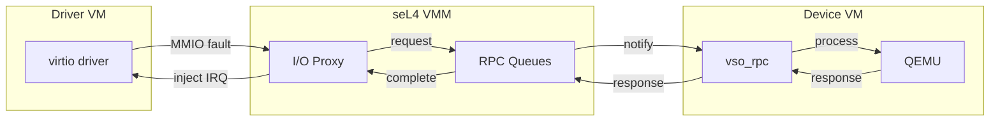
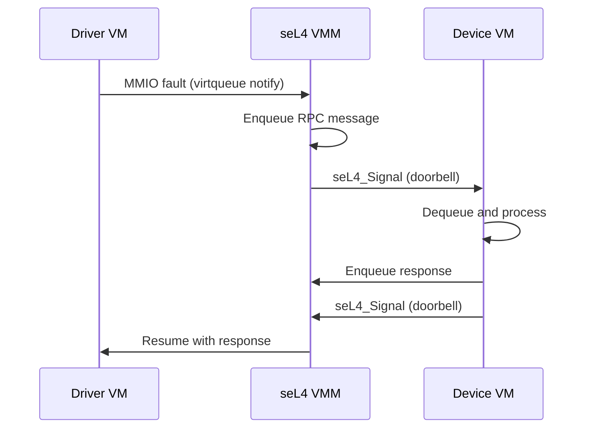
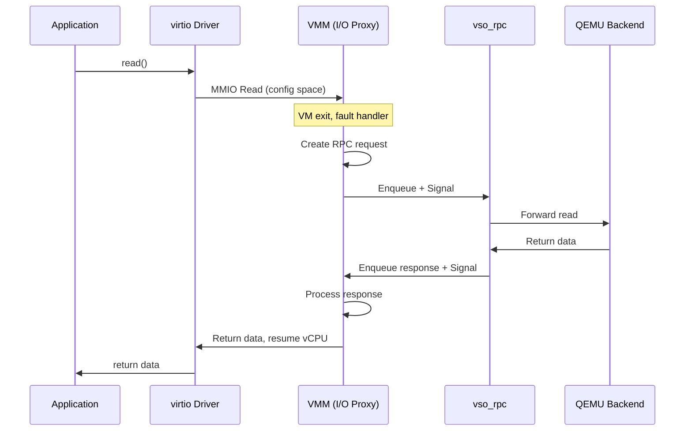
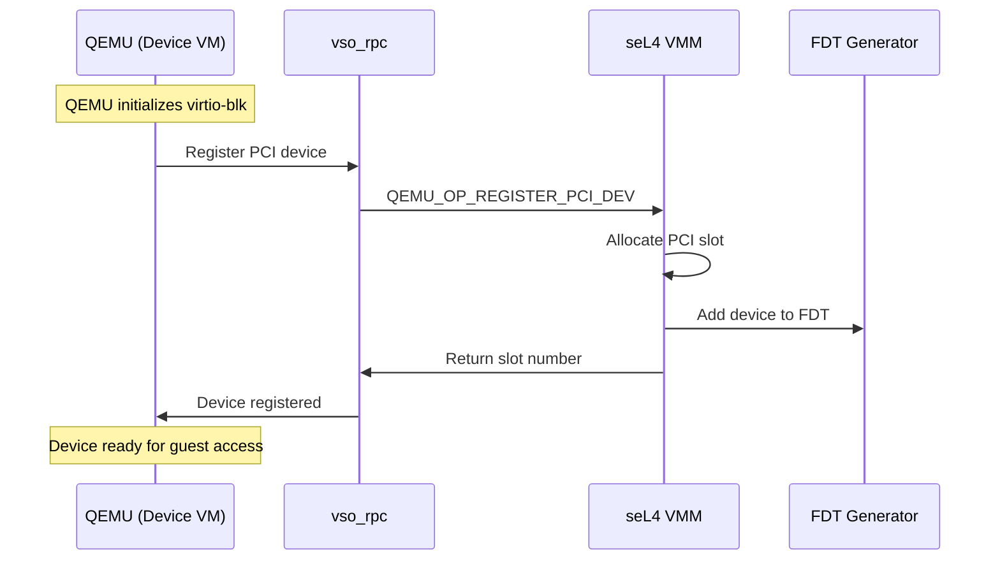
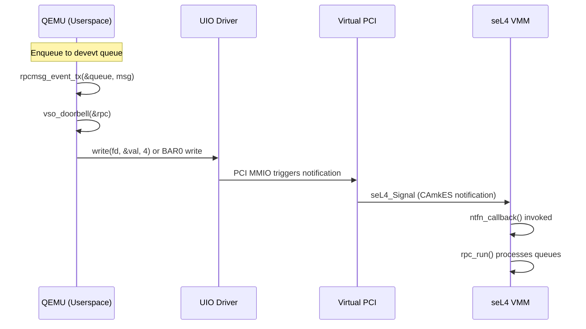
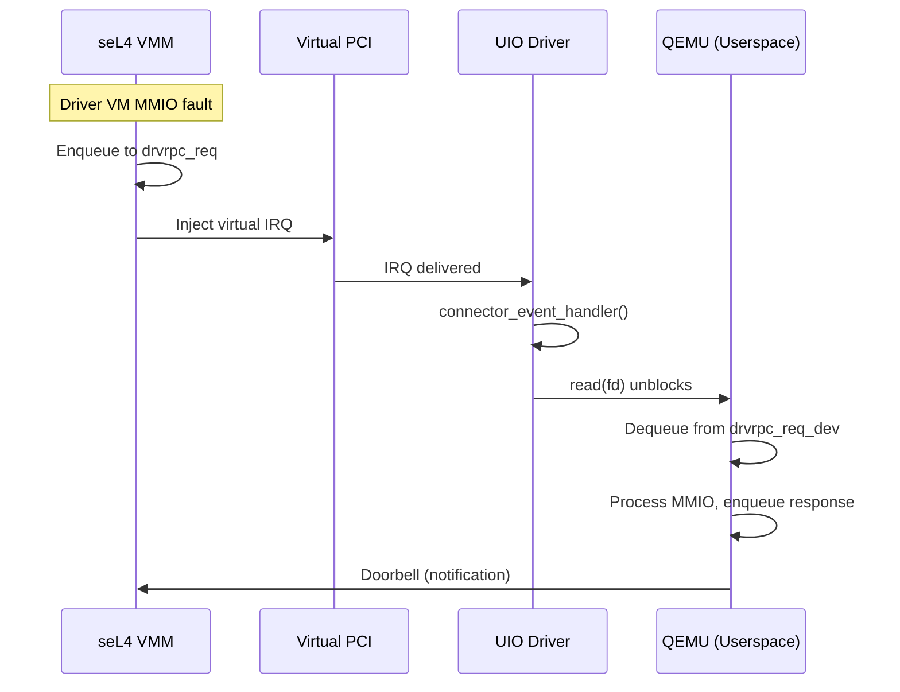

# RPC Protocol

This document describes the RPC (Remote Procedure Call) protocol used for communication between the seL4 VMM and device VMs running QEMU.

## Overview

The RPC protocol enables:
- **MMIO forwarding**: Driver VM MMIO accesses forwarded to device VM
- **Interrupt injection**: Device VM signals interrupts to driver VMs
- **PCI device registration**: QEMU registers virtio devices with VMM
- **Control operations**: VM startup synchronization



## Message Format

### rpcmsg_t Structure

RPC messages use a compact 4-register format:

```c
// From include/sel4/rpc.h
typedef struct rpcmsg {
    seL4_Word mr0;  // Operation, slot, direction, address space, length
    seL4_Word mr1;  // Address or data
    seL4_Word mr2;  // Data
    seL4_Word mr3;  // Extended data
} rpcmsg_t;
```

### mr0 Encoding

The first message register (`mr0`) is a packed bit field:

```
┌─────────┬───────────┬───────────┬────────────┬────────┐
│  op     │ mmio_slot │ direction │ addr_space │ length │
│ [31:26] │  [25:20]  │   [19]    │  [18:11]   │ [10:7] │
└─────────┴───────────┴───────────┴────────────┴────────┘
6 bits     6 bits      1 bit       8 bits       4 bits
```

| Field | Bits | Description |
|-------|------|-------------|
| `op` | 31:26 | Operation code (QEMU_OP_*) |
| `mmio_slot` | 25:20 | MMIO slot identifier |
| `direction` | 19 | 0=read, 1=write |
| `addr_space` | 18:11 | Address space (AS_GLOBAL or device slot) |
| `length` | 10:7 | Access size (1, 2, 4, or 8 bytes) |

## Operation Codes

### Driver → Device Operations

| Opcode | Name | Description |
|--------|------|-------------|
| 0 | `QEMU_OP_MMIO` | MMIO read/write request |
| 2 | `QEMU_OP_PUTC_LOG` | Log character output |

### Device → Driver Operations

| Opcode | Name | Description |
|--------|------|-------------|
| 16 | `QEMU_OP_SET_IRQ` | Set/clear/pulse interrupt line |
| 18 | `QEMU_OP_START_VM` | Backend ready signal |
| 19 | `QEMU_OP_REGISTER_PCI_DEV` | Register PCI device |
| 20 | `QEMU_OP_MMIO_REGION_CONFIG` | Configure MMIO region |

## Operation Details

### QEMU_OP_MMIO (0)

MMIO read/write operations between driver VM and device VM.

**Request (Driver → Device):**
```
mr0: op=0, slot, direction, addr_space, length
mr1: address (offset within region)
mr2: write_data (for writes)
mr3: (unused)
```

**Response (Device → Driver):**
```
mr0: (same as request)
mr1: address
mr2: read_data (for reads)
mr3: (unused)
```

**Example - Config Space Read:**
```c
// Driver VM reads PCI config register
rpcmsg_t req = {
    .mr0 = MAKE_MR0(QEMU_OP_MMIO, slot, DIR_READ, AS_PCIDEV(slot), 4),
    .mr1 = 0x10,  // BAR0 offset
    .mr2 = 0,
    .mr3 = 0
};
```

### QEMU_OP_SET_IRQ (16)

Interrupt injection from device VM to driver VM.

**Message Format:**
```
mr0: op=16, (other fields)
mr1: irq_number
mr2: level (0=clear, 1=set, 2=pulse)
mr3: (unused)
```

**IRQ Levels:**
| Value | Name | Description |
|-------|------|-------------|
| 0 | `RPC_IRQ_CLR` | Clear interrupt (level → low) |
| 1 | `RPC_IRQ_SET` | Set interrupt (level → high) |
| 2 | `RPC_IRQ_PULSE` | Pulse interrupt (edge trigger) |

### QEMU_OP_START_VM (18)

Signals that the device VM backend is ready.

**Message Format:**
```
mr0: op=18
mr1: (unused)
mr2: (unused)
mr3: (unused)
```

The VMM waits for this message before allowing the driver VM to proceed with device access.

### QEMU_OP_REGISTER_PCI_DEV (19)

Registers a PCI device from QEMU with the VMM.

**Message Format:**
```
mr0: op=19
mr1: device_id | (vendor_id << 16)
mr2: subsystem_id | (subsystem_vendor_id << 16)
mr3: class_code | (revision << 24)
```

**Response:**
```
mr0: op=19
mr1: assigned_slot (PCI slot number in guest)
mr2: (unused)
mr3: (unused)
```

### QEMU_OP_MMIO_REGION_CONFIG (20)

Configures an MMIO region for a device.

**Message Format:**
```
mr0: op=20, flags
mr1: base_address
mr2: size
mr3: (unused)
```

**Flags:**
| Flag | Value | Description |
|------|-------|-------------|
| `SEL4_MMIO_REGION_FREE` | 0x1 | Deallocate region |

## Address Spaces

The `addr_space` field identifies the target of an MMIO operation:

| Value | Macro | Description |
|-------|-------|-------------|
| 0xFF | `AS_GLOBAL` | Global MMIO space |
| 0-31 | `AS_PCIDEV(slot)` | Per-PCI-device MMIO |

## RPC Queues

### Queue Structure

```c
typedef struct rpc_queue {
    volatile uint32_t head;      // Producer index
    volatile uint32_t tail;      // Consumer index
    uint32_t size;               // Queue capacity
    rpcmsg_t *messages;          // Message buffer
} rpc_queue_t;
```

### Queue Types

The vso_rpc structure contains three queues:

| Queue | Direction | Purpose |
|-------|-----------|---------|
| `driver_rpc_req` | Driver → Device | MMIO requests |
| `driver_rpc_resp` | Device → Driver | MMIO responses |
| `device_event` | Device → Driver | Async events (IRQ, etc.) |

### Queue Operations

**Enqueue (Producer):**
```c
void rpc_queue_enqueue(rpc_queue_t *q, rpcmsg_t *msg) {
    uint32_t head = q->head;
    q->messages[head] = *msg;
    __atomic_store_n(&q->head, (head + 1) % q->size, __ATOMIC_RELEASE);
}
```

**Dequeue (Consumer):**
```c
bool rpc_queue_dequeue(rpc_queue_t *q, rpcmsg_t *msg) {
    uint32_t tail = q->tail;
    uint32_t head = __atomic_load_n(&q->head, __ATOMIC_ACQUIRE);
    if (tail == head) return false;  // Empty
    *msg = q->messages[tail];
    q->tail = (tail + 1) % q->size;
    return true;
}
```

## Notification Mechanism

### Doorbell

When a message is enqueued, the sender notifies the receiver:



### CAmkES Connections

Notifications use CAmkES event interfaces:

```camkes
// Device VM emits, driver connection consumes
connection seL4GlobalAsynch virtio_notify(
    from vm0.virtio_vm1_notify,
    to vm1_virtio_vm0.notify
);
```

## Sequence Diagrams

### MMIO Read Sequence



### PCI Device Registration Sequence



## Error Handling

### Timeout

If the device VM doesn't respond within a timeout:
- VMM returns error to driver VM
- Driver VM virtio driver handles as device error

### Invalid Operations

Unknown opcodes are logged and ignored:
```c
if (op >= QEMU_OP_MAX) {
    ZF_LOGE("Unknown RPC opcode: %d", op);
    return;
}
```

## Device-Side Queue Mapping

This section describes how RPC queues are structured and accessed from the device VM (running QEMU).

### IOBUF Memory Layout

The shared I/O buffer (`rpcmsg_iobuf_t`) is a 2-page (8KB) region containing both message buffers and queue metadata:

```
┌─────────────────────────────────────────────────────────────┐
│                     IOBUF (2 pages, 8KB)                    │
├─────────────────────────────────────────────────────────────┤
│  rpcmsg_buffer_t buffers[2]                                 │
│    ├─ [0] drvrpc - MMIO request/response messages (32 msgs) │
│    └─ [1] devevt - Device event messages (32 messages)      │
├─────────────────────────────────────────────────────────────┤
│  rpcmsg_queue_t queues[4]                                   │
│    ├─ [0] drvrpc_req      - VMM → Device (kernel) requests  │
│    ├─ [1] drvrpc_req_dev  - Kernel → Userspace forwarding   │
│    ├─ [2] drvrpc_resp     - Device → VMM responses          │
│    └─ [3] devevt          - Device → VMM async events       │
└─────────────────────────────────────────────────────────────┘
```

### Queue Data Structures

**Message Buffer** (from `rpc_queue.h`):
```c
#define RPCMSG_BUFFER_SIZE 32  // Power of 2

typedef struct rpcmsg_buffer {
    rpcmsg_t messages[RPCMSG_BUFFER_SIZE];
} rpcmsg_buffer_t;
```

**Queue Structure** (lock-free ring buffer):
```c
typedef struct rpcmsg_queue_t {
    volatile rpcmsg_queue_bound_t prod;  // Producer head/tail
    volatile rpcmsg_queue_bound_t cons;  // Consumer head/tail
    uint16_t ring[RPCMSG_BUFFER_SIZE];   // Ring buffer indices
} rpcmsg_queue_t;

typedef struct rpcmsg_queue_bound {
    volatile rpcmsg_marker_t tail;
    volatile rpcmsg_marker_t head;
} rpcmsg_queue_bound_t;

typedef union rpcmsg_marker {
    uint64_t raw;              // For atomic 64-bit operations
    struct {
        uint32_t pos;          // Position in ring
        uint32_t count;        // Commit counter (for lock-free)
    } marker;
} rpcmsg_marker_t;
```

### Queue IDs and Roles

```c
typedef enum rpcmsg_queue_id {
    queue_id_drvrpc_req = 0,     // VMM → Device requests
    queue_id_drvrpc_req_dev,     // Kernel → Userspace forwarding
    queue_id_drvrpc_resp,        // Device → VMM responses
    queue_id_devevt,             // Device → VMM events
    queue_id_last,
} rpcmsg_queue_id_t;
```

| Queue ID | Direction | Role | Used By |
|----------|-----------|------|---------|
| `drvrpc_req` | VMM → Device | MMIO requests | VMM enqueues, Device kernel dequeues |
| `drvrpc_req_dev` | Kernel → User | Forwarded requests | Device kernel enqueues, QEMU dequeues |
| `drvrpc_resp` | Device → VMM | MMIO responses | QEMU enqueues, VMM dequeues |
| `devevt` | Device → VMM | IRQ, PCI registration | QEMU enqueues, VMM dequeues |

### Device-Side Queue Access Macros

The device VM (QEMU) accesses queues through these macros:

```c
// From include/sel4/rpc.h

// Get queue from iobuf pointer
#define iobuf_queue(_addr, _bid, _qid, _type) ({      \
    rpcmsg_iobuf_t *_iobuf = (void *)(_addr);         \
    _type _q = {                                       \
        .buffer = &_iobuf->buffers[(_bid)],           \
        .queue = &_iobuf->queues[(_qid)],             \
    };                                                 \
    _q;                                                \
})

// Device userspace queue accessors
#define device_drvrpc_req(_addr)  iobuf_queue((_addr), iobuf_id_drvrpc, \
                                              queue_id_drvrpc_req_dev, rpcmsg_rpc_queue_t)
#define device_drvrpc_resp(_addr) iobuf_queue((_addr), iobuf_id_drvrpc, \
                                              queue_id_drvrpc_resp, rpcmsg_rpc_queue_t)
#define devevt_queue(_addr)       iobuf_queue((_addr), iobuf_id_devevt, \
                                              queue_id_devevt, rpcmsg_event_queue_t)
```

### UIO Kernel Module Exposure

The Linux kernel module (`connection.c`) exposes the shared memory via UIO:

```c
// From connection.c - PCI BAR mapping
for (i = 0; i < MAX_UIO_MAPS; i++) {
    uio->mem[i].addr = pci_resource_start(dev, i);
    uio->mem[i].internal_addr = ioremap_cache(
        pci_resource_start(dev, i),
        pci_resource_len(dev, i));
    uio->mem[i].size = pci_resource_len(dev, i);
    uio->mem[i].memtype = UIO_MEM_IOVA;
}

// IRQ handler for incoming notifications
static irqreturn_t connector_event_handler(int irq, struct uio_info *dev_info) {
    uint32_t *event_bar = dev_info->mem[0].internal_addr;
    u32 val = readl(&event_bar[1]);
    if (val == 0) return IRQ_NONE;
    writel(0, &event_bar[1]);  // Clear status
    return IRQ_HANDLED;
}
```

**PCI BAR Layout:**
| BAR | Content | Description |
|-----|---------|-------------|
| BAR0 | Event registers | Doorbell control, IRQ status |
| BAR1 | iobuf | Shared memory with queues |
| BAR2+ | memdev | Guest memory access (optional) |

### Device-Side Initialization

```c
// QEMU seL4 accelerator initialization (simplified)
int fd = open("/dev/uio0", O_RDWR);

// Map iobuf from BAR1
void *iobuf = mmap(NULL, IOBUF_SIZE, PROT_READ | PROT_WRITE,
                   MAP_SHARED, fd, 1 * getpagesize());

// Initialize vso_rpc with device role
vso_rpc_init(&rpc, vso_rpc_device, iobuf, doorbell_callback, cookie);
```

## Doorbell Mechanism

### Device → VMM Notification

When QEMU needs to notify the VMM (e.g., IRQ injection, MMIO completion):



**Code Flow:**
```c
// 1. QEMU sends IRQ notification
device_rpc_req_pulse_irqline(&rpc, irq_num);

// 2. Which calls device_event_tx()
static inline int device_event_tx(vso_rpc_t *rpc, unsigned int op, ...) {
    rpcmsg_event_tx(&rpc->device_event, mr0, mr1, mr2, mr3);
    return vso_doorbell(rpc);  // Ring the doorbell
}

// 3. Doorbell callback (set during init)
static inline int vso_doorbell(vso_rpc_t *rpc) {
    rpc->doorbell(rpc->doorbell_cookie);
    return 0;
}

// 4. In CAmkES template - actual notification
static void doorbell_callback(void *cookie) {
    vmX_ntfn_send_emit();  // seL4 async notification to VMM
}
```

### VMM → Device Notification

When the VMM sends MMIO requests to the device:



**VMM-Side Queue Processing:**
```c
// From libsel4vm_glue.c
int rpc_run(io_proxy_t *io_proxy) {
    rpcmsg_t *resp;
    rpcmsg_t event;

    // Process MMIO responses first
    for_each_driver_rpc_resp(resp, id, &io_proxy->rpc) {
        rpc_process(resp, io_proxy);
    }

    // Process device events (IRQ, PCI registration)
    for_each_device_event(event, &io_proxy->rpc) {
        rpc_process(&event, io_proxy);
    }

    return 0;
}
```

### Lock-Free Queue Operations

The queues use lock-free algorithms with atomic compare-and-swap:

```c
// Producer (enqueue) - simplified
int rpcmsg_enqueue(rpcmsg_queue_t *q, ...) {
    // Atomically claim slot
    do {
        old_tail = atomic_load(&q->prod.tail);
        new_tail.pos = old_tail.pos + 1;
        new_tail.count = old_tail.count + 1;
    } while (!atomic_compare_and_swap(&q->prod.tail, &old_tail, new_tail));

    // Write message at claimed slot
    q->ring[old_tail.pos & MASK] = msg_id;

    // Update head to make visible to consumer
    rpcmsg_commit_update(&q->prod);
}

// Consumer (dequeue) - simplified
int rpcmsg_dequeue(rpcmsg_queue_t *q, ...) {
    // Atomically claim entry
    do {
        old_tail = atomic_load(&q->cons.tail);
        if (q->prod.head.pos == old_tail.pos)
            return -1;  // Empty
        new_tail.pos = old_tail.pos + 1;
    } while (!atomic_compare_and_swap(&q->cons.tail, &old_tail, new_tail));

    // Read message
    msg_id = q->ring[old_tail.pos & MASK];
    rpcmsg_commit_update(&q->cons);
}
```

## Related Documentation

- [Memory Model](memory-model.md) - Shared memory regions
- [I/O Proxy](../components/io-proxy.md) - VMM-side RPC handling
- [QEMU Backend](../integration/qemu-backend.md) - Device VM RPC handling
- [Guest-Side Components](../integration/guest-side-components.md) - Device-side implementation details
