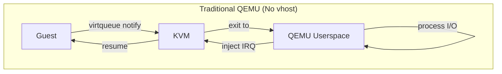
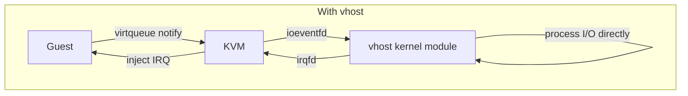
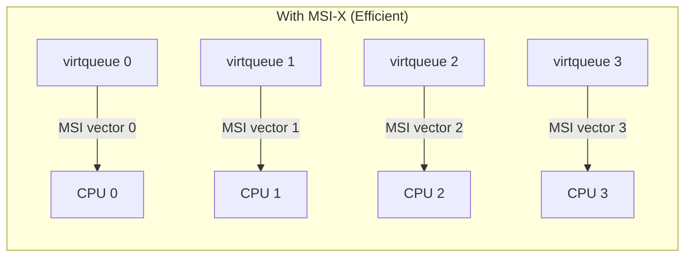
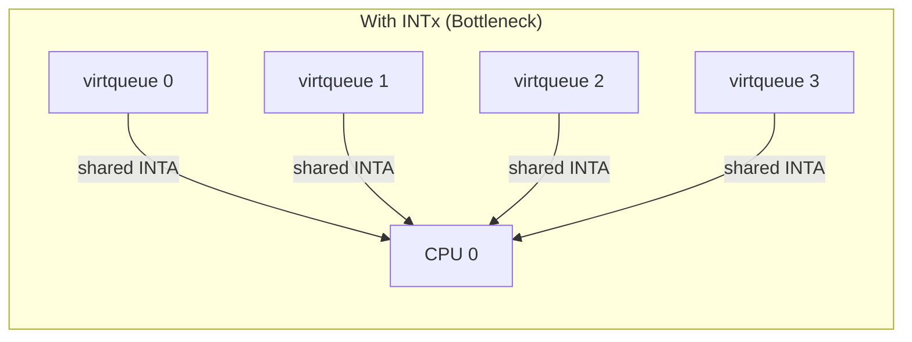
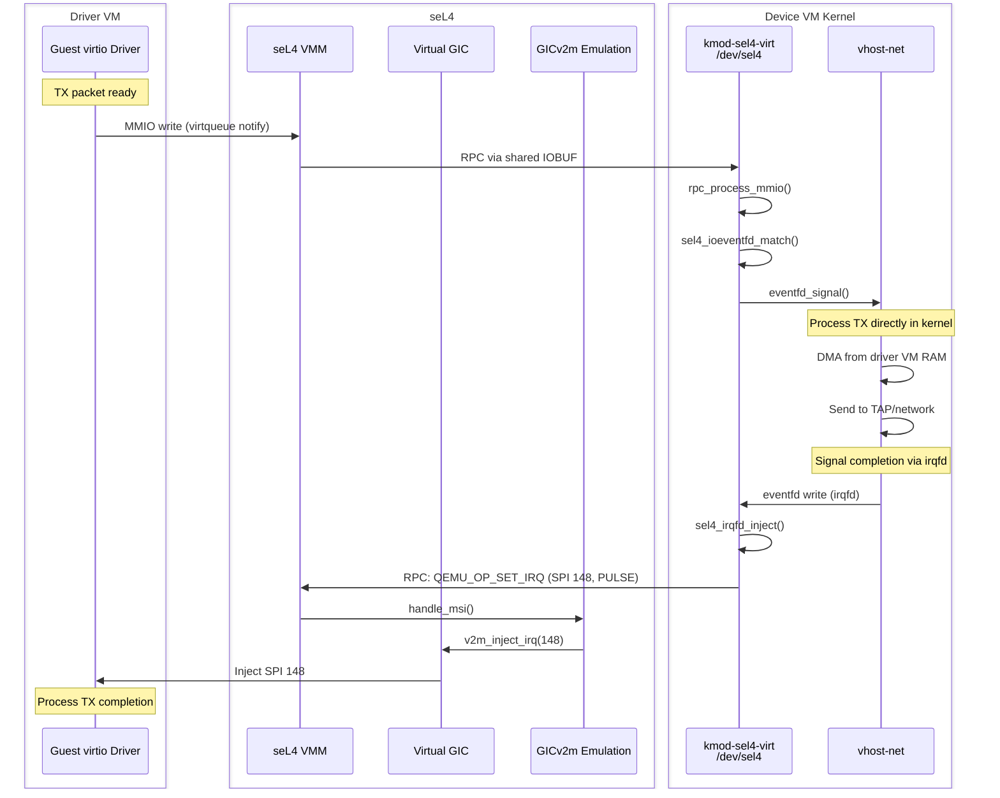
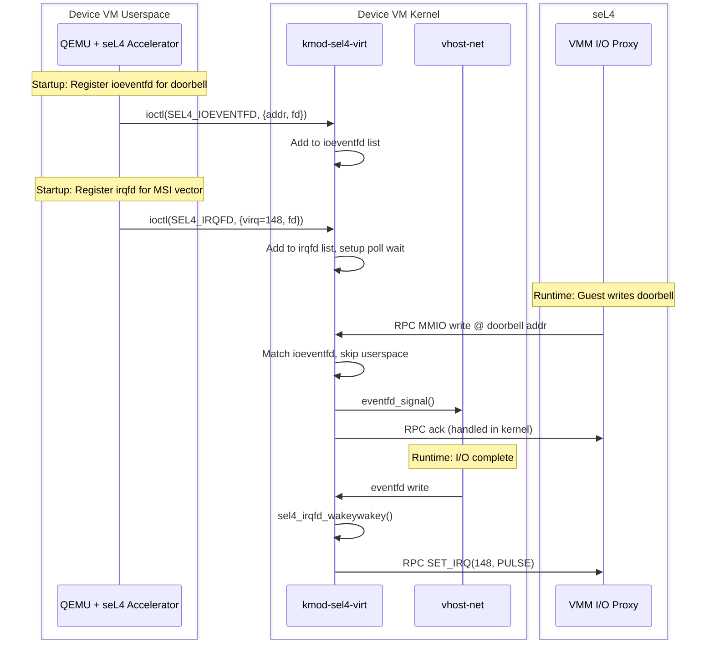
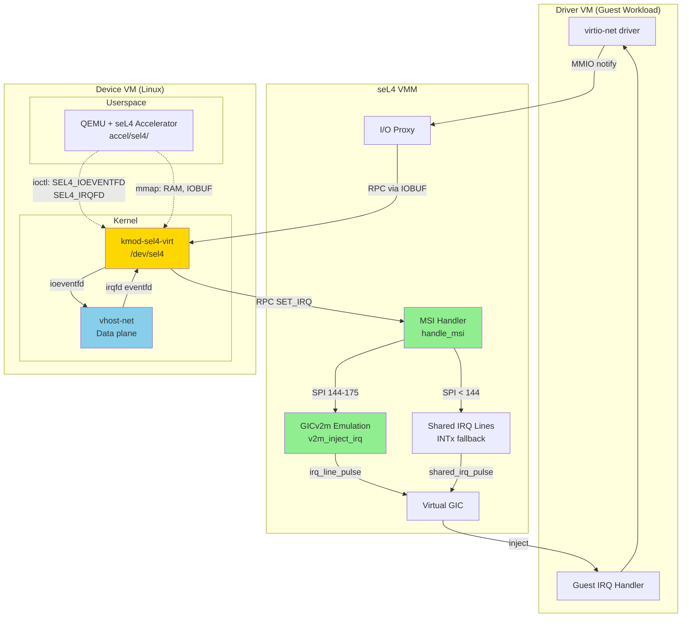

# vhost-Style Acceleration

This document explains the vhost acceleration model and why MSI support is essential for achieving KVM-like performance in this architecture.

## Overview

vhost is a Linux kernel feature that moves virtio data plane processing from QEMU userspace into the kernel, dramatically reducing I/O latency by eliminating context switches.





## Why MSI is Essential for vhost

### The Interrupt Injection Problem

vhost processes virtqueues in kernel space but still needs to signal completion to the guest. In KVM, this is done via `irqfd` - a mechanism that allows kernel code to inject interrupts directly.

For this to be efficient, MSI/MSI-X provides critical advantages over legacy INTx:

| Aspect | INTx (Legacy) | MSI/MSI-X |
|--------|---------------|-----------|
| **Lines** | 4 shared lines (INTA-INTD) | Per-device or per-queue vectors |
| **Trigger** | Level (requires EOI) | Edge (fire and forget) |
| **Multi-queue** | All queues share one IRQ | Each queue gets own vector |
| **CPU affinity** | Single CPU handles all | Interrupts can target specific CPUs |
| **Latency** | Higher (EOI overhead) | Lower (direct injection) |

### Multi-Queue Networking

Modern high-performance networking relies on multi-queue virtio-net:





Without MSI-X, all queues funnel through a single interrupt line, negating the parallelism benefits of multi-queue.

## Architecture in This System

### Complete vhost Data Path



### Detailed ioeventfd/irqfd Flow



### Component Interaction



## MSI Configuration

### GICv2m Frame Setup

The GICv2m emulation provides the MSI injection point:

```c
// Platform configuration (RPi4)
static gicv2m_t v2m = {
    .base = 0x08021000,      // GICv2m frame address
    .size = 0x1000,          // 4KB
    .irq_base = 144,         // First MSI-capable SPI
    .num_irq = 32,           // SPIs 144-175 for MSI
};
```

### Device Tree for Guest

```dts
/ {
    v2m: v2m@8020000 {
        compatible = "arm,gic-v2m-frame";
        reg = <0x0 0x08020000 0x0 0x1000>;
        msi-controller;
        arm,msi-base-spi = <144>;
        arm,msi-num-spis = <32>;
    };

    pcie@10000000 {
        /* PCI host bridge */
        msi-parent = <&v2m>;
        /* ... */
    };
};
```

### IRQ Routing

```
┌─────────────────────────────────────────────────────────────────┐
│                     IRQ Number Space                            │
├─────────────────────────────────────────────────────────────────┤
│  0-15   │ SGI (Software Generated Interrupts)                   │
│  16-31  │ PPI (Private Peripheral Interrupts)                   │
│  32-63  │ PCI INTx (shared, level-triggered)                    │
│         │  → Uses shared_irq_line_t                             │
│  64-143 │ Platform devices, emulated devices                    │
│         │  → Uses irq_line_t                                    │
│ 144-175 │ MSI/MSI-X (edge-triggered)                            │
│         │  → Uses GICv2m, irq_line_pulse()                      │
└─────────────────────────────────────────────────────────────────┘
```

## Performance Implications

### seL4 IPC Latency Advantage

A key architectural difference from KVM is the extra RPC hop through the seL4 VMM. However, this overhead is minimal due to seL4's exceptional IPC performance:

| System | IPC Latency | Notes |
|--------|-------------|-------|
| seL4 | ~100-200 cycles | Formally verified, highly optimized fast path |
| Linux | ~1000-10000 cycles | System call overhead, scheduler complexity |

seL4's IPC between threads (whether normal EL0 threads or EL1 vCPU threads) is **orders of magnitude faster** than Linux context switches. This is a fundamental design property of the seL4 microkernel:

- **Minimal kernel path** - IPC is the most optimized operation in seL4
- **No scheduler overhead** - Direct thread-to-thread transfer
- **Cache-friendly** - Small kernel footprint, hot paths stay in cache
- **Predictable latency** - No jitter from kernel housekeeping

```
KVM vhost path:
  vhost → irqfd → KVM → guest
  [~500 cycles total]

seL4 vhost path:
  vhost → irqfd → kmod → RPC → VMM → guest
  [~500 cycles for irqfd] + [~200 cycles for seL4 IPC] = ~700 cycles

Overhead: ~40% more cycles, but still sub-microsecond
```

The RPC hop adds latency equivalent to **one additional seL4 IPC**, which is negligible compared to:
- Network packet processing (~microseconds)
- Disk I/O (~milliseconds)
- The cost of going through QEMU userspace (~10-100x slower)

This makes the seL4-based vhost acceleration practical for high-performance I/O despite the architectural indirection.

### Without MSI (INTx Only)

1. **Shared interrupt line** - All virtio devices share 4 lines
2. **Level-triggered** - Requires proper EOI sequence
3. **Single CPU** - All interrupts go to one processor
4. **IRQ storms** - Multiple devices asserting same line
5. **Higher latency** - EOI overhead on every interrupt

### With MSI

1. **Dedicated vectors** - Each device/queue gets own interrupt
2. **Edge-triggered** - Simple pulse, no EOI needed
3. **Multi-CPU** - Interrupts can be spread across cores
4. **No contention** - No shared line arbitration
5. **Lower latency** - Direct SPI injection via GICv2m

### Measured Impact

For vhost-net with multi-queue (typical 4-queue setup):

| Metric | INTx | MSI-X | Improvement |
|--------|------|-------|-------------|
| Interrupt coalescing | Required | Optional | Simpler |
| CPU utilization | 1 core saturated | Spread across 4 | 4x parallelism |
| Packet rate | Limited by IRQ handling | Near line rate | Significant |
| Latency jitter | Higher (EOI, sharing) | Lower | More predictable |

## Implementation Details

### MSI Injection Path

```c
// 1. vhost completes I/O, triggers eventfd
// 2. UIO driver sends RPC
rpcmsg_t msg = {
    .mr0 = MAKE_MR0(QEMU_OP_SET_IRQ, ...),
    .mr1 = 148,           // MSI SPI number
    .mr2 = RPC_IRQ_PULSE, // Edge trigger
};

// 3. VMM receives and routes to MSI handler
int handle_msi(io_proxy_t *io_proxy, unsigned int op, rpcmsg_t *msg) {
    if (op == QEMU_OP_SET_IRQ) {
        uint32_t irq = msg->mr1;
        uint32_t level = msg->mr2;

        // Check if in MSI range
        if (v2m_irq_valid(&v2m, irq)) {
            return msi_irq_set(irq, level);
        }
    }
    return RPCMSG_RC_NONE;  // Not MSI, try other handlers
}

// 4. GICv2m injects the SPI
int msi_irq_set(uint32_t irq, uint32_t op) {
    switch (op) {
    case RPC_IRQ_PULSE:
        v2m_inject_irq(&v2m, irq);  // Calls irq_line_pulse()
        break;
    }
    return RPCMSG_RC_HANDLED;
}
```

### vhost Setup in Device VM

```bash
# Load vhost modules
modprobe vhost
modprobe vhost_net

# QEMU uses vhost for data plane
qemu-system-aarch64 \
    -machine virt-sel4 \
    -accel sel4 \
    -netdev tap,id=net0,vhost=on,queues=4 \
    -device virtio-net-pci,netdev=net0,mq=on,vectors=10
```

## Summary

MSI support is **essential** for vhost-style acceleration because:

1. **vhost requires efficient interrupt injection** - The whole point of vhost is to avoid QEMU userspace for the data plane. Without efficient interrupts, the optimization is incomplete.

2. **Multi-queue requires per-queue vectors** - Modern networking uses multiple queues for parallelism. INTx can't provide this.

3. **Edge triggering matches the model** - vhost's eventfd/irqfd mechanism naturally maps to MSI's edge-triggered semantics.

4. **GICv2m provides the mechanism** - The emulated GICv2m frame allows direct SPI injection, completing the fast path.

Without MSI, you could still run vhost, but:
- All interrupts would funnel through shared INTx lines
- Multi-queue benefits would be negated
- Interrupt handling overhead would become a bottleneck
- The performance would not match KVM-native vhost

## vhost with Memory Isolation

vhost acceleration works with **both** VMSWIOTLB configurations:

| Configuration | vhost | Zero-copy | Isolation |
|---------------|-------|-----------|-----------|
| VMSWIOTLB=0 | ✓ Full acceleration | ✓ Yes | ✗ None |
| VMSWIOTLB=1 | ✓ Full acceleration | ✓ Yes | ✓ Strong |

The `VMSWIOTLB` flag controls **what memory is shared**, not **how vhost accesses it**:

- **VMSWIOTLB=0**: vhost can access entire driver VM RAM
- **VMSWIOTLB=1**: vhost can only access the DMA pool (restricted-dma-pool)

In both cases:
- ioeventfd triggers vhost directly from doorbell writes
- irqfd injects MSI interrupts via kmod-sel4-virt
- Data transfer is zero-copy (shared memdev dataport)
- Full KVM-like performance is achieved

**Recommended for security-sensitive deployments**: Use `VMSWIOTLB=1` to get vhost acceleration with strong memory isolation. Even if the entire Device VM guest operating system is compromised (kernel at EL1, not just QEMU userspace), the attacker cannot read driver VM's private memory—only DMA buffers are visible. This isolation is hardware-enforced by seL4 via stage-2 page tables; Device VM simply has no mappings to driver VM's private RAM.

See [Memory Model](memory-model.md#memory-isolation-vmswiotlb1) for detailed isolation explanation.

## Source Files

| File | Description |
|------|-------------|
| `src/gicv2m.c` | GICv2m MSI frame emulation |
| `src/plat/rpi4/msi.c` | RPi4 MSI configuration |
| `src/msi.c` | MSI handler stubs |
| `include/tii/gicv2m.h` | GICv2m data structures |
| `include/tii/msi.h` | MSI handler API |

## Related Documentation

- [Interrupt Handling](../components/interrupt-handling.md) - Detailed MSI implementation
- [Virtio Architecture](virtio-architecture.md) - Overall virtio device model
- [QEMU Backend](../integration/qemu-backend.md) - QEMU seL4 accelerator
- [Guest-Side Components](../integration/guest-side-components.md) - vhost module loading
