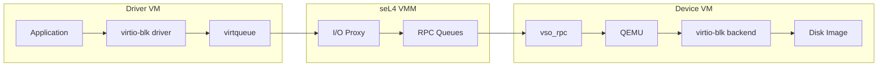
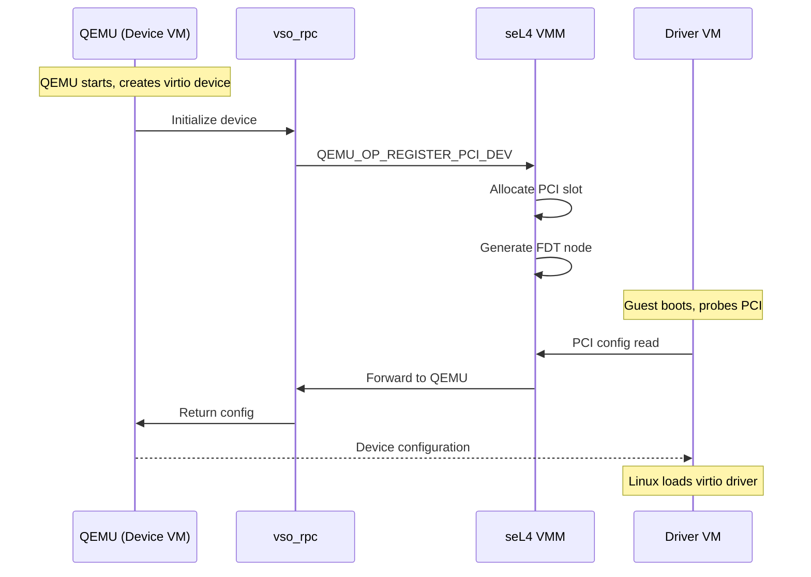
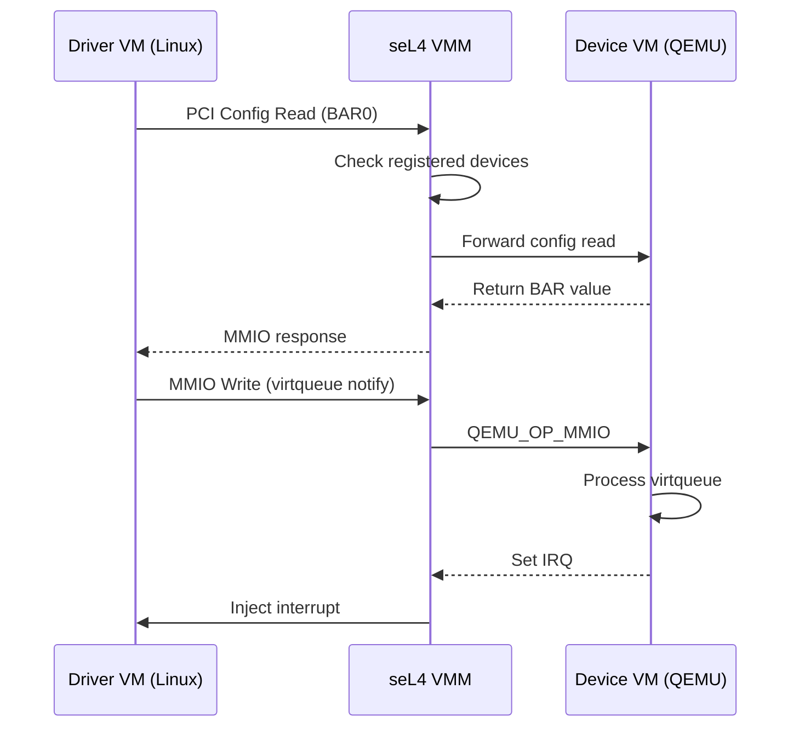

# Virtio Architecture

This document describes how virtio devices are implemented across multiple VMs in the TII seL4 virtualization platform.

## Overview

Traditional virtio implementations have the device backend in the hypervisor or host kernel. Our architecture **splits the virtio device across VMs**:

- **Driver VM**: Runs standard Linux virtio drivers (frontend) - the VM that *uses* virtio devices
- **Device VM**: Runs QEMU with virtio device backends - the VM that *provides* virtio devices
- **seL4 VMM**: Routes communication between VMs



## Why This Architecture?

### Security Benefits

| Benefit | Description |
|---------|-------------|
| **Reduced TCB** | Device backends run in userspace, not kernel |
| **Isolation** | Compromised backend doesn't affect other VMs |
| **Flexibility** | Easy to add/modify device types |

### Comparison with Traditional Approaches

| Approach | Backend Location | Security | Performance |
|----------|------------------|----------|-------------|
| KVM/QEMU | Host userspace | Medium | High |
| Xen PV | Dom0 kernel | Low | High |
| **TII seL4** | Guest VM (QEMU) | High | Medium |

## Virtio Device Types

### Supported Devices

The platform supports any virtio device that QEMU can emulate:

| Device | virtio Type | Use Case |
|--------|-------------|----------|
| Block | virtio-blk | Disk storage |
| Network | virtio-net | Networking |
| Console | virtio-console | Serial console |
| 9P | virtio-9p | Filesystem sharing |

### Device Registration Flow



## Device VM Architecture

### QEMU seL4 Accelerator

QEMU runs inside the device VM with a custom "seL4 accelerator" that:

1. Replaces KVM/TCG with seL4-specific I/O handling
2. Uses `vso_rpc` library for communication with VMM
3. Handles virtio device backends normally

```
┌─────────────────────────────────────────────────┐
│                  Device VM (Linux)               │
│  ┌─────────────────────────────────────────┐    │
│  │                QEMU Process              │    │
│  │  ┌─────────────┐  ┌─────────────────┐   │    │
│  │  │ seL4 Accel  │  │ virtio Backends │   │    │
│  │  │  (sel4-all) │  │ (blk, net, etc) │   │    │
│  │  └──────┬──────┘  └────────┬────────┘   │    │
│  │         │                  │            │    │
│  │         └────────┬─────────┘            │    │
│  │                  ▼                      │    │
│  │         ┌────────────────┐              │    │
│  │         │   vso_rpc lib  │              │    │
│  │         └────────┬───────┘              │    │
│  └──────────────────┼──────────────────────┘    │
│                     │                           │
│         ┌───────────▼───────────┐               │
│         │  /dev/uio* (shared    │               │
│         │   memory + events)    │               │
│         └───────────────────────┘               │
└─────────────────────────────────────────────────┘
```

### vso_rpc Communication

The `vso_rpc` library provides:

```c
// RPC structure (from include/sel4/rpc.h)
typedef struct vso_rpc {
    rpc_queue_t driver_rpc_req;   // Driver → Device requests
    rpc_queue_t driver_rpc_resp;  // Device → Driver responses
    rpc_queue_t device_event;     // Async events
    void (*doorbell)(void *);     // Notification callback
    void *doorbell_arg;
} vso_rpc_t;
```

## Driver VM Architecture

### virtio Driver Stack

Driver VMs run standard Linux with unmodified virtio drivers:

```
┌─────────────────────────────────────────────────┐
│                  Driver VM (Linux)               │
│  ┌─────────────────────────────────────────┐    │
│  │            User Applications             │    │
│  └─────────────────┬───────────────────────┘    │
│                    │                            │
│  ┌─────────────────▼───────────────────────┐    │
│  │          Linux Kernel                    │    │
│  │  ┌─────────────────────────────────┐    │    │
│  │  │        virtio Drivers           │    │    │
│  │  │   (virtio-blk, virtio-net, etc) │    │    │
│  │  └─────────────┬───────────────────┘    │    │
│  │                │                        │    │
│  │  ┌─────────────▼───────────────────┐    │    │
│  │  │      virtio-pci Transport       │    │    │
│  │  │  (MMIO access to virtqueues)    │    │    │
│  │  └─────────────┬───────────────────┘    │    │
│  │                │                        │    │
│  │  ┌─────────────▼───────────────────┐    │    │
│  │  │         SWIOTLB                  │    │    │
│  │  │  (DMA bounce buffer for         │    │    │
│  │  │   cross-VM data transfer)       │    │    │
│  │  └─────────────────────────────────┘    │    │
│  └─────────────────────────────────────────┘    │
└─────────────────────────────────────────────────┘
```

### SWIOTLB (Software I/O TLB)

Since guest VMs cannot directly access each other's memory, SWIOTLB provides a bounce buffer:

1. Driver VM allocates SWIOTLB region at boot
2. VMM maps this region to Device VM's address space
3. DMA operations use SWIOTLB for data transfer
4. Provides memory isolation while enabling I/O

## Multi-VM Configuration

### Example: Two VMs

```camkes
// vm_qemu_virtio.camkes
assembly {
    composition {
        component VM vm0;  // Device VM (runs QEMU, provides virtio backends)
        component VM vm1;  // Driver VM (uses virtio devices)

        // Virtio connections
        VIRTIO_COMPOSITION_DEF(0, 1)
    }
    configuration {
        // VM0 has virtio devices (provides backends to VM1)
        vm0.vm_virtio_devices = [
            { id: 1, data_base: "...", ctrl_base: "..." }
        ];

        // VM1 is virtio driver (uses devices from VM0)
        vm1.vm_virtio_drivers = [
            { id: 0, data_base: "...", ctrl_base: "..." }
        ];
    }
}
```

### Example: Three VMs (Multi-Driver)

```camkes
// vm_virtio_multi_user.camkes
assembly {
    composition {
        component VM vm0;  // Device VM (runs QEMU)
        component VM vm1;  // Driver VM 1
        component VM vm2;  // Driver VM 2

        VIRTIO_COMPOSITION_DEF(0, 1)
        VIRTIO_COMPOSITION_DEF(0, 2)
    }
    configuration {
        // VM0 serves both VM1 and VM2
        vm0.vm_virtio_devices = [
            { id: 1, ... },
            { id: 2, ... }
        ];
        vm1.vm_virtio_drivers = [{ id: 0, ... }];
        vm2.vm_virtio_drivers = [{ id: 0, ... }];
    }
}
```

## PCI Device Presentation

Virtio devices are presented to guest VMs as PCI devices:

| Property | Value |
|----------|-------|
| Vendor ID | 0x1AF4 (Red Hat) |
| Device ID | 0x1000+ (virtio type) |
| Subsystem ID | virtio device type |
| BARs | MMIO regions for config, queues |

### PCI Configuration Flow



## Performance Considerations

### Optimization Techniques

1. **Large Pages**: 2MB pages reduce TLB misses
2. **Batch Processing**: Multiple virtqueue entries per notification
3. **IRQ Coalescing**: Reduce interrupt frequency
4. **SWIOTLB Sizing**: Adequate buffer size prevents stalls

### Latency Path

```
User App → syscall → virtio driver → MMIO write → VM exit →
VMM fault handler → RPC enqueue → notification →
QEMU dequeue → virtio backend → [device operation] →
RPC response → notification → VMM → inject IRQ →
virtio driver → syscall return → User App
```

## Related Documentation

- [RPC Protocol](rpc-protocol.md) - Message format and opcodes
- [Memory Model](memory-model.md) - SWIOTLB and shared memory
- [PCI Passthrough](../components/pci-passthrough.md) - PCI device emulation
