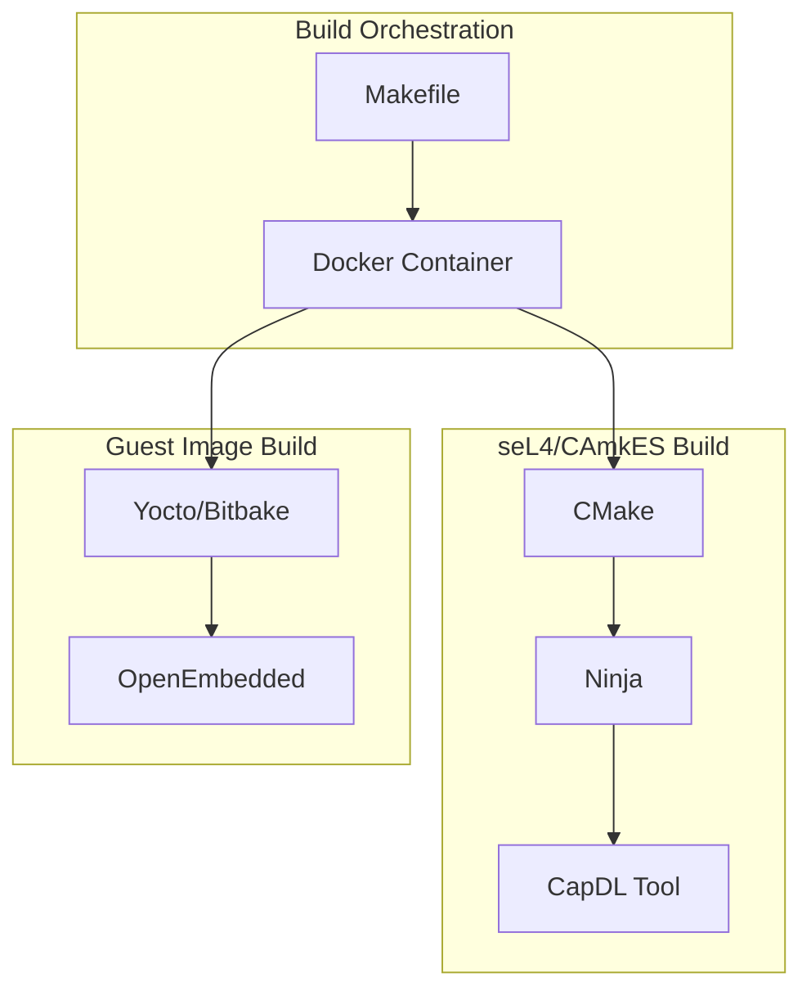
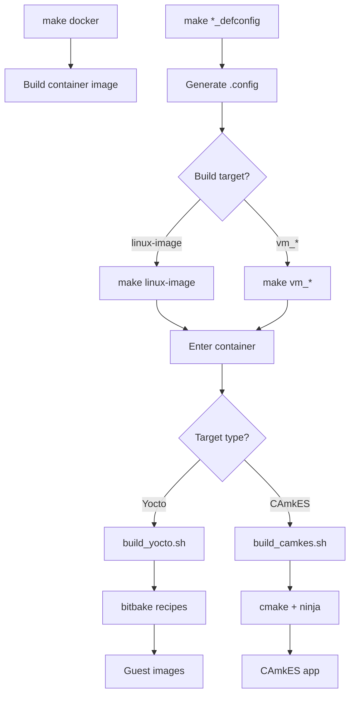

# Build Architecture

This document describes the multi-layered build system architecture for the TII seL4 virtio platform.

## Overview

The build system combines multiple technologies:



## Directory Structure

```
$WORKSPACE/
├── Makefile                    # Symlink to tii_sel4_build/Makefile
├── .config                     # Platform configuration
├── tii_sel4_build/
│   ├── Makefile               # Main build orchestration
│   ├── docker/
│   │   ├── Dockerfile         # Build container
│   │   └── enter_container.sh # Container entry script
│   ├── scripts/
│   │   ├── build_camkes.sh    # CAmkES build script
│   │   ├── build_yocto.sh     # Yocto build script
│   │   └── functions.sh       # Common functions
│   ├── configs/
│   │   ├── raspberrypi4-64_defconfig
│   │   └── qemuarm64_defconfig
│   └── yocto/
│       └── conf/              # Yocto layer config
└── vm-images/
    ├── meta-sel4/             # TII Yocto layer
    ├── poky/                  # Poky reference
    └── setup.sh               # Yocto setup script
```

## Build Flow

### Complete Build Flow



## Docker Container

### Dockerfile

The container provides a consistent build environment:

```dockerfile
# tii_sel4_build/docker/Dockerfile
FROM debian:bullseye

# Install build dependencies
RUN apt-get update && apt-get install -y \
    build-essential \
    cmake \
    ninja-build \
    python3 \
    device-tree-compiler \
    qemu-system-arm \
    ...

# Install Haskell Stack (for capdl-tool)
RUN curl -sSL https://get.haskellstack.org/ | sh

# Install cross-compiler
RUN apt-get install -y \
    gcc-aarch64-linux-gnu \
    g++-aarch64-linux-gnu

# Yocto dependencies
RUN apt-get install -y \
    gawk \
    texinfo \
    chrpath \
    diffstat \
    ...
```

### Container Entry

```bash
# docker/enter_container.sh
docker run -it \
    -v ${WORKSPACE}:${WORKSPACE} \
    -v ${HOME}/.ssh:${HOME}/.ssh \
    -v ${BUILD_CACHE_DIR}/stack:${HOME}/.stack \
    -v ${YOCTO_SOURCE_MIRROR_DIR}:${WORKSPACE}/downloads \
    -w ${WORKSPACE} \
    tiiuae/build:latest \
    "$@"
```

## Makefile Targets

### Top-Level Makefile

```makefile
# tii_sel4_build/Makefile

# Docker targets
docker:
	docker build -t tiiuae/build docker/

# Configuration targets
%_defconfig:
	cp configs/$@ .config

# Build targets
linux-image:
	$(ENTER_CONTAINER) scripts/build_yocto.sh

vm_%:
	CAMKES_VM_APP=$@ $(ENTER_CONTAINER) scripts/build_camkes.sh

# Simulation
simulate_%:
	./$(BUILD_DIR)/simulate
```

### Key Variables

| Variable | Description |
|----------|-------------|
| `PLATFORM` | Target platform (rpi4, qemu-arm-virt) |
| `AARCH64` | 64-bit ARM build |
| `CROSS_COMPILER_PREFIX` | Cross-compiler prefix |
| `CAMKES_VM_APP` | CAmkES application name |
| `MACHINE` | Yocto machine name |

## CMake Build

### CAmkES Build Script

```bash
# scripts/build_camkes.sh

# Source configuration
source .config

# Create build directory
BUILD_DIR="${PLATFORM}_${CAMKES_VM_APP}"
mkdir -p ${BUILD_DIR}

# Configure with CMake
cmake -G Ninja \
    -DPLATFORM=${PLATFORM} \
    -DCAMKES_VM_APP=${CAMKES_VM_APP} \
    -DAARCH64=${AARCH64} \
    -B ${BUILD_DIR} \
    -S projects/tii-sel4-vm

# Build
ninja -C ${BUILD_DIR}
```

### CMake Configuration

```cmake
# projects/tii-sel4-vm/CMakeLists.txt

cmake_minimum_required(VERSION 3.12)
project(tii-sel4-vm C ASM)

# Find seL4 packages
find_package(seL4 REQUIRED)
find_package(CAmkES REQUIRED)

# Include TII helpers
include(tii_camkes_vm_helpers.cmake)

# Build library
add_library(tii_sel4vm OBJECT
    src/libsel4vm_glue.c
    src/io_proxy.c
    src/fdt.c
    ...
)

# Generate CAmkES root server
GenerateCAmkESRootserver()
```

## Yocto Build

### Setup Script

```bash
# vm-images/setup.sh

# Source Poky environment
source poky/oe-init-build-env build

# Read machine from config
MACHINE=$(grep MACHINE ../.config | cut -d= -f2)

# Configure layers
bitbake-layers add-layer ../meta-sel4
bitbake-layers add-layer ../meta-openembedded/meta-oe
...
```

### Build Script

```bash
# scripts/build_yocto.sh

cd vm-images
source setup.sh

# Build images
bitbake vm-image-driver vm-image-user vm-image-boot
```

### Layer Configuration

```
# meta-sel4/conf/layer.conf
BBPATH .= ":${LAYERDIR}"
BBFILES += "${LAYERDIR}/recipes-*/*/*.bb"
BBFILE_COLLECTIONS += "meta-sel4"
BBFILE_PATTERN_meta-sel4 = "^${LAYERDIR}/"
LAYERSERIES_COMPAT_meta-sel4 = "scarthgap"
```

## Configuration System

### Platform Configs

```bash
# configs/raspberrypi4-64_defconfig
AARCH64=1
PLATFORM=rpi4
NUM_NODES=4
CROSS_COMPILER_PREFIX=aarch64-linux-gnu-
MACHINE=vm-raspberrypi4-64
```

### CMake Flags

Configuration values are converted to CMake flags:

```bash
# From .config
AARCH64=1
PLATFORM=rpi4

# Becomes
cmake -DAARCH64=1 -DPLATFORM=rpi4 ...
```

## Build Cache

### Haskell Stack Cache

CapDL tool requires Haskell Stack:

```bash
# Pre-populate cache
make build_cache
```

Cache location: `~/.tii_sel4_build/stack/`

### Yocto Shared State

```
vm-images/build/sstate-cache/    # Build artifacts
vm-images/build/downloads/       # Source tarballs
```

## CI/CD Integration

### GitHub Actions

```yaml
# .github/workflows/build-vm-images.yml
jobs:
  build:
    runs-on: self-hosted
    steps:
      - uses: actions/checkout@v3
      - name: Build Docker
        run: make docker
      - name: Configure
        run: make raspberrypi4-64_defconfig
      - name: Build Images
        run: make linux-image
      - name: Build App
        run: make vm_qemu_virtio
```

### Artifacts

Build artifacts are published to Artifactory:

```yaml
- name: Publish
  uses: ./.github/actions/artifact-publish
  with:
    path: rpi4_vm_qemu_virtio/images/
```

## Troubleshooting

### Container Issues

```bash
# Rebuild container
make docker DOCKER_OPTS="--no-cache"

# Debug container
docker run -it tiiuae/build /bin/bash
```

### CMake Issues

```bash
# Clean build
rm -rf rpi4_vm_qemu_virtio
make vm_qemu_virtio

# Verbose output
ninja -C rpi4_vm_qemu_virtio -v
```

### Yocto Issues

```bash
# Clean recipe
bitbake -c cleanall vm-image-driver

# Verbose build
bitbake -v vm-image-driver
```

## Related Documentation

- [Yocto Integration](yocto-integration.md)
- [CI/CD](ci-cd.md)
- [Building](../getting-started/building.md)
