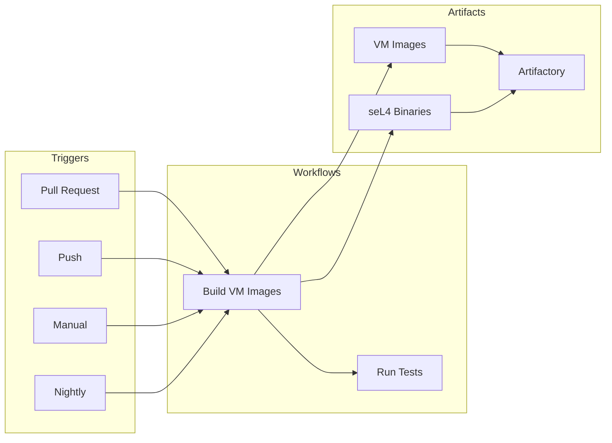

# CI/CD Pipeline

This document describes the GitHub Actions CI/CD pipeline for building and testing the TII seL4 virtio project.

## Overview

The CI/CD pipeline automates:

- Building Yocto guest images
- Building seL4/CAmkES applications
- Running tests on hardware
- Publishing artifacts to Artifactory



## Workflow Files

### Main Workflows

| Workflow | File | Description |
|----------|------|-------------|
| Build VM Images | `build-vm-images.yml` | Main build workflow |
| Run Tests | `run_tests.yml` | Hardware testing |
| PR Check | `pr.yml` | Pull request validation |

### Trigger Workflows

| Workflow | File | Trigger |
|----------|------|---------|
| `trigger-pr.yml` | Pull requests | Build on PR |
| `trigger-push-development.yml` | Push to development | Build on merge |
| `trigger-push-ci.yml` | Push to CI branch | CI testing |
| `trigger-nightly.yml` | Scheduled | Nightly builds |
| `trigger-manual.yml` | Manual | On-demand builds |
| `trigger-release.yml` | Tags | Release builds |
| `trigger-mirror-update.yml` | Mirror sync | Upstream sync |

## Build VM Images Workflow

### Workflow Definition

```yaml
# tii_sel4_build/.github/workflows/build-vm-images.yml
name: Build vm images
on:
  workflow_call:
    inputs:
      manifest-url:
        description: 'Manifest repository'
        default: 'git@github.com:tiiuae/tii_sel4_manifest.git'
        type: string
      manifest-revision:
        description: 'Manifest revision'
        default: 'tii/development'
        type: string
      platform:
        description: 'Platform config'
        default: 'raspberrypi4-64_defconfig'
        type: string
    secrets:
      ssh-key:
        required: true
      rt-user:
        required: true
      rt-api-key:
        required: true
      rt-url:
        required: true
```

### Jobs

#### 1. Code Checkout (code)

Creates a manifest for consistent builds:

```yaml
jobs:
  code:
    name: Create manifest for the jobs
    runs-on: ubuntu-latest
    outputs:
      manifest: ${{ steps.manifest.outputs.manifest-xml }}
    steps:
      - name: Generate manifest
        uses: ./.github/actions/repo-manifest-checkout
        with:
          manifest-url: ${{ inputs.manifest-url }}
          manifest-revision: ${{ inputs.manifest-revision }}
```

#### 2. Build QEMU Virtio (build-qemu-virtio)

Builds the main virtio demo:

```yaml
  build-qemu-virtio:
    runs-on: [self-hosted, yocto-build]
    needs: [code]
    steps:
      - name: Build Yocto images
        uses: ./.github/actions/yocto-build
        with:
          workspace: ./workspace/vm-images
          recipes: "vm-image-driver vm-image-driver-gui vm-image-boot"

      - name: Build vm_qemu_virtio
        uses: ./.github/actions/sel4-build
        with:
          CONFIG: ${{ inputs.platform }}
          TARGET: 'vm_qemu_virtio'

      - name: Publish images to artifactory
        uses: ./.github/actions/artifact-publish
```

#### 3. Build Reference Images (build-reference-images)

Builds test and reference applications:

```yaml
  build-reference-images:
    runs-on: ubuntu-latest
    needs: [code]
    steps:
      - name: Build vm_minimal
        uses: ./.github/actions/sel4-build
        with:
          target: 'vm_minimal'

      - name: Build vm_multi
        uses: ./.github/actions/sel4-build
        with:
          target: 'vm_multi'

      - name: Build sel4test
        uses: ./.github/actions/sel4-build
        with:
          target: 'sel4test'
```

## Custom Actions

### repo-manifest-checkout

Handles Google Repo checkout with manifest:

```yaml
# .github/actions/repo-manifest-checkout/action.yml
inputs:
  manifest-url:
    description: 'Manifest repository URL'
  manifest-revision:
    description: 'Manifest branch/tag'
  manifest:
    description: 'Manifest filename'
  repo-override:
    description: 'Override specific repo'
  ssh-key:
    description: 'SSH key for checkout'
```

### yocto-build

Builds Yocto images:

```yaml
# .github/actions/yocto-build/action.yml
inputs:
  workspace:
    description: 'Build workspace path'
  recipes:
    description: 'Recipes to build'
```

### sel4-build

Builds seL4/CAmkES applications:

```yaml
# .github/actions/sel4-build/action.yml
inputs:
  config:
    description: 'Platform configuration'
  target:
    description: 'Build target'
  workspace:
    description: 'Build workspace'
```

### artifact-publish

Publishes to Artifactory:

```yaml
# .github/actions/artifact-publish/action.yml
inputs:
  rt-user:
    description: 'Artifactory username'
  rt-api-key:
    description: 'Artifactory API key'
  rt-url:
    description: 'Artifactory URL'
  input-paths:
    description: 'Files to publish'
```

## Build Targets

### vm_qemu_virtio

Two-VM virtio demo:

```yaml
target: 'vm_qemu_virtio'
artifacts:
  - capdl-loader-image-arm-bcm2711
  - vm-image-driver-vm-raspberrypi4-64.tar.bz2
  - vm-image-driver-vm-raspberrypi4-64.ext3
```

### vm_minimal

Minimal single-VM example:

```yaml
target: 'vm_minimal'
artifacts:
  - capdl-loader-image-arm-bcm2711
```

### vm_multi

Multi-VM example:

```yaml
target: 'vm_multi'
artifacts:
  - capdl-loader-image-arm-bcm2711
```

### sel4test

seL4 test suite:

```yaml
target: 'sel4test'
artifacts:
  - sel4test-driver-image-arm-bcm2711
```

## Hardware Testing

### Test Workflow

```yaml
# tii_sel4_build/.github/workflows/run_tests.yml
name: Run tests
on:
  workflow_call:
    inputs:
      test-target:
        description: 'Test to run'
        type: string

jobs:
  hardware-test:
    runs-on: [self-hosted, rpi4-test]
    steps:
      - name: Flash device
        run: ./scripts/flash.sh ${{ inputs.test-target }}

      - name: Run tests
        run: ./scripts/run_tests.sh

      - name: Collect results
        uses: actions/upload-artifact@v3
        with:
          name: test-results
          path: results/
```

### Test Hardware

- Raspberry Pi 4 test rigs
- Self-hosted runners with serial access
- Automated flashing and boot monitoring

## Artifact Publishing

### Artifactory Structure

```
tii-sel4-artifacts/
├── rpi4_vm_qemu_virtio/
│   ├── capdl-loader-image-arm-bcm2711
│   ├── vm-image-driver-vm-raspberrypi4-64.tar.bz2
│   └── vm-image-driver-vm-raspberrypi4-64.ext3
├── rpi4_vm_minimal/
│   └── capdl-loader-image-arm-bcm2711
├── rpi4_vm_multi/
│   └── capdl-loader-image-arm-bcm2711
└── rpi4_vm_sel4test/
    └── sel4test-driver-image-arm-bcm2711
```

### Publishing Configuration

```yaml
- name: Publish images to artifactory
  uses: ./.github/actions/artifact-publish
  with:
    rt-user: ${{ secrets.rt-user }}
    rt-api-key: ${{ secrets.rt-api-key }}
    rt-url: ${{ secrets.rt-url }}
    build-num: ${{ github.run_number }}
    input-paths: |
      workspace/rpi4_vm_qemu_virtio/images/capdl-loader-image-arm-bcm2711:tii-sel4-artifacts/rpi4_vm_qemu_virtio/
      workspace/vm-images/build/tmp/deploy/images/vm-raspberrypi4-64/vm-image-driver-vm-raspberrypi4-64.tar.bz2:tii-sel4-artifacts/rpi4_vm_qemu_virtio/
```

## Trigger Configuration

### Pull Request Trigger

```yaml
# tii_sel4_build/.github/workflows/trigger-pr.yml
name: PR Build
on:
  pull_request:
    branches:
      - 'tii/**'

jobs:
  build:
    uses: ./.github/workflows/build-vm-images.yml
    with:
      manifest-revision: ${{ github.head_ref }}
    secrets: inherit
```

### Nightly Trigger

```yaml
# tii_sel4_build/.github/workflows/trigger-nightly.yml
name: Nightly Build
on:
  schedule:
    - cron: '0 2 * * *'  # 2 AM UTC

jobs:
  build:
    uses: ./.github/workflows/build-vm-images.yml
    with:
      manifest-revision: 'tii/development'
    secrets: inherit
```

### Manual Trigger

```yaml
# tii_sel4_build/.github/workflows/trigger-manual.yml
name: Manual Build
on:
  workflow_dispatch:
    inputs:
      platform:
        description: 'Platform'
        default: 'raspberrypi4-64_defconfig'
      target:
        description: 'Build target'
        default: 'vm_qemu_virtio'

jobs:
  build:
    uses: ./.github/workflows/build-vm-images.yml
    with:
      platform: ${{ inputs.platform }}
    secrets: inherit
```

## Build Environment

### Self-Hosted Runners

```yaml
# Yocto builds require self-hosted runners
runs-on: [self-hosted, yocto-build]

# Hardware tests require test runners
runs-on: [self-hosted, rpi4-test]
```

### Runner Requirements

**Yocto Build Runner:**
- 32GB+ RAM
- 500GB+ disk space
- Docker support
- Yocto dependencies installed

**Test Runner:**
- Raspberry Pi 4 connected via serial
- USB relay for power control
- Network access for flashing

## Secrets Configuration

| Secret | Description |
|--------|-------------|
| `SSH_KEY` | Deploy key for repo access |
| `RT_USER` | Artifactory username |
| `RT_API_KEY` | Artifactory API key |
| `RT_URL` | Artifactory server URL |

## Debugging CI Failures

### View Logs

```bash
# GitHub Actions UI provides logs
# Or use GitHub CLI
gh run view <run-id> --log
```

### Local Build

```bash
# Reproduce CI build locally
cd tii_sel4_build
make docker
make raspberrypi4-64_defconfig
make vm_qemu_virtio
```

### Common Issues

| Issue | Cause | Solution |
|-------|-------|----------|
| Manifest checkout fails | SSH key issue | Check deploy keys |
| Yocto build fails | Disk space | Clean sstate-cache |
| Artifactory publish fails | Auth issue | Verify secrets |
| Hardware test timeout | Boot failure | Check serial logs |

## Source Files

| File | Description |
|------|-------------|
| `tii_sel4_build/.github/workflows/` | Workflow definitions |
| `tii_sel4_build/.github/actions/` | Custom actions |
| `tii_sel4_build/scripts/` | Build scripts |

## Related Documentation

- [Build Architecture](build-architecture.md)
- [Yocto Integration](yocto-integration.md)
- [Building](../getting-started/building.md)
