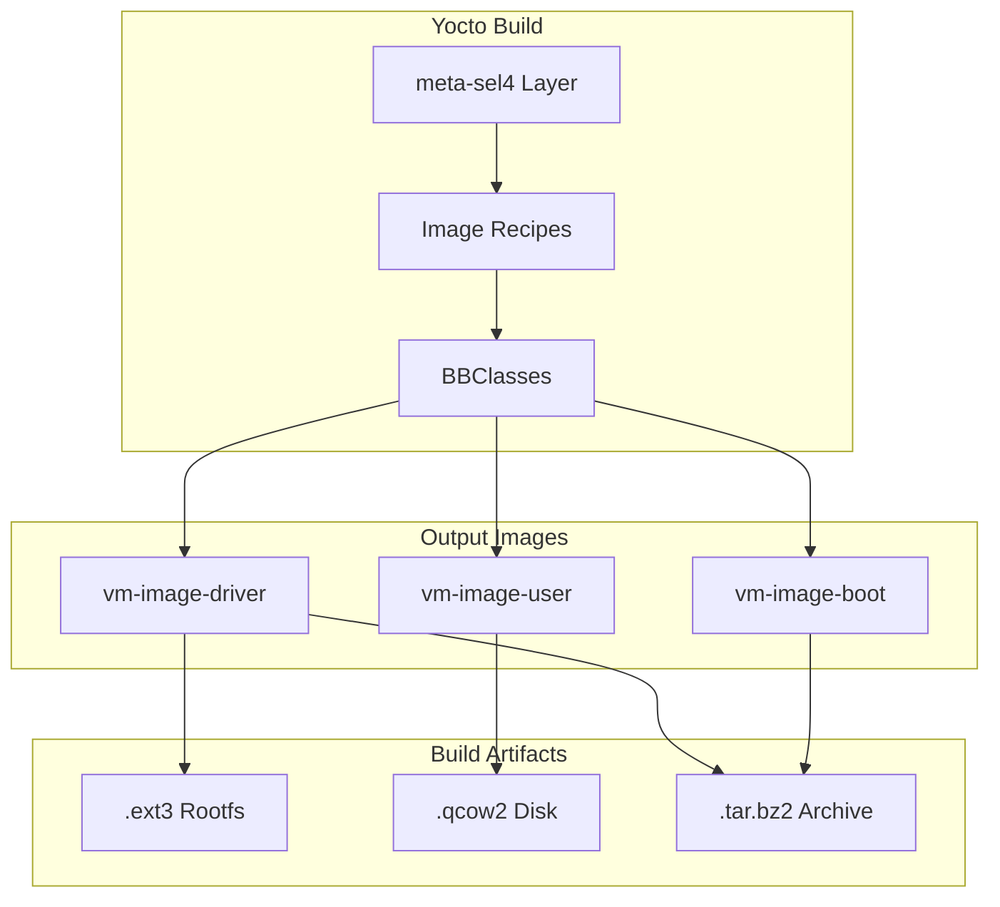

# Yocto Integration

This document describes the Yocto/OpenEmbedded integration for building guest VM images.

## Overview

TII uses Yocto to build Linux guest images for both device and driver VMs:



## Directory Structure

```
vm-images/
├── meta-sel4/                    # TII Yocto layer
│   ├── classes/
│   │   ├── vm-guest-image.bbclass
│   │   ├── vm-guest-images-install.bbclass
│   │   ├── vm-image-features.bbclass
│   │   └── image-hostname.bbclass
│   ├── images/
│   │   ├── vm-image-driver.bb
│   │   ├── vm-image-driver-gui.bb
│   │   ├── vm-image-user.bb
│   │   ├── vm-image-user-gui.bb
│   │   └── vm-image-boot.bb
│   ├── recipes-*/                # Custom recipes
│   └── conf/
│       └── layer.conf
├── meta-raspberrypi/             # RPi BSP layer
├── meta-virtualization/          # Virtualization support
└── build/
    └── conf/
        ├── local.conf
        └── bblayers.conf
```

## Image Types

### vm-image-driver

The device VM image that runs QEMU backends:

```bitbake
# vm-images/meta-sel4/images/vm-image-driver.bb
require recipes-core/images/core-image-minimal.bb
inherit image-hostname vm-image-features vm-guest-images-install

SUMMARY = "Driver VM"

IMAGE_FEATURES += " \
    qemu-virtualization \
    benchmark \
"

# Hostname for the VM
export VM_IMAGE_HOSTNAME = "driver-vm"

# Nested guest images to install
VM_GUEST_IMAGES ?= " \
    vm-image-user \
"
VM_GUEST_IMAGE_vm-image-user = "user-vm.qcow2"
```

**Key Features:**
- QEMU with seL4 accelerator
- vhost kernel modules
- Benchmark tools
- Contains nested user VM image

### vm-image-user

The driver VM image that uses virtio devices:

```bitbake
# vm-images/meta-sel4/images/vm-image-user.bb
require recipes-core/images/core-image-minimal.bb
inherit image-hostname vm-image-features vm-guest-image

SUMMARY = "User VM"

IMAGE_FEATURES += " \
    benchmark \
"

export VM_IMAGE_HOSTNAME = "user-vm"

# Add QEMU shared folder mount
add_qemu_share() {
    mkdir -p ${IMAGE_ROOTFS}/mnt/shared
    cat >> ${IMAGE_ROOTFS}${sysconfdir}/fstab <<EOF
shared /mnt/shared    9p      trans=virtio,version=9p2000.L   0 0
EOF
}
```

**Key Features:**
- Minimal Linux image
- virtio drivers
- 9P filesystem support for QEMU sharing
- Benchmark tools

### vm-image-boot

Standalone boot image for testing:

```bitbake
# vm-images/meta-sel4/images/vm-image-boot.bb
require recipes-core/images/core-image-minimal.bb
inherit image-hostname

SUMMARY = "Boot VM"
export VM_IMAGE_HOSTNAME = "boot-vm"
```

## BBClasses

### vm-guest-image.bbclass

Adds QCOW2 image format support:

```bitbake
# vm-images/meta-sel4/classes/vm-guest-image.bbclass
IMAGE_FSTYPES += " \
    ext4.qcow2 \
"
```

This enables building QCOW2 disk images for use with QEMU.

### vm-guest-images-install.bbclass

Installs nested guest images into the device VM:

```bitbake
# vm-images/meta-sel4/classes/vm-guest-images-install.bbclass
# Copies guest images (e.g., user-vm.qcow2) into /var/lib/virt/images/
```

**Variables:**
| Variable | Description |
|----------|-------------|
| `VM_GUEST_IMAGES` | List of image recipes to include |
| `VM_GUEST_IMAGE_<recipe>` | Output filename for image |

### vm-image-features.bbclass

Defines feature packages for VM images:

```bitbake
# vm-images/meta-sel4/classes/vm-image-features.bbclass

FEATURE_PACKAGES_qemu-virtualization = "\
    qemu \
    qemu-rnd-helper \
    kernel-module-vhost \
    kernel-module-vhost-net \
    kernel-module-tap \
"

FEATURE_PACKAGES_benchmark = " \
    screen \
    tii-benchmark \
"

FEATURE_PACKAGES_gui-benchmark = " \
    x11perf \
    xrestop \
    xwininfo \
    mesa-demos \
"
```

**Available Features:**
| Feature | Description |
|---------|-------------|
| `qemu-virtualization` | QEMU and vhost modules |
| `benchmark` | Performance testing tools |
| `gui-benchmark` | X11/OpenGL benchmarks |
| `gui-test` | Graphics testing (piglit) |

### image-hostname.bbclass

Sets the hostname for each VM:

```bitbake
# vm-images/meta-sel4/classes/image-hostname.bbclass
# Uses VM_IMAGE_HOSTNAME variable to set /etc/hostname
```

## Custom Recipes

### seL4-Specific Kernel Modules

```
meta-sel4/recipes-kernel/
├── kernel-module-sel4-virt/      # Virtio kernel module
├── kernel-module-sel4-tracebuffer/  # Tracing support
└── cross-connector/              # Cross-VM connection driver
```

### QEMU with seL4 Accelerator

```
meta-sel4/recipes-devtools/
└── qemu/
    └── qemu_%.bbappend           # Adds seL4 accelerator patches
```

### Benchmark Tools

```
meta-sel4/recipes-benchmark/
└── tii-benchmark/
    └── tii-benchmark_%.bb        # TII benchmark suite
```

## Build Configuration

### local.conf

```bash
# vm-images/build/conf/local.conf

# Machine configuration
MACHINE = "vm-raspberrypi4-64"

# Build parallelism
BB_NUMBER_THREADS = "8"
PARALLEL_MAKE = "-j8"

# Download directory (shared cache)
DL_DIR = "${TOPDIR}/../downloads"

# SSTATE cache
SSTATE_DIR = "${TOPDIR}/../sstate-cache"

# Image features
EXTRA_IMAGE_FEATURES += "debug-tweaks"

# SWIOTLB size
CMDLINE_SWIOTLB = "swiotlb=65536"
```

### bblayers.conf

```bash
# vm-images/build/conf/bblayers.conf

BBLAYERS ?= " \
    ${TOPDIR}/../meta-poky \
    ${TOPDIR}/../meta-openembedded/meta-oe \
    ${TOPDIR}/../meta-openembedded/meta-networking \
    ${TOPDIR}/../meta-virtualization \
    ${TOPDIR}/../meta-raspberrypi \
    ${TOPDIR}/../meta-sel4 \
"
```

## Building Images

### Initialize Build Environment

```bash
cd vm-images
source poky/oe-init-build-env build
```

### Build Individual Images

```bash
# Build driver VM image
bitbake vm-image-driver

# Build user VM image
bitbake vm-image-user

# Build GUI variants
bitbake vm-image-driver-gui
bitbake vm-image-user-gui
```

### Build All Images

```bash
# Build all VM images
bitbake vm-image-driver vm-image-user vm-image-boot
```

### Build Output

```
build/tmp/deploy/images/vm-raspberrypi4-64/
├── vm-image-driver-vm-raspberrypi4-64.ext3
├── vm-image-driver-vm-raspberrypi4-64.tar.bz2
├── vm-image-user-vm-raspberrypi4-64.ext4.qcow2
├── vm-image-user-vm-raspberrypi4-64.tar.bz2
└── modules-vm-raspberrypi4-64.tgz
```

## Image Formats

| Format | Use Case | Description |
|--------|----------|-------------|
| `.ext3` | seL4 VMM | Raw filesystem for direct VM loading |
| `.ext4.qcow2` | QEMU | QCOW2 disk image for nested VMs |
| `.tar.bz2` | Archive | Compressed rootfs for extraction |

## Kernel Configuration

### Device VM Kernel

```kconfig
# Required for QEMU
CONFIG_VHOST=m
CONFIG_VHOST_NET=m
CONFIG_TAP=m

# Required for seL4 integration
CONFIG_UIO=y
CONFIG_UIO_PCI_GENERIC=y
```

### Driver VM Kernel

```kconfig
# virtio drivers
CONFIG_VIRTIO=y
CONFIG_VIRTIO_PCI=y
CONFIG_VIRTIO_BLK=y
CONFIG_VIRTIO_NET=y

# Cross-VM communication
CONFIG_UIO=y
```

## Customization

### Adding Packages to an Image

```bitbake
# In your image recipe
IMAGE_INSTALL:append = " \
    my-package \
    another-package \
"
```

### Creating a Custom Image

```bitbake
# my-custom-image.bb
require vm-image-user.bb

SUMMARY = "My Custom VM Image"

IMAGE_INSTALL:append = " \
    custom-app \
"

IMAGE_FEATURES += " \
    ssh-server-dropbear \
"
```

### Adding a Custom Feature

```bitbake
# In vm-image-features.bbclass or custom bbclass
FEATURE_PACKAGES_my-feature = " \
    package1 \
    package2 \
"
```

Then use in image:
```bitbake
IMAGE_FEATURES += "my-feature"
```

## Nested Image Installation

Device VMs can contain images for nested VMs:

```bitbake
# In vm-image-driver.bb
VM_GUEST_IMAGES ?= " \
    vm-image-user \
    vm-image-custom \
"
VM_GUEST_IMAGE_vm-image-user = "user-vm.qcow2"
VM_GUEST_IMAGE_vm-image-custom = "custom-vm.qcow2"
```

Images are installed to `/var/lib/virt/images/`:
```
/var/lib/virt/images/
├── user-vm.qcow2
└── custom-vm.qcow2
```

## Troubleshooting

### Build Failures

```bash
# Clean and rebuild
bitbake -c cleanall vm-image-driver
bitbake vm-image-driver

# Verbose output
bitbake -v vm-image-driver
```

### Missing Dependencies

```bash
# Check recipe dependencies
bitbake -g vm-image-driver
cat recipe-depends.dot
```

### Image Size Issues

```bitbake
# Increase rootfs size
IMAGE_ROOTFS_EXTRA_SPACE = "262144"  # 256MB extra
```

## Integration with seL4 Build

The Makefile orchestrates both Yocto and CMake builds:

```makefile
# From tii_sel4_build/Makefile
linux-image:
    cd vm-images && \
    source poky/oe-init-build-env build && \
    bitbake vm-image-driver vm-image-user

vm_qemu_virtio: linux-image
    # Build seL4/CAmkES application with Linux images
```

## Source Files

| File | Description |
|------|-------------|
| `vm-images/meta-sel4/` | TII Yocto layer |
| `vm-images/meta-sel4/images/` | Image recipes |
| `vm-images/meta-sel4/classes/` | BBClasses |
| `vm-images/meta-sel4/recipes-*/` | Package recipes |

## Related Documentation

- [Build Architecture](build-architecture.md)
- [CI/CD](ci-cd.md)
- [Guest Linux](../integration/guest-linux.md)
