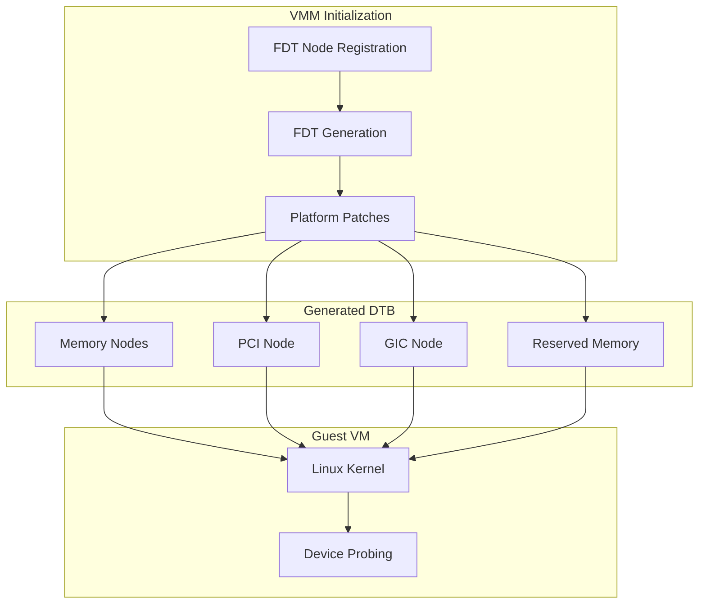

# Device Tree Generation

This document describes the Flattened Device Tree (FDT) generation for guest VMs.

## Overview

Guest VMs receive a dynamically generated device tree that describes:

- Available memory regions
- Virtual devices (PCI, interrupt controller)
- Reserved memory (SWIOTLB)
- Platform-specific configuration



## FDT Node Registration

### Registration Macro

FDT nodes are registered using a linker section:

```c
// From include/tii/fdt.h
#define DEFINE_FDT_NODE(name, fn) \
    static fdt_node_t __fdt_node_##name \
    __attribute__((used, section("_fdt_node"))) = { \
        .generate = fn \
    }

typedef struct fdt_node {
    int (*generate)(void *fdt, void *cookie);
} fdt_node_t;
```

### Example Registration

```c
// Register a custom FDT node generator
static int generate_my_device(void *fdt, void *cookie) {
    fdt_begin_node(fdt, "my-device@1000");
    fdt_property_string(fdt, "compatible", "vendor,my-device");
    fdt_property_u32(fdt, "reg", 0x1000);
    fdt_end_node(fdt);
    return 0;
}

DEFINE_FDT_NODE(my_device, generate_my_device);
```

### Generation All Nodes

```c
// From src/fdt.c
void fdt_node_generate_all(void *fdt, void *cookie) {
    // Iterate through _fdt_node section
    extern fdt_node_t __start__fdt_node[];
    extern fdt_node_t __stop__fdt_node[];

    for (fdt_node_t *node = __start__fdt_node;
         node < __stop__fdt_node;
         node++) {
        node->generate(fdt, cookie);
    }
}
```

## Core FDT Nodes

### Memory Node

```c
static int generate_memory_node(void *fdt, void *cookie) {
    vm_config_t *config = cookie;

    fdt_begin_node(fdt, "memory@40000000");
    fdt_property_string(fdt, "device_type", "memory");

    uint64_t reg[] = {
        cpu_to_fdt64(config->ram_base),
        cpu_to_fdt64(config->ram_size)
    };
    fdt_property(fdt, "reg", reg, sizeof(reg));

    fdt_end_node(fdt);
    return 0;
}
```

### PCI Node

```c
static int generate_pci_node(void *fdt, void *cookie) {
    fdt_begin_node(fdt, "pci@70000000");

    fdt_property_string(fdt, "compatible", "pci-host-ecam-generic");
    fdt_property_string(fdt, "device_type", "pci");
    fdt_property_u32(fdt, "#address-cells", 3);
    fdt_property_u32(fdt, "#size-cells", 2);
    fdt_property_u32(fdt, "#interrupt-cells", 1);

    // Config space (ECAM)
    uint64_t reg[] = {
        cpu_to_fdt64(PCI_CFG_BASE),
        cpu_to_fdt64(PCI_CFG_SIZE)
    };
    fdt_property(fdt, "reg", reg, sizeof(reg));

    // Bus range
    uint32_t bus_range[] = { 0, 0 };
    fdt_property(fdt, "bus-range", bus_range, sizeof(bus_range));

    // Memory ranges
    uint32_t ranges[] = {
        // flags, pci_addr_hi, pci_addr_lo, cpu_addr_hi, cpu_addr_lo, size_hi, size_lo
        0x02000000, 0, PCI_MEM_BASE, 0, PCI_MEM_BASE, 0, PCI_MEM_SIZE
    };
    fdt_property(fdt, "ranges", ranges, sizeof(ranges));

    // MSI parent
    if (msi_phandle) {
        fdt_property_u32(fdt, "msi-parent", msi_phandle);
    }

    // Interrupt map
    generate_interrupt_map(fdt);

    fdt_end_node(fdt);
    return 0;
}
```

### Reserved Memory

```c
static int generate_reserved_memory(void *fdt, void *cookie) {
    vm_config_t *config = cookie;

    fdt_begin_node(fdt, "reserved-memory");
    fdt_property_u32(fdt, "#address-cells", 2);
    fdt_property_u32(fdt, "#size-cells", 2);
    fdt_property_empty(fdt, "ranges");

    // SWIOTLB region
    fdt_begin_node(fdt, "swiotlb@50000000");
    fdt_property_string(fdt, "compatible", "restricted-dma-pool");
    uint64_t reg[] = {
        cpu_to_fdt64(config->swiotlb_base),
        cpu_to_fdt64(config->swiotlb_size)
    };
    fdt_property(fdt, "reg", reg, sizeof(reg));
    fdt_property_empty(fdt, "reusable");

    uint32_t phandle = fdt_alloc_phandle();
    fdt_property_u32(fdt, "phandle", phandle);

    fdt_end_node(fdt);  // swiotlb

    fdt_end_node(fdt);  // reserved-memory
    return 0;
}
```

### GICv2m Node

```c
static int generate_gicv2m_node(void *fdt, void *cookie) {
    gicv2m_config_t *config = cookie;

    fdt_begin_node(fdt, "v2m@8020000");
    fdt_property_string(fdt, "compatible", "arm,gic-v2m-frame");
    fdt_property_empty(fdt, "msi-controller");

    uint64_t reg[] = {
        cpu_to_fdt64(config->base),
        cpu_to_fdt64(0x1000)
    };
    fdt_property(fdt, "reg", reg, sizeof(reg));

    uint32_t phandle = fdt_alloc_phandle();
    fdt_property_u32(fdt, "phandle", phandle);

    // Store phandle for PCI node reference
    msi_phandle = phandle;

    fdt_end_node(fdt);
    return 0;
}
```

## Platform-Specific Customization

### RPi4 USB Nodes

```c
// From src/plat/rpi4/fdt.c
static int generate_rpi4_usb(void *fdt, void *cookie) {
    // Generate USB controller nodes for RPi4
    fdt_begin_node(fdt, "usb@7e980000");
    fdt_property_string(fdt, "compatible", "brcm,bcm2835-usb");
    // ...
    fdt_end_node(fdt);
    return 0;
}

DEFINE_FDT_NODE(rpi4_usb, generate_rpi4_usb);
```

### QEMU ARM Virt

Default nodes work for QEMU ARM Virt platform.

## PCI Device Nodes

### Per-Device Generation

When a PCI device is registered, its FDT node is generated:

```c
void fdt_add_pci_device(void *fdt, pci_device_t *dev) {
    char name[32];
    snprintf(name, sizeof(name), "pci@%x,%x",
             PCI_SLOT(dev->bdf), PCI_FUNC(dev->bdf));

    fdt_begin_node(fdt, name);

    // Address
    uint32_t reg[] = {
        (dev->bdf << 8),  // config address
        0, 0, 0, 0        // no BAR mapping in node
    };
    fdt_property(fdt, "reg", reg, sizeof(reg));

    // Assign SWIOTLB region
    if (dev->needs_dma) {
        fdt_property_u32(fdt, "memory-region", swiotlb_phandle);
    }

    fdt_end_node(fdt);
}
```

## Phandle Management

### Allocation

```c
static uint32_t next_phandle = 1;

uint32_t fdt_alloc_phandle(void) {
    return next_phandle++;
}
```

### Cross-References

Phandles enable cross-references between nodes:

```dts
// Generated DTS equivalent
gicv2m: v2m@8020000 {
    compatible = "arm,gic-v2m-frame";
    phandle = <0x1>;
};

pci@70000000 {
    msi-parent = <0x1>;  // Reference to gicv2m
};
```

## DTB Output

### Generation Flow

```c
int generate_guest_dtb(vm_t *vm, void **dtb, size_t *size) {
    void *fdt = malloc(FDT_MAX_SIZE);

    // Initialize FDT
    fdt_create(fdt, FDT_MAX_SIZE);
    fdt_begin_node(fdt, "");

    // Add standard properties
    fdt_property_u32(fdt, "#address-cells", 2);
    fdt_property_u32(fdt, "#size-cells", 2);
    fdt_property_string(fdt, "compatible", "linux,dummy-virt");

    // Generate all registered nodes
    fdt_node_generate_all(fdt, vm->config);

    // End and pack
    fdt_end_node(fdt);
    fdt_finish(fdt);

    *dtb = fdt;
    *size = fdt_totalsize(fdt);
    return 0;
}
```

### Loading into Guest

```c
// Copy DTB to guest memory
void load_guest_dtb(vm_t *vm, void *dtb, size_t size) {
    uintptr_t dtb_addr = vm->config->dtb_addr;

    // Map and copy
    vm_ram_touch(vm, dtb_addr, size, copy_dtb, dtb);

    // Pass to kernel (via register or boot args)
    vm->vcpu->regs.x0 = dtb_addr;
}
```

## Debugging

### Dump Generated DTB

```bash
# In guest VM
dtc -I dtb -O dts /sys/firmware/fdt

# Or from host with extracted DTB
dtc -I dtb -O dts guest.dtb
```

### Common Issues

| Issue | Cause | Solution |
|-------|-------|----------|
| Device not found | Missing FDT node | Add node generator |
| Wrong address | Incorrect reg property | Check address/size |
| No interrupts | Missing interrupt properties | Add interrupt-map |

## Source Files

| File | Description |
|------|-------------|
| `src/fdt.c` | Core FDT generation |
| `src/plat/rpi4/fdt.c` | RPi4-specific nodes |
| `include/tii/fdt.h` | FDT API |

## Related Documentation

- [PCI Passthrough](pci-passthrough.md) - PCI node generation
- [Memory Model](../architecture/memory-model.md) - Reserved memory
- [Interrupt Handling](interrupt-handling.md) - Interrupt mapping
