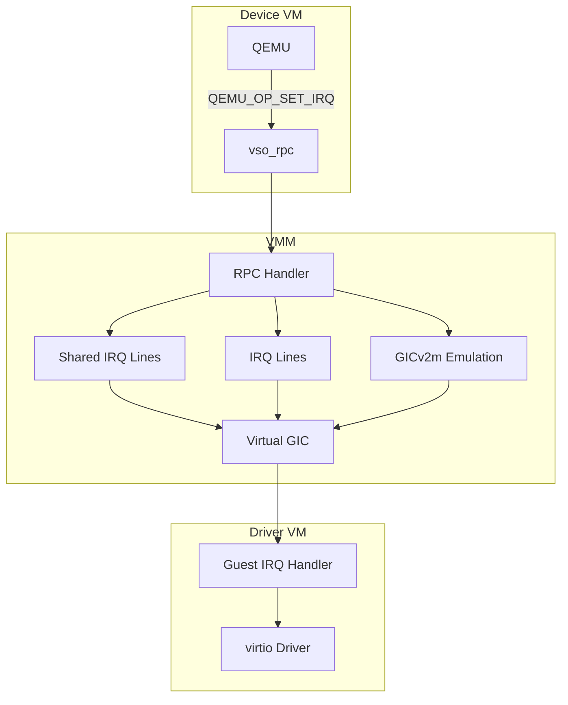
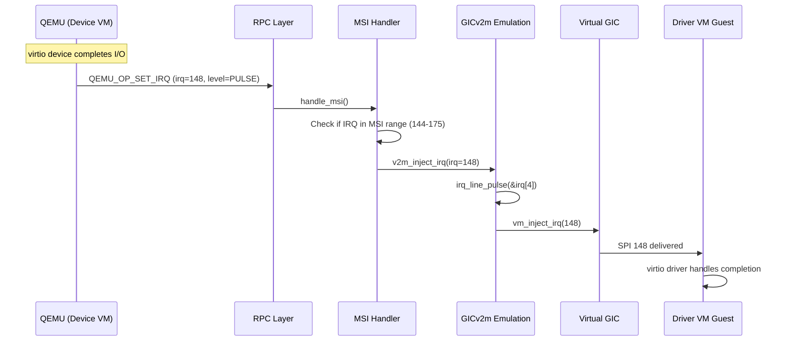

# Interrupt Handling

This document describes interrupt emulation and handling for guest VMs.

## Overview

The interrupt handling system provides:

- Virtual GIC (Generic Interrupt Controller) emulation
- IRQ line emulation (edge and level triggered)
- Shared IRQ lines for PCI devices
- MSI (Message Signaled Interrupt) support via GICv2m



## IRQ Line Emulation

### Single IRQ Line

For simple devices with dedicated interrupt lines:

```c
// From include/tii/irq_line.h
typedef struct irq_line {
    vm_t *vm;               // Target VM
    int irq;                // Guest IRQ number
    bool level;             // Current level (for level-triggered)
} irq_line_t;

// Initialize IRQ line
int irq_line_init(irq_line_t *line, vm_t *vm, int irq);

// Set IRQ level
void irq_line_set(irq_line_t *line, int level);

// Pulse IRQ (edge triggered)
void irq_line_pulse(irq_line_t *line);
```

### Implementation

```c
// From src/irq_line.c
void irq_line_set(irq_line_t *line, int level) {
    if (level) {
        vm_inject_irq(line->vm, line->irq);
    }
    line->level = level;
}

void irq_line_pulse(irq_line_t *line) {
    vm_inject_irq(line->vm, line->irq);
}
```

## Shared IRQ Lines

### Purpose

PCI devices may share interrupt lines (INTx). The shared IRQ line tracks multiple sources:

```c
// From include/tii/shared_irq_line.h
typedef struct shared_irq_line {
    uint64_t sources;       // Bitmap: bit N = source N active
    int irq;                // Guest IRQ number
    vm_t *vm;               // Target VM
} shared_irq_line_t;
```

### Operations

```c
// Initialize shared IRQ line
int shared_irq_line_init(shared_irq_line_t *line, vm_t *vm, int irq);

// Set source active (edge-triggered injection)
void shared_irq_set(shared_irq_line_t *line, int source);

// Clear source
void shared_irq_clear(shared_irq_line_t *line, int source);

// Pulse source
void shared_irq_pulse(shared_irq_line_t *line, int source);
```

### Implementation

```c
// From src/shared_irq_line.c
void shared_irq_set(shared_irq_line_t *line, int source) {
    uint64_t old = line->sources;
    line->sources |= (1ULL << source);

    // Inject on rising edge (first source becoming active)
    if (old == 0 && line->sources != 0) {
        vm_inject_irq(line->vm, line->irq);
    }
}

void shared_irq_clear(shared_irq_line_t *line, int source) {
    line->sources &= ~(1ULL << source);
}

void shared_irq_pulse(shared_irq_line_t *line, int source) {
    // Set then clear - generates edge
    shared_irq_set(line, source);
    shared_irq_clear(line, source);
}
```

## GICv2m MSI Emulation

### Overview

GICv2m provides MSI (Message Signaled Interrupt) support for ARM systems using GICv2. Instead of dedicated interrupt lines, MSI allows devices to signal interrupts by writing to a specific memory address. This is essential for PCIe devices and virtio-pci.



### Data Structures

```c
// From include/tii/gicv2m.h
#define GICV2M_IRQ_MAX 128

typedef struct gicv2m {
    uintptr_t base;                    // GICv2m frame base address
    size_t size;                       // Frame size (typically 4KB)
    irq_line_t irq[GICV2M_IRQ_MAX];   // Array of IRQ lines
    uint32_t irq_base;                 // First SPI number (e.g., 144)
    uint32_t num_irq;                  // Number of MSI-capable SPIs
} gicv2m_t;
```

**Fields:**
| Field | Description |
|-------|-------------|
| `base` | Guest physical address of MSI frame |
| `size` | Size of memory region (4KB) |
| `irq[]` | Pre-initialized IRQ lines for each MSI |
| `irq_base` | First SPI number available for MSI |
| `num_irq` | Count of MSI-capable interrupts |

### Platform Configuration

**Raspberry Pi 4:**
```c
// From src/plat/rpi4/msi.c
static gicv2m_t v2m = {
    .base = 0x08021000,      // GICv2m frame address
    .size = BIT(PAGE_BITS_4K),  // 4KB
    .irq_base = 144,         // First MSI SPI
    .num_irq = 32,           // 32 MSIs (SPIs 144-175)
};
```

**QEMU ARM Virt:**
The QEMU platform may use different addresses matching the QEMU virt machine's GICv2m configuration.

### MSI Frame Registers

The GICv2m frame provides these registers:

| Offset | Register | Access | Description |
|--------|----------|--------|-------------|
| 0x008 | `V2M_MSI_TYPER` | RO | Type register: `(irq_base << 16) \| num_irq` |
| 0x040 | `V2M_MSI_SETSPI_NS` | WO | Write SPI number (10 bits) to inject |
| 0xFCC | `V2M_MSI_IIDR` | RO | Implementation ID (0x53 << 20) |
| 0xFD0-0xFFC | `V2M_IIDR0-11` | RO | Additional ID registers (zero) |

### MSI Frame Fault Handler

When the guest accesses the GICv2m frame, the VMM handles the memory fault:

```c
// From src/gicv2m.c
static memory_fault_result_t v2m_fault_handler(vm_t *vm, vm_vcpu_t *vcpu,
                                               uintptr_t paddr, size_t len,
                                               void *cookie)
{
    gicv2m_t *s = cookie;
    uint32_t val = 0;

    if (is_vcpu_read_fault(vcpu)) {
        // Handle register reads
        switch (paddr - s->base) {
        case V2M_MSI_TYPER:
            val = (s->irq_base << 16) | s->num_irq;
            break;
        case V2M_MSI_IIDR:
            val = 0x53 << 20;  // Product ID 'S'
            break;
        }
        set_vcpu_fault_data(vcpu, val);
    } else {
        // Handle register writes
        val = emulate_vcpu_fault(vcpu, 0);
        if ((paddr - s->base) == V2M_MSI_SETSPI_NS) {
            // Extract SPI number and inject
            uint32_t spi = (val & 0x3ff) - s->irq_base;
            if (spi < s->num_irq) {
                irq_line_pulse(&s->irq[spi]);
            }
        }
    }

    advance_vcpu_fault(vcpu);
    return FAULT_HANDLED;
}
```

### RPC-Based MSI Injection

For virtio devices running in QEMU, MSI is typically triggered via RPC rather than direct memory writes:

```c
// From src/plat/rpi4/msi.c

// Check if IRQ is in MSI range
int msi_irq_set(uint32_t irq, uint32_t op)
{
    if (!v2m_irq_valid(&v2m, irq)) {
        return RPCMSG_RC_NONE;  // Not an MSI, let other handlers try
    }

    switch (op) {
    case RPC_IRQ_SET:
    case RPC_IRQ_PULSE:
        if (v2m_inject_irq(&v2m, irq)) {
            return RPCMSG_RC_ERROR;
        }
        break;
    case RPC_IRQ_CLR:
        // MSI is edge-triggered, clear is a no-op
        break;
    }

    return RPCMSG_RC_HANDLED;
}

// RPC callback for QEMU_OP_SET_IRQ
int handle_msi(io_proxy_t *io_proxy, unsigned int op, rpcmsg_t *msg)
{
    if (op == QEMU_OP_SET_IRQ) {
        return msi_irq_set(msg->mr1, msg->mr2);
    }
    return RPCMSG_RC_NONE;
}
```

### MSI Injection API

```c
// From src/gicv2m.c

// Check if IRQ number is valid for this GICv2m
bool v2m_irq_valid(gicv2m_t *s, uint32_t irq)
{
    return irq >= s->irq_base && irq < (s->irq_base + s->num_irq);
}

// Inject an MSI interrupt
int v2m_inject_irq(gicv2m_t *s, uint32_t irq)
{
    if (!v2m_irq_valid(s, irq)) {
        return -1;
    }
    // Pulse the corresponding IRQ line
    return irq_line_pulse(&s->irq[irq - s->irq_base]);
}
```

### GICv2m Initialization

```c
// From src/gicv2m.c
int v2m_init(gicv2m_t *s, vm_t *vm)
{
    // Validate configuration
    if (s->num_irq > GICV2M_IRQ_MAX) {
        return -1;
    }
    if (s->irq_base + s->num_irq > 1020) {
        return -1;  // SPI range exceeded
    }

    // Initialize IRQ lines for each MSI
    for (uint32_t i = 0; i < s->num_irq; i++) {
        uint32_t irq = s->irq_base + i;
        irq_line_init(&s->irq[i], vm->vcpus[BOOT_VCPU], irq, s);
    }

    // Reserve memory region for fault handling
    vm_reserve_memory_at(vm, s->base, s->size, v2m_fault_handler, s);

    return 0;
}

// Platform initialization
int msi_init(vm_t *vm)
{
    return v2m_init(&v2m, vm);
}
```

### Device Tree Configuration

The guest must be told about the GICv2m frame:

```dts
/ {
    v2m: v2m@8020000 {
        compatible = "arm,gic-v2m-frame";
        reg = <0x0 0x08020000 0x0 0x1000>;
        msi-controller;
        arm,msi-base-spi = <144>;
        arm,msi-num-spis = <32>;
        phandle = <0x8003>;
    };

    pcie@10000000 {
        /* ... */
        msi-parent = <&v2m>;
    };
};
```

### MSI Flow Summary

1. **Device Setup**: QEMU configures virtio-pci devices with MSI capability pointing to GICv2m frame
2. **Interrupt Trigger**: When virtio device completes I/O:
   - QEMU sends `QEMU_OP_SET_IRQ` with SPI number (e.g., 148) and `RPC_IRQ_PULSE`
3. **MSI Handler**: VMM's `handle_msi()` checks if IRQ is in MSI range
4. **Injection**: `v2m_inject_irq()` pulses the corresponding `irq_line_t`
5. **vGIC Delivery**: IRQ is injected to guest via virtual GIC
6. **Guest Handling**: Linux virtio driver's MSI handler runs

### MSI vs INTx Comparison

| Aspect | MSI | INTx (Shared IRQ) |
|--------|-----|-------------------|
| Lines | Per-device/per-queue | Shared (4 lines max) |
| Trigger | Edge (pulse) | Level |
| Routing | Direct SPI | Through swizzle logic |
| Performance | Better (no sharing) | IRQ storms possible |
| Data Structure | `gicv2m_t` | `shared_irq_line_t` |

### Debugging MSI

```bash
# Check MSI allocation in guest
cat /proc/interrupts | grep MSI

# Verify GICv2m frame in device tree
dtc -I fs /proc/device-tree 2>/dev/null | grep -A5 "gic-v2m"

# Check virtio MSI configuration
lspci -vvv | grep -A10 "MSI:"
```

## Virtual GIC

### TII Enhancements

TII added level-triggered IRQ support to the vGIC:

```c
// From projects/sel4_projects_libs/libsel4vm/src/arch/arm/vgic/

// Set IRQ level (new API)
int vm_set_irq_level(vm_t *vm, int irq, int level);

// Get IRQ trigger type
int vm_vgic_irq_get_trigger(vm_t *vm, int irq);
```

### IRQ Queueing Fix

Prevents duplicate IRQ queueing:

```c
// From vgic.c
bool vgic_irq_queued(vgic_t *vgic, int irq) {
    // Check if IRQ already in pending list
    for (int i = 0; i < vgic->overflow_count; i++) {
        if (vgic->overflow_list[i] == irq) {
            return true;
        }
    }
    return false;
}

int vm_inject_irq(vm_t *vm, int irq) {
    if (vgic_irq_queued(&vm->vgic, irq)) {
        return 0;  // Already queued, skip
    }
    // Queue the IRQ
    return vgic_inject_irq(&vm->vgic, irq);
}
```

## RPC IRQ Operations

### QEMU_OP_SET_IRQ

Device VMs signal interrupts via RPC:

```c
// Message format
#define RPC_IRQ_CLR     0   // Clear (level low)
#define RPC_IRQ_SET     1   // Set (level high)
#define RPC_IRQ_PULSE   2   // Pulse (edge)

rpcmsg_t msg = {
    .mr0 = MAKE_MR0(QEMU_OP_SET_IRQ, ...),
    .mr1 = irq_number,
    .mr2 = level  // 0, 1, or 2
};
```

### IRQ Handler

```c
// From src/libsel4vm_glue.c
static bool handle_irq(io_proxy_t *io_proxy, rpcmsg_t *msg) {
    if (RPC_OP(msg->mr0) != QEMU_OP_SET_IRQ) {
        return false;
    }

    int irq = msg->mr1;
    int level = msg->mr2;

    // Route based on IRQ number
    if (irq < 32) {
        // PCI IRQ (shared line)
        shared_irq_line_t *line = get_pci_irq_line(irq);
        switch (level) {
        case RPC_IRQ_CLR:
            shared_irq_clear(line, msg->mr3);
            break;
        case RPC_IRQ_SET:
            shared_irq_set(line, msg->mr3);
            break;
        case RPC_IRQ_PULSE:
            shared_irq_pulse(line, msg->mr3);
            break;
        }
    } else {
        // Emulated device IRQ (single line)
        irq_line_t *line = get_emudev_irq_line(irq);
        switch (level) {
        case RPC_IRQ_CLR:
            irq_line_set(line, 0);
            break;
        case RPC_IRQ_SET:
            irq_line_set(line, 1);
            break;
        case RPC_IRQ_PULSE:
            irq_line_pulse(line);
            break;
        }
    }

    return true;
}
```

## IRQ Allocation

### IRQ Reservations

Track allocated IRQs per I/O proxy:

```c
// From src/irq_reservations.c
typedef struct irq_reservation {
    int irq;
    io_proxy_t *io_proxy;
    struct irq_reservation *next;
} irq_reservation_t;

int irq_res_alloc(io_proxy_t *io_proxy);
void irq_res_free(io_proxy_t *io_proxy, int irq);
```

### IRQ Number Ranges

| Range | Use |
|-------|-----|
| 0-15 | SGI (Software Generated) |
| 16-31 | PPI (Private Peripheral) |
| 32-63 | PCI INTx (shared) |
| 64+ | Emulated devices, MSI |

## Trigger Types

### Edge vs Level Triggered

```c
// Trigger type in GIC configuration
typedef enum {
    IRQ_TRIGGER_EDGE,   // Interrupt on rising edge
    IRQ_TRIGGER_LEVEL   // Interrupt while level high
} irq_trigger_t;
```

### Behavior Differences

| Type | Set | Clear | Inject |
|------|-----|-------|--------|
| Edge | N/A | N/A | On pulse |
| Level | Assert | Deassert | While high |

## Source Files

| File | Description |
|------|-------------|
| `src/irq_line.c` | Single IRQ line implementation |
| `src/shared_irq_line.c` | Shared IRQ lines for PCI INTx |
| `src/gicv2m.c` | GICv2m MSI frame emulation |
| `src/msi.c` | MSI handler stubs (weak symbols) |
| `src/plat/rpi4/msi.c` | RPi4 MSI configuration and handling |
| `src/plat/qemu-arm-virt/msi.c` | QEMU ARM Virt MSI configuration |
| `src/irq_reservations.c` | IRQ allocation tracking |
| `include/tii/gicv2m.h` | GICv2m data structures and API |
| `include/tii/msi.h` | MSI handler API |
| `include/tii/irq_line.h` | IRQ line API |
| `include/tii/shared_irq_line.h` | Shared IRQ line API |
| `sel4_projects_libs/.../vgic/` | Virtual GIC implementation |

## Related Documentation

- [I/O Proxy](io-proxy.md)
- [PCI Passthrough](pci-passthrough.md)
- [RPC Protocol](../architecture/rpc-protocol.md)
