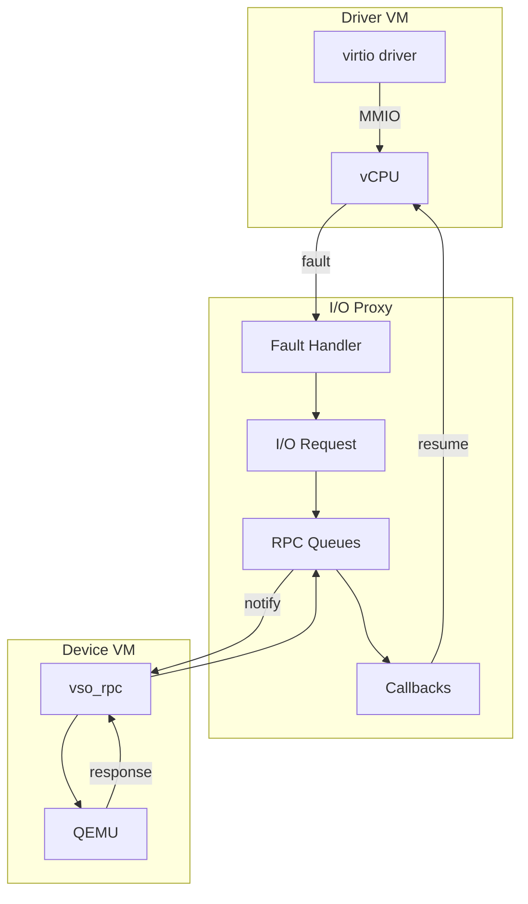
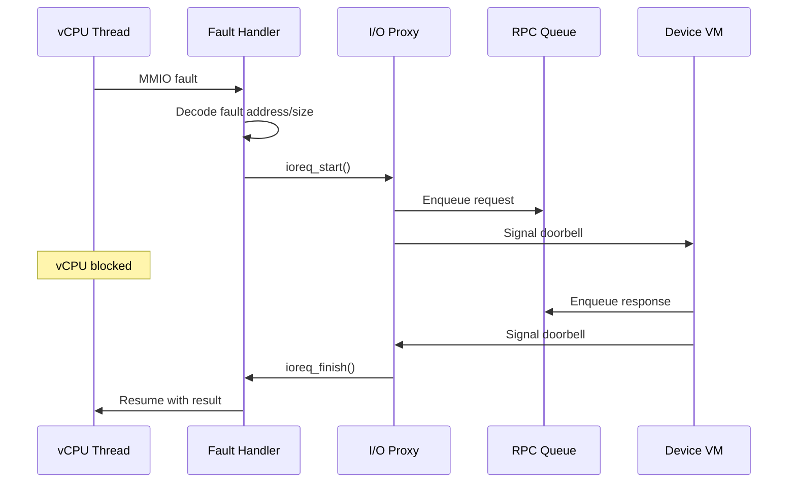
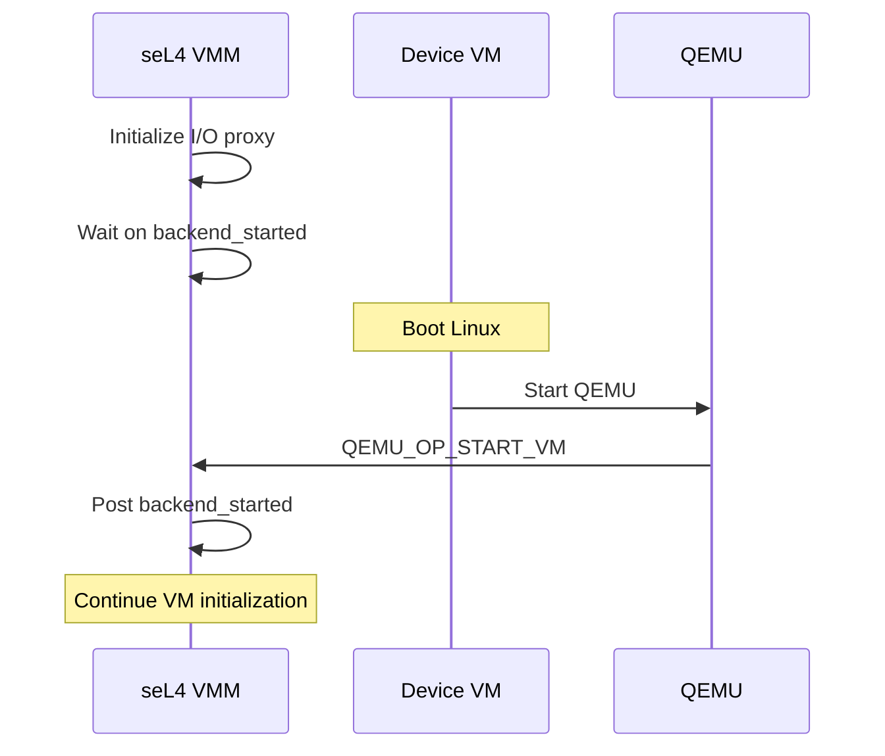

# I/O Proxy

This document describes the I/O Proxy infrastructure that handles communication between driver VMs and device VMs.

## Overview

The I/O Proxy is the core VMM component that:

- Intercepts MMIO faults from driver VMs
- Routes requests to device VMs via RPC
- Handles responses and resumes VM execution
- Manages interrupt injection



## Data Structures

### io_proxy_t

The main I/O proxy structure:

```c
// From include/tii/io_proxy.h
typedef struct io_proxy {
    /* Synchronization */
    sync_sem_t backend_started;     // Backend ready semaphore
    int ok_to_run;                  // Backend running flag

    /* RPC infrastructure */
    vso_rpc_t rpc;                  // RPC queues and callbacks

    /* Processing callback */
    int (*run)(struct io_proxy *);  // RPC processing function

    /* Memory regions */
    uintptr_t data_base;            // Device data region base
    uintptr_t ctrl_base;            // Control region base
    size_t data_size;               // Data region size
    size_t ctrl_size;               // Control region size

    /* Buffer access */
    uintptr_t (*iobuf_get)(struct io_proxy *, int page);

    /* Memory allocator */
    vka_t *vka;

    /* Pending I/O operations */
    ioack_t ioacks[MAX_IOACKS];     // MMIO acknowledgment slots
} io_proxy_t;
```

### ioack_t

Tracks pending I/O operations:

```c
typedef struct ioack {
    bool active;                    // Slot in use
    ioack_fn_t callback;            // Completion callback
    void *cookie;                   // Callback argument
    seL4_Word result;               // Operation result
} ioack_t;
```

## Initialization

### libsel4vm_io_proxy_init()

Initializes the I/O proxy for a VM:

```c
int libsel4vm_io_proxy_init(
    vm_t *vm,
    io_proxy_t *io_proxy,
    vka_t *vka
);
```

**Steps:**
1. Initialize RPC queues
2. Register fault handlers
3. Set up callback chain
4. Initialize PCI emulation
5. Wait for backend startup

### Callback Chain

The I/O proxy uses a callback chain for RPC processing:

```c
// From src/libsel4vm_glue.c
static rpc_callback_t rpc_callbacks[] = {
    handle_mmio,        // QEMU_OP_MMIO
    handle_msi,         // MSI interrupts
    handle_pci,         // PCI operations
    handle_emudev,      // Emulated devices
    handle_control,     // Control operations
    NULL                // Terminator
};
```

## MMIO Handling

### Fault Flow



### ioreq_start()

Initiates an I/O request:

```c
int ioreq_start(
    io_proxy_t *io_proxy,
    int slot,
    ioack_fn_t callback,
    void *cookie
);
```

### ioreq_finish()

Completes an I/O request:

```c
void ioreq_finish(
    io_proxy_t *io_proxy,
    int slot,
    seL4_Word result
);
```

### ioreq_native()

Synchronous I/O for non-vCPU threads:

```c
seL4_Word ioreq_native(
    io_proxy_t *io_proxy,
    int addr_space,
    uintptr_t addr,
    size_t size,
    bool is_write,
    seL4_Word value
);
```

## RPC Processing

### rpc_process()

Main RPC message dispatcher:

```c
int rpc_process(io_proxy_t *io_proxy) {
    rpcmsg_t msg;

    // Process all pending messages
    while (rpc_queue_dequeue(&io_proxy->rpc.device_event, &msg)) {
        int op = RPC_OP(msg.mr0);

        // Walk callback chain
        for (rpc_callback_t *cb = rpc_callbacks; *cb; cb++) {
            if ((*cb)(io_proxy, &msg)) {
                break;  // Message handled
            }
        }
    }

    return 0;
}
```

### Message Handlers

#### handle_mmio()

Handles MMIO responses:

```c
static bool handle_mmio(io_proxy_t *io_proxy, rpcmsg_t *msg) {
    if (RPC_OP(msg->mr0) != QEMU_OP_MMIO) {
        return false;
    }

    int slot = RPC_MMIO_SLOT(msg->mr0);
    seL4_Word data = msg->mr2;

    // Complete the pending request
    ioreq_finish(io_proxy, slot, data);

    return true;
}
```

#### handle_control()

Handles control operations:

```c
static bool handle_control(io_proxy_t *io_proxy, rpcmsg_t *msg) {
    if (RPC_OP(msg->mr0) != QEMU_OP_START_VM) {
        return false;
    }

    // Signal backend is ready
    io_proxy->ok_to_run = 1;
    sync_sem_post(&io_proxy->backend_started);

    return true;
}
```

## Backend Synchronization

### Startup Sequence



### Waiting for Backend

```c
void io_proxy_wait_for_backend(io_proxy_t *io_proxy) {
    // Block until device VM signals ready
    sync_sem_wait(&io_proxy->backend_started);
}
```

## Thread Safety

### Native Thread I/O

For non-vCPU threads (e.g., interrupt handlers):

```c
// Thread-local storage for native I/O
static __thread struct {
    sync_sem_t sem;
    seL4_Word result;
} native_io;

seL4_Word ioreq_native(...) {
    // Send request
    rpc_queue_enqueue(&io_proxy->rpc.driver_rpc_req, &msg);
    doorbell_ring(io_proxy);

    // Wait for response
    sync_sem_wait(&native_io.sem);

    return native_io.result;
}
```

## Configuration

### CAmkES Attributes

```camkes
configuration {
    vm0.io_proxy_data_base = "0x50000000";
    vm0.io_proxy_data_size = "0x10000000";
    vm0.io_proxy_ctrl_base = "0x60000000";
    vm0.io_proxy_ctrl_size = "0x1000";
}
```

## Source Files

| File | Description |
|------|-------------|
| `src/io_proxy.c` | Core I/O proxy implementation |
| `src/libsel4vm_glue.c` | VMM integration and callbacks |
| `include/tii/io_proxy.h` | Public API |

## Related Documentation

- [RPC Protocol](../architecture/rpc-protocol.md)
- [PCI Passthrough](pci-passthrough.md)
- [Interrupt Handling](interrupt-handling.md)
