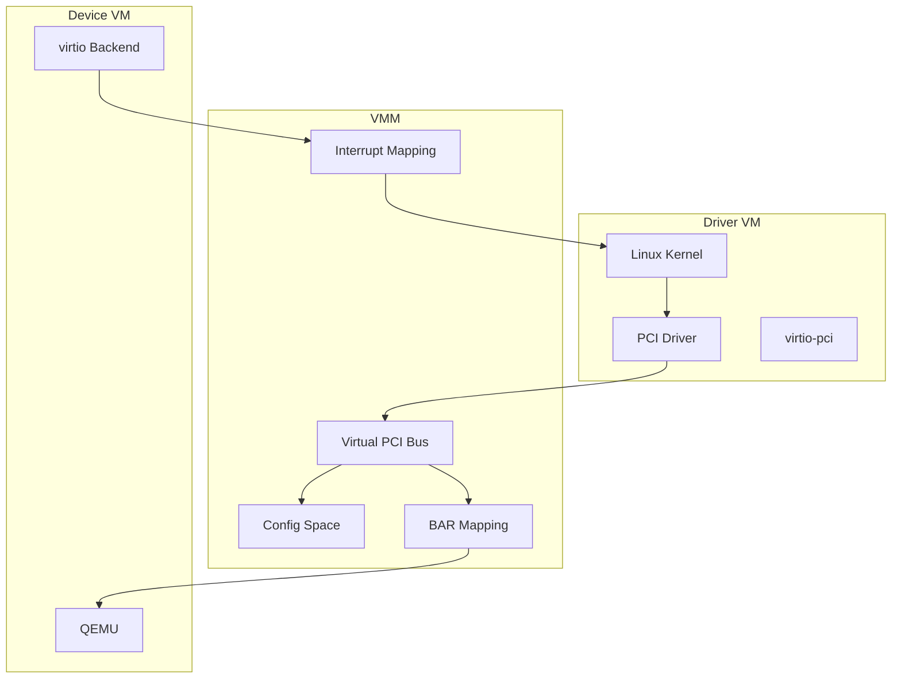
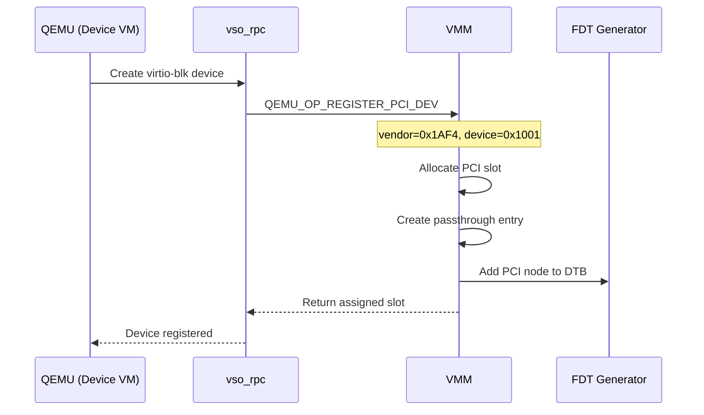

# PCI Passthrough

This document describes PCI device passthrough and emulation for virtio devices.

## Overview

Virtio devices are presented to driver VMs as PCI devices:

- QEMU registers PCI devices with the VMM
- VMM emulates PCI configuration space
- MMIO accesses are forwarded to QEMU
- Interrupts are routed back to the driver VM



## PCI Device Registration

### Registration Flow



### Registration Message

```c
// Device → VMM
rpcmsg_t msg = {
    .mr0 = MAKE_MR0(QEMU_OP_REGISTER_PCI_DEV, ...),
    .mr1 = device_id | (vendor_id << 16),
    .mr2 = subsystem_id | (subsystem_vendor << 16),
    .mr3 = class_code | (revision << 24)
};

// VMM → Device (response)
rpcmsg_t resp = {
    .mr1 = assigned_slot  // PCI slot number
};
```

### PCI Identifiers

| Field | virtio Value | Description |
|-------|--------------|-------------|
| Vendor ID | 0x1AF4 | Red Hat (virtio) |
| Device ID | 0x1000+ | virtio device type |
| Subsystem Vendor | 0x1AF4 | Red Hat |
| Subsystem ID | Device-specific | virtio type |

## Configuration Space

### Config Space Layout

Standard PCI configuration space (256 bytes, or 4KB for PCIe):

```
Offset  Size  Field
0x00    2     Vendor ID
0x02    2     Device ID
0x04    2     Command
0x06    2     Status
0x08    1     Revision ID
0x09    3     Class Code
0x0C    1     Cache Line Size
0x0D    1     Latency Timer
0x0E    1     Header Type
0x0F    1     BIST
0x10    4     BAR0
0x14    4     BAR1
...
0x3C    1     Interrupt Line
0x3D    1     Interrupt Pin
```

### Config Space Access

```c
// VMM handles config space reads/writes
static int handle_pci_config(
    vm_t *vm,
    uintptr_t addr,
    size_t size,
    bool is_write,
    seL4_Word *data
) {
    int slot = PCI_SLOT(addr);
    int offset = PCI_OFFSET(addr);

    if (is_write) {
        // Forward to QEMU
        *data = ioreq_native(io_proxy, AS_PCIDEV(slot),
                            offset, size, true, *data);
    } else {
        // Read from QEMU
        *data = ioreq_native(io_proxy, AS_PCIDEV(slot),
                            offset, size, false, 0);

        // Remap interrupt line/pin if needed
        if (offset == PCI_INTERRUPT_LINE) {
            *data = remap_irq(*data);
        }
    }

    return 0;
}
```

### ECAM Support

TII added PCIe Extended Configuration Access Mechanism:

```c
// From projects/sel4_projects_libs
typedef enum {
    PCI_BUS_CAM,    // 256 bytes per device
    PCI_BUS_ECAM    // 4KB per device
} vmm_pci_flags_t;

size_t vmm_pci_config_size(vmm_pci_flags_t flags) {
    return (flags & PCI_BUS_ECAM) ? 4096 : 256;
}
```

## BAR Mapping

### BAR Types

| BAR Type | Description |
|----------|-------------|
| Memory 32-bit | 32-bit MMIO region |
| Memory 64-bit | 64-bit MMIO region (uses 2 BARs) |
| I/O | I/O port region (legacy) |

### BAR Allocation

```c
// Allocate BAR region in guest address space
int allocate_bar(
    vm_t *vm,
    int slot,
    int bar,
    size_t size,
    uintptr_t *guest_addr
) {
    // Find free region in PCI memory window
    *guest_addr = pci_mem_alloc(size);

    // Install fault handler for this region
    vm_memory_reservation_t *res = vm_reserve_memory_at(
        vm, *guest_addr, size,
        pci_bar_fault_handler, &bar_ctx);

    return 0;
}
```

### BAR Fault Handler

```c
static memory_fault_result_t pci_bar_fault_handler(
    vm_t *vm,
    vm_vcpu_t *vcpu,
    uintptr_t addr,
    size_t size,
    void *cookie
) {
    bar_context_t *ctx = cookie;

    // Forward to QEMU
    seL4_Word data;
    if (is_write) {
        data = get_fault_data(vcpu);
        ioreq_native(ctx->io_proxy, AS_PCIDEV(ctx->slot),
                    addr - ctx->base, size, true, data);
    } else {
        data = ioreq_native(ctx->io_proxy, AS_PCIDEV(ctx->slot),
                           addr - ctx->base, size, false, 0);
        set_fault_data(vcpu, data);
    }

    advance_vcpu_pc(vcpu);
    return FAULT_HANDLED;
}
```

## Interrupt Routing

### INTx Mapping

PCI legacy interrupts (INTA-INTD) are swizzled through the PCI bridge:

```c
// Calculate guest IRQ from PCI slot and pin
int pci_intx_to_irq(int slot, int pin) {
    // Standard PCI swizzle
    int swizzled_pin = (slot + pin) % 4;
    return PCI_IRQ_BASE + swizzled_pin;
}
```

### Shared IRQ Lines

Multiple devices may share an interrupt line:

```c
// From src/shared_irq_line.c
typedef struct shared_irq_line {
    uint64_t sources;       // Bitmap of active sources
    int irq;                // Guest IRQ number
    vm_t *vm;               // Target VM
} shared_irq_line_t;

void shared_irq_set(shared_irq_line_t *line, int source) {
    uint64_t old = line->sources;
    line->sources |= (1ULL << source);

    if (old == 0) {
        // First source active, inject IRQ
        vm_inject_irq(line->vm, line->irq);
    }
}
```

### MSI Support

Message Signaled Interrupts via GICv2m:

```c
// MSI write triggers interrupt
void gicv2m_handle_msi(
    io_proxy_t *io_proxy,
    uint32_t data
) {
    int spi = data & 0x3FF;  // SPI number
    vm_inject_irq(io_proxy->vm, spi);
}
```

## Device Tree Generation

### PCI Node

```c
// From src/fdt.c
void fdt_generate_pci_node(void *fdt, pci_device_t *dev) {
    char name[32];
    snprintf(name, sizeof(name), "pci@%x", dev->slot);

    fdt_begin_node(fdt, name);
    fdt_property_string(fdt, "compatible", "pci-host-ecam-generic");
    fdt_property_u32(fdt, "#address-cells", 3);
    fdt_property_u32(fdt, "#size-cells", 2);

    // Bus range
    uint32_t bus_range[] = { 0, 0 };
    fdt_property(fdt, "bus-range", bus_range, sizeof(bus_range));

    // Ranges (config, memory, I/O)
    // ...

    // MSI parent
    if (msi_phandle) {
        fdt_property_u32(fdt, "msi-parent", msi_phandle);
    }

    fdt_end_node(fdt);
}
```

## PCI Memory Window

### Address Layout

```
Guest Physical Address Space
├── 0x00000000 - 0x3FFFFFFF: RAM
├── 0x40000000 - 0x4FFFFFFF: Device MMIO
├── 0x50000000 - 0x6FFFFFFF: PCI Memory Window (512MB)
│   ├── 0x50000000: BAR regions
│   └── ...
└── 0x70000000 - 0x70FFFFFF: PCI Config (ECAM)
```

### Configuration (RPi4)

```c
// From libsel4vmmplatsupport/plat_include/bcm2711
#define PCI_MEM_WINDOW_BASE  0x50000000
#define PCI_MEM_WINDOW_SIZE  0x20000000  // 512MB
#define PCI_CFG_WINDOW_BASE  0x70000000
#define PCI_CFG_WINDOW_SIZE  0x01000000  // 16MB (ECAM)
```

## Non-Existent Device Handling

Per PCI specification, reads to non-existent devices return all 1s:

```c
// From libsel4vmmplatsupport
if (!device_exists(slot)) {
    *data = 0xFFFFFFFF;
    return FAULT_HANDLED;
}
```

## Source Files

| File | Description |
|------|-------------|
| `src/libsel4vm_glue.c` | PCI registration handling |
| `projects/sel4_projects_libs/.../vpci.c` | Virtual PCI implementation |
| `projects/sel4_projects_libs/.../pci.c` | PCI helpers |

## Related Documentation

- [I/O Proxy](io-proxy.md)
- [Interrupt Handling](interrupt-handling.md)
- [Device Tree](device-tree.md)
