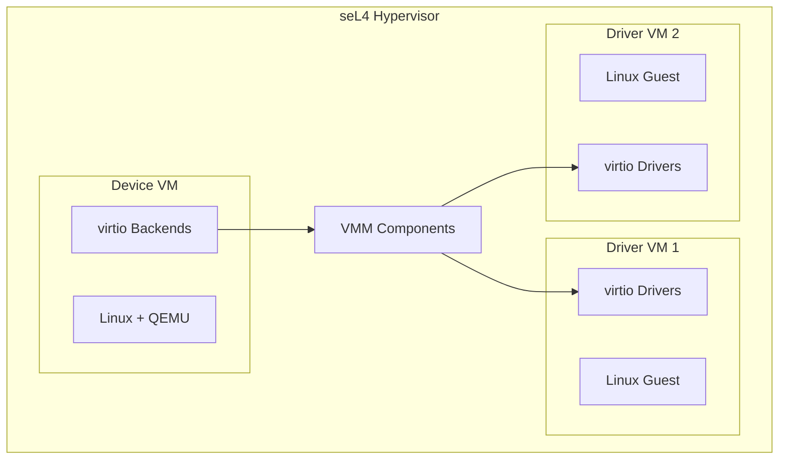

# Deployment Scenarios

This document describes deployment configurations and multi-VM architectures for the TII seL4 virtio system.

## Overview

The virtio-over-RPC architecture supports various deployment scenarios:



## Two-VM Configuration

### Architecture

The basic configuration with one device VM and one driver VM:

```
┌─────────────────────────────────────────────────────────────┐
│                       seL4 Hypervisor                       │
├─────────────────────────────┬───────────────────────────────┤
│        Device VM (VM0)      │       Driver VM (VM1)         │
│                             │                               │
│  ┌───────────────────────┐  │  ┌─────────────────────────┐  │
│  │    Linux + QEMU       │  │  │      Linux Guest        │  │
│  │                       │  │  │                         │  │
│  │  ┌─────────────────┐  │  │  │  ┌─────────────────┐    │  │
│  │  │ virtio-blk-pci  │──┼──┼──┼──│  virtio-blk     │    │  │
│  │  │ virtio-net-pci  │──┼──┼──┼──│  virtio-net     │    │  │
│  │  └─────────────────┘  │  │  │  └─────────────────┘    │  │
│  │                       │  │  │                         │  │
│  │  user-vm.qcow2        │  │  │  Application Workload   │  │
│  └───────────────────────┘  │  └─────────────────────────┘  │
└─────────────────────────────┴───────────────────────────────┘
```

### CAmkES Configuration

```camkes
assembly {
    composition {
        component VM vm0;    // Device VM
        component VM vm1;    // Driver VM

        VIRTIO_COMPOSITION_DEF(0, 1)
    }

    configuration {
        vm0.vm_name = "device-vm";
        vm0.vm_virtio_devices = [
            { id: 1, data_base: "0x50000000", data_size: "0x10000000", ... }
        ];

        vm1.vm_name = "driver-vm";
        vm1.vm_virtio_drivers = [
            { id: 0, data_base: "0x50000000", data_size: "0x10000000", ... }
        ];
    }
}
```

### Use Cases

- Development and testing
- Simple isolated workloads
- Single-user systems

## Multi-User Configuration

### Architecture

One device VM serving multiple driver VMs:

```
┌──────────────────────────────────────────────────────────────────────┐
│                          seL4 Hypervisor                             │
├─────────────────────────┬────────────────────┬───────────────────────┤
│     Device VM (VM0)     │  Driver VM (VM1)   │   Driver VM (VM2)     │
│                         │                    │                       │
│  ┌───────────────────┐  │  ┌──────────────┐  │  ┌─────────────────┐  │
│  │   Linux + QEMU    │  │  │ Linux Guest  │  │  │  Linux Guest    │  │
│  │                   │  │  │              │  │  │                 │  │
│  │  ┌─────────────┐  │  │  │ User App 1   │  │  │  User App 2     │  │
│  │  │ virtio-blk  │──┼──┼──│ /dev/vda     │  │  │  /dev/vda       │  │
│  │  │ virtio-blk  │──┼──┼──┼──────────────┼──┼──│  Isolated       │  │
│  │  │ virtio-net  │──┼──┼──│ eth0         │  │  │  eth0           │  │
│  │  │ virtio-net  │──┼──┼──┼──────────────┼──┼──│  Isolated       │  │
│  │  └─────────────┘  │  │  └──────────────┘  │  └─────────────────┘  │
│  └───────────────────┘  │                    │                       │
└─────────────────────────┴────────────────────┴───────────────────────┘
```

### CAmkES Configuration

```camkes
assembly {
    composition {
        component VM vm0;    // Device VM
        component VM vm1;    // Driver VM 1
        component VM vm2;    // Driver VM 2

        VIRTIO_COMPOSITION_DEF(0, 1)
        VIRTIO_COMPOSITION_DEF(0, 2)
    }

    configuration {
        vm0.vm_virtio_devices = [
            { id: 1, ... },  // For VM1
            { id: 2, ... }   // For VM2
        ];

        vm1.vm_virtio_drivers = [{ id: 0, ... }];
        vm2.vm_virtio_drivers = [{ id: 0, ... }];
    }
}
```

### Use Cases

- Multi-tenant environments
- Workload isolation
- Shared infrastructure with separate user VMs

## Advanced Topology Patterns

The seL4 architecture supports arbitrary VM topologies. This section demonstrates patterns beyond simple two-VM configurations.

### Multi-Backend Single Driver

Multiple specialized device VMs serve a single workload VM:

```
┌──────────────────────────────────────────────────────────────────────────────┐
│                             seL4 Hypervisor                                   │
├────────────────────┬────────────────────┬────────────────────────────────────┤
│   Storage VM       │    Network VM      │          Workload VM               │
│                    │                    │                                    │
│  ┌──────────────┐  │  ┌──────────────┐  │  ┌────────────────────────────┐   │
│  │ Linux + QEMU │  │  │ Linux + QEMU │  │  │       Linux Guest          │   │
│  │              │  │  │              │  │  │                            │   │
│  │ virtio-blk ──┼──┼──┼──────────────┼──┼──┼── /dev/vda                 │   │
│  │              │  │  │ virtio-net ──┼──┼──┼── eth0                     │   │
│  │  [eMMC only] │  │  │  [NIC only]  │  │  │                            │   │
│  └──────────────┘  │  └──────────────┘  │  │  Applications (isolated)   │   │
│                    │                    │  └────────────────────────────┘   │
└────────────────────┴────────────────────┴────────────────────────────────────┘

Security benefit: Compromising Network VM does NOT expose storage data
```

**CAmkES Configuration:**

```camkes
assembly {
    composition {
        component VM vm_storage;
        component VM vm_network;
        component VM vm_workload;

        // Storage backend serves workload
        VIRTIO_COMPOSITION_DEF(storage, workload)

        // Network backend serves workload (separate channel)
        VIRTIO_COMPOSITION_DEF(network, workload)
    }

    configuration {
        // Storage VM: only eMMC passthrough
        vm_storage.pci_devices = [{ name: "emmc", bus: 1, dev: 0, fun: 0 }];
        vm_storage.vm_virtio_devices = [
            { type: "blk", id: 0, target: "workload" }
        ];

        // Network VM: only NIC passthrough
        vm_network.pci_devices = [{ name: "eth", bus: 2, dev: 0, fun: 0 }];
        vm_network.vm_virtio_devices = [
            { type: "net", id: 0, target: "workload" }
        ];

        // Workload VM: NO hardware, fully isolated
        vm_workload.pci_devices = [];
        vm_workload.vm_virtio_drivers = [
            { type: "blk", backend: "storage" },
            { type: "net", backend: "network" }
        ];
    }
}
```

**Use Cases:**
- Security-critical workloads requiring compartmentalized I/O
- Regulatory compliance (storage backend audited separately)
- Defense-in-depth architectures

### Shared Backend Multiple Drivers

One device VM serves multiple isolated workload VMs:

```
┌──────────────────────────────────────────────────────────────────────────────┐
│                             seL4 Hypervisor                                   │
├───────────────────────────┬──────────────────────┬───────────────────────────┤
│       Device VM           │    Workload VM 1     │     Workload VM 2         │
│                           │                      │                           │
│  ┌─────────────────────┐  │  ┌────────────────┐  │  ┌─────────────────────┐  │
│  │   Linux + QEMU      │  │  │  Linux Guest   │  │  │    Linux Guest      │  │
│  │                     │  │  │                │  │  │                     │  │
│  │  virtio-blk (disk0) ┼──┼──┼─ /dev/vda      │  │  │                     │  │
│  │  virtio-blk (disk1) ┼──┼──┼────────────────┼──┼──┼─ /dev/vda           │  │
│  │  virtio-net (tap0) ─┼──┼──┼─ eth0          │  │  │                     │  │
│  │  virtio-net (tap1) ─┼──┼──┼────────────────┼──┼──┼─ eth0               │  │
│  │                     │  │  │                │  │  │                     │  │
│  │  [NIC + Storage]    │  │  │  Tenant A      │  │  │   Tenant B          │  │
│  └─────────────────────┘  │  └────────────────┘  │  └─────────────────────┘  │
└───────────────────────────┴──────────────────────┴───────────────────────────┘

Note: Workload VMs are isolated from each other (separate dataports)
```

**CAmkES Configuration:**

```camkes
assembly {
    composition {
        component VM vm_backend;
        component VM vm_tenant_a;
        component VM vm_tenant_b;

        VIRTIO_COMPOSITION_DEF(backend, tenant_a)
        VIRTIO_COMPOSITION_DEF(backend, tenant_b)
    }

    configuration {
        vm_backend.vm_virtio_devices = [
            { type: "blk", id: 0, target: "tenant_a", disk: "tenant-a.qcow2" },
            { type: "blk", id: 1, target: "tenant_b", disk: "tenant-b.qcow2" },
            { type: "net", id: 0, target: "tenant_a", tap: "tap0" },
            { type: "net", id: 1, target: "tenant_b", tap: "tap1" }
        ];
    }
}
```

**Use Cases:**
- Multi-tenant hosting
- Development/test environments
- Resource consolidation with isolation

### Chain Topology (Tiered Security)

VMs form a chain where each acts as device for the next tier:

```
┌──────────────────────────────────────────────────────────────────────────────┐
│                             seL4 Hypervisor                                   │
├─────────────────────┬─────────────────────┬──────────────────────────────────┤
│    Gateway VM       │   Application VM    │         Database VM              │
│    (Tier 0)         │    (Tier 1)         │         (Tier 2)                 │
│                     │                     │                                  │
│  ┌───────────────┐  │  ┌───────────────┐  │  ┌────────────────────────────┐  │
│  │ Linux + QEMU  │  │  │ Linux + QEMU  │  │  │      Linux Guest           │  │
│  │               │  │  │               │  │  │                            │  │
│  │ [Physical NIC]│  │  │ virtio-net ◄──┼──┼──┼── eth0 (app network)       │  │
│  │               │  │  │ (from gateway)│  │  │                            │  │
│  │ virtio-net ───┼──┼──►(to gateway)   │  │  │                            │  │
│  │ (for app VM)  │  │  │               │  │  │                            │  │
│  │               │  │  │ virtio-blk ───┼──┼──► /dev/vda (app sees DB as   │  │
│  │               │  │  │ (for db VM)   │  │  │           block device)    │  │
│  └───────────────┘  │  └───────────────┘  │  └────────────────────────────┘  │
└─────────────────────┴─────────────────────┴──────────────────────────────────┘

Data flow: Internet → Gateway → App → Database
Each tier more isolated than the last
```

**Security Properties:**
- Gateway VM: Internet-facing, highest exposure
- Application VM: Only accessible via Gateway's virtio-net
- Database VM: Only accessible via App's virtio-blk, no network

**CAmkES Configuration:**

```camkes
assembly {
    composition {
        component VM vm_gateway;    // Tier 0: Internet-facing
        component VM vm_app;        // Tier 1: Application logic
        component VM vm_database;   // Tier 2: Data storage

        // Gateway provides network to App
        VIRTIO_COMPOSITION_DEF(gateway, app)

        // App provides storage interface to Database
        VIRTIO_COMPOSITION_DEF(app, database)
    }

    configuration {
        // Gateway: physical NIC, provides virtio-net to app
        vm_gateway.pci_devices = [{ name: "eth0" }];
        vm_gateway.vm_virtio_devices = [
            { type: "net", id: 0, target: "app" }
        ];

        // App: virtio-net from gateway, provides virtio-blk to database
        // This VM is BOTH driver (for gateway) AND device (for database)
        vm_app.vm_virtio_drivers = [
            { type: "net", backend: "gateway" }
        ];
        vm_app.vm_virtio_devices = [
            { type: "blk", id: 0, target: "database" }
        ];

        // Database: only sees virtio-blk, completely air-gapped from network
        vm_database.vm_virtio_drivers = [
            { type: "blk", backend: "app" }
        ];
    }
}
```

**Use Cases:**
- DMZ architectures
- Defense-in-depth network segmentation
- Compliance (PCI-DSS, HIPAA) requiring data isolation

### Mesh Topology (Peer Services)

VMs provide services to each other in a mesh pattern:

```
┌──────────────────────────────────────────────────────────────────────────────┐
│                             seL4 Hypervisor                                   │
│                                                                              │
│      ┌─────────────┐           ┌─────────────┐           ┌─────────────┐    │
│      │  Auth VM    │◄─────────►│  App VM     │◄─────────►│  Cache VM   │    │
│      │             │  virtio-  │             │  virtio-  │             │    │
│      │ Provides:   │   vsock   │ Provides:   │   vsock   │ Provides:   │    │
│      │ - Auth API  │           │ - REST API  │           │ - KV Store  │    │
│      └──────┬──────┘           └──────┬──────┘           └──────┬──────┘    │
│             │                         │                         │           │
│             │      virtio-vsock       │      virtio-vsock       │           │
│             │                         │                         │           │
│             └─────────────────────────┼─────────────────────────┘           │
│                                       │                                      │
│                                       ▼                                      │
│                              ┌─────────────┐                                 │
│                              │  Logger VM  │                                 │
│                              │             │                                 │
│                              │ All VMs log │                                 │
│                              │ here        │                                 │
│                              └─────────────┘                                 │
└──────────────────────────────────────────────────────────────────────────────┘
```

**Use Cases:**
- Microservice architectures
- Service mesh implementations
- Distributed systems with mutual authentication

### Topology Selection Guide

| Pattern | VMs | Complexity | Security | Use Case |
|---------|-----|------------|----------|----------|
| **Two-VM** | 2 | Low | Good | Simple workloads |
| **Multi-Backend** | 3+ | Medium | Excellent | Compartmentalized I/O |
| **Shared Backend** | 3+ | Medium | Good | Multi-tenant |
| **Chain** | 3+ | Medium | Excellent | Tiered security |
| **Mesh** | 4+ | High | Varies | Microservices |

## Hardware Passthrough

### PCIe Device Passthrough

Physical devices can be passed to specific VMs:

```
┌────────────────────────────────────────────────────────────┐
│                     seL4 Hypervisor                        │
├─────────────────────────────┬──────────────────────────────┤
│       Device VM (VM0)       │      Driver VM (VM1)         │
│                             │                              │
│  ┌───────────────────────┐  │  ┌────────────────────────┐  │
│  │   Linux + QEMU        │  │  │    Linux Guest         │  │
│  │                       │  │  │                        │  │
│  │  Physical GPU ────────┼──┼──┼── GPU Passthrough      │  │
│  │  Physical NIC ────────┼──┼──┼── NIC Passthrough      │  │
│  │  virtio (emulated)    │──┼──│  virtio devices        │  │
│  └───────────────────────┘  │  └────────────────────────┘  │
│                             │                              │
│  Hardware: RPi4 PCIe        │                              │
└─────────────────────────────┴──────────────────────────────┘
```

### Raspberry Pi 4 PCIe

The RPi4 has limited PCIe (one lane), typically used for:
- USB controller (VL805)
- External NVMe storage
- Network interfaces

### Configuration

```camkes
configuration {
    // Pass physical device to VM
    vm0.pci_devices = [
        {
            name: "usb_controller",
            bus: 0, dev: 0, fun: 0,
            irq: 148
        }
    ];
}
```

## Memory Configurations

### Small Memory (512MB per VM)

```camkes
configuration {
    vm0.ram_base = "0x40000000";
    vm0.ram_size = "0x20000000";  // 512MB

    vm1.ram_base = "0x60000000";
    vm1.ram_size = "0x20000000";  // 512MB
}
```

### Large Memory (2GB per VM)

```camkes
configuration {
    vm0.ram_base = "0x40000000";
    vm0.ram_size = "0x80000000";  // 2GB

    vm1.ram_base = "0xC0000000";
    vm1.ram_size = "0x80000000";  // 2GB
}
```

### SWIOTLB Allocation

```camkes
configuration {
    // 64MB SWIOTLB per VM
    vm0.swiotlb_base = "0x38000000";
    vm0.swiotlb_size = "0x4000000";

    vm1.swiotlb_base = "0x58000000";
    vm1.swiotlb_size = "0x4000000";
}
```

## Network Configurations

### NAT (Device VM as Gateway)

```
┌─────────────────────────────────────────────────────────┐
│                   seL4 Hypervisor                       │
├──────────────────────────┬──────────────────────────────┤
│     Device VM            │       Driver VM              │
│                          │                              │
│  Physical NIC ───────┐   │                              │
│  (eth0: DHCP)        │   │                              │
│                      │   │                              │
│  virtio-net ─────────┼───┼── virtio-net                 │
│  (tap0: 10.0.0.1)    │   │   (eth0: 10.0.0.2)           │
│                      │   │                              │
│  NAT/iptables ───────┘   │                              │
└──────────────────────────┴──────────────────────────────┘
```

**Device VM Configuration:**
```bash
# Enable IP forwarding
echo 1 > /proc/sys/net/ipv4/ip_forward

# NAT rule
iptables -t nat -A POSTROUTING -o eth0 -j MASQUERADE
```

### Bridged Network

```
┌─────────────────────────────────────────────────────────┐
│                   seL4 Hypervisor                       │
├──────────────────────────┬──────────────────────────────┤
│     Device VM            │       Driver VM              │
│                          │                              │
│  Physical NIC ─┬─ br0    │                              │
│  (eth0)        │         │                              │
│                │         │                              │
│  virtio-net ───┘─────────┼── virtio-net                 │
│  (tap0)                  │   (eth0: DHCP)               │
│                          │                              │
└──────────────────────────┴──────────────────────────────┘
```

**Device VM Configuration:**
```bash
# Create bridge
brctl addbr br0
brctl addif br0 eth0
brctl addif br0 tap0
ip link set br0 up
```

## Storage Configurations

### Local Disk Image

```bash
# QEMU command in device VM
qemu-system-aarch64 \
    -drive file=/var/lib/virt/images/user-vm.qcow2,id=hd0,format=qcow2 \
    -device virtio-blk-pci,drive=hd0
```

### Shared Filesystem (9P)

```bash
# Share directory with driver VM
qemu-system-aarch64 \
    -fsdev local,id=shared,path=/mnt/shared,security_model=mapped \
    -device virtio-9p-pci,fsdev=shared,mount_tag=shared
```

**Driver VM:**
```bash
mount -t 9p -o trans=virtio,version=9p2000.L shared /mnt/shared
```

### Network Storage (iSCSI, NFS)

Device VM can access network storage and expose via virtio-blk:
```bash
# Mount iSCSI target
iscsiadm -m node -T target -p server -l

# Expose via QEMU
qemu-system-aarch64 \
    -drive file=/dev/sda,id=hd0,format=raw \
    -device virtio-blk-pci,drive=hd0
```

## Security Considerations

### VM Isolation

- Each VM has separate address space
- seL4 capabilities control resource access
- CAmkES enforces component boundaries

### Data Protection

```
┌────────────────────────────────────────┐
│           seL4 Capability System       │
├────────────────────────────────────────┤
│  VM0 Caps    │  VM1 Caps   │  VM2 Caps │
│  - RAM 0     │  - RAM 1    │  - RAM 2  │
│  - Dataport  │  - Dataport │  - None   │
│  - IRQ       │  - IRQ      │           │
└──────────────┴─────────────┴───────────┘
```

### Network Security

- Device VM acts as firewall
- Driver VMs isolated from each other
- Optional VLANs for network separation

## Deployment Checklist

### Pre-Deployment

- [ ] Verify hardware compatibility (ARM64, PCIe)
- [ ] Calculate memory requirements per VM
- [ ] Plan network topology
- [ ] Prepare storage images

### Configuration

- [ ] Set memory regions in CAmkES
- [ ] Configure SWIOTLB sizes
- [ ] Set up virtio device mappings
- [ ] Configure interrupt assignments

### Testing

- [ ] Boot each VM individually
- [ ] Test virtio device functionality
- [ ] Verify network connectivity
- [ ] Check storage performance

### Production

- [ ] Enable security features
- [ ] Configure monitoring
- [ ] Set up logging
- [ ] Document configuration

## Source Files

| File | Description |
|------|-------------|
| `apps/Arm/vm_qemu_virtio/` | Two-VM demo |
| `apps/Arm/vm_virtio_multi_user/` | Multi-user demo |
| `configurations/tii/vm.h` | VM configuration macros |

## Related Documentation

- [Production Guide](production-guide.md)
- [Memory Model](../architecture/memory-model.md)
- [Building](../getting-started/building.md)
