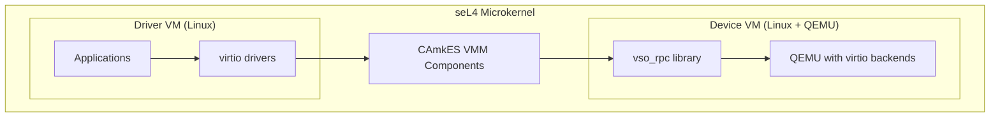

# TII seL4 Virtio Virtualization Platform

This project extends the seL4 microkernel and CAmkES component framework to enable **virtio device virtualization** across multiple guest VMs. Virtio backends run inside guest Linux VMs using QEMU, providing a flexible and secure architecture for device sharing.

## What We Built

Technology Innovation Institute (TII) developed a virtualization platform that:

- Runs **multiple isolated guest VMs** on the seL4 microkernel (ARM architecture)
- Enables **virtio devices** in driver VMs with backends served by device VMs
- Uses **QEMU** running inside a "device VM" to provide virtio device emulation
- Implements a custom **RPC protocol** for efficient VM-to-VM communication
- Supports **Raspberry Pi 4** and **QEMU ARM Virt** platforms



## Key Features

| Feature | Description |
|---------|-------------|
| **VM Isolation** | seL4's capability-based security ensures strong isolation between VMs |
| **Flexible Backends** | Virtio backends run in userspace (QEMU), easy to configure and extend |
| **Standard Interfaces** | Uses standard Linux virtio drivers in guest VMs |
| **Large Page Support** | 2MB page mappings for improved performance |
| **PCIe/ECAM Support** | Full PCIe extended configuration space support |

## Documentation Sections

### Architecture
- [System Overview](architecture/overview.md) - High-level architecture and component relationships
- [VM Topology](architecture/vm-topology.md) - Flexible N:M topology and compartmentalization
- [Real-Time Properties](architecture/real-time-properties.md) - WCET guarantees and safety certification
- [Virtio Architecture](architecture/virtio-architecture.md) - How virtio devices span VMs
- [RPC Protocol](architecture/rpc-protocol.md) - VM-to-VM communication protocol
- [Memory Model](architecture/memory-model.md) - Shared memory and SWIOTLB
- [vhost Acceleration](architecture/vhost-acceleration.md) - Why MSI is essential for KVM-like performance

### Components
- [I/O Proxy](components/io-proxy.md) - Core I/O request handling infrastructure
- [PCI Passthrough](components/pci-passthrough.md) - PCI device virtualization
- [Interrupt Handling](components/interrupt-handling.md) - IRQ, MSI, and GICv2m emulation
- [Device Tree](components/device-tree.md) - FDT generation for guest VMs
- [CAmkES Templates](components/camkes-templates.md) - Component templates for virtio VMs

### Integration
- [seL4 Kernel Modifications](integration/kernel-modifications.md) - TII changes to seL4 kernel
- [QEMU Backend](integration/qemu-backend.md) - QEMU seL4 accelerator details
- [QEMU seL4 Accelerator](integration/qemu-sel4-accelerator.md) - QEMU accel/sel4 implementation details
- [kmod-sel4-virt](integration/kmod-sel4-virt.md) - Kernel module providing KVM-like API
- [Guest-Side Components](integration/guest-side-components.md) - Code running inside guest VMs
- [Guest Linux Configuration](integration/guest-linux.md) - Guest kernel and driver setup
- [Other Repository Changes](integration/other-repos.md) - Changes across TII repositories

### Getting Started
- [Prerequisites](getting-started/prerequisites.md) - Development environment setup
- [Building](getting-started/building.md) - Build instructions
- [Running on QEMU](getting-started/running-qemu.md) - QEMU ARM Virt instructions
- [Running on RPi4](getting-started/running-rpi4.md) - Raspberry Pi 4 deployment

### Build System
- [Build Architecture](build-system/build-architecture.md) - Docker, Make, CMake, Yocto
- [Yocto Integration](build-system/yocto-integration.md) - Guest image generation
- [CI/CD](build-system/ci-cd.md) - GitHub Actions workflows

### Deployment
- [Deployment Scenarios](deployment/deployment-scenarios.md) - Multi-VM configurations
- [Production Guide](deployment/production-guide.md) - Performance and security

### Reference
- [API Reference](reference/api-reference.md) - Data structures and functions
- [RPC Opcodes](reference/rpc-opcodes.md) - Complete opcode reference
- [Configuration](reference/configuration.md) - CMake and CAmkES options

### Appendix
- [KVM vs pKVM vs seL4](appendix/kvm-pkvm-sel4-comparison.md) - Virtualization approach comparison
- [Glossary](appendix/glossary.md) - Terms and definitions
- [Related Work](appendix/related-work.md) - Background reading

## Quick Start

```bash
# Clone and sync repositories
repo init -u git@github.com:tiiuae/tii_sel4_manifest.git -b tii/development
repo sync

# Build Docker container
make docker

# Configure for Raspberry Pi 4
make raspberrypi4-64_defconfig

# Build guest Linux images
make linux-image

# Build CAmkES VM application
make vm_qemu_virtio
```

See [Getting Started](getting-started/prerequisites.md) for detailed instructions.

## Repository Structure

| Repository | Description |
|------------|-------------|
| `projects/tii-sel4-vm` | Main TII project (this documentation) |
| `kernel/` | seL4 kernel with TII modifications |
| `projects/sel4_projects_libs/` | VMM libraries with large page, PCIe, IRQ enhancements |
| `projects/vm-linux/` | Guest Linux integration |
| `sources/kmod-sel4-virt/` | Kernel module bridging QEMU and seL4 RPC |
| `sources/qemu-sel4-virtio/` | QEMU with seL4 accelerator for virtio backends |
| `tii_sel4_build/` | Build system and Docker |
| `vm-images/meta-sel4/` | Yocto layer for guest images |

## Supported Platforms

| Platform | Status | Notes |
|----------|--------|-------|
| QEMU ARM Virt | Supported | Development and testing |
| Raspberry Pi 4 | Supported | Production target |

## License

This project is part of the seL4 ecosystem. See individual repositories for license information.

## Contributing

Contributions are welcome. Please see the [build instructions](getting-started/building.md) to set up your development environment.
