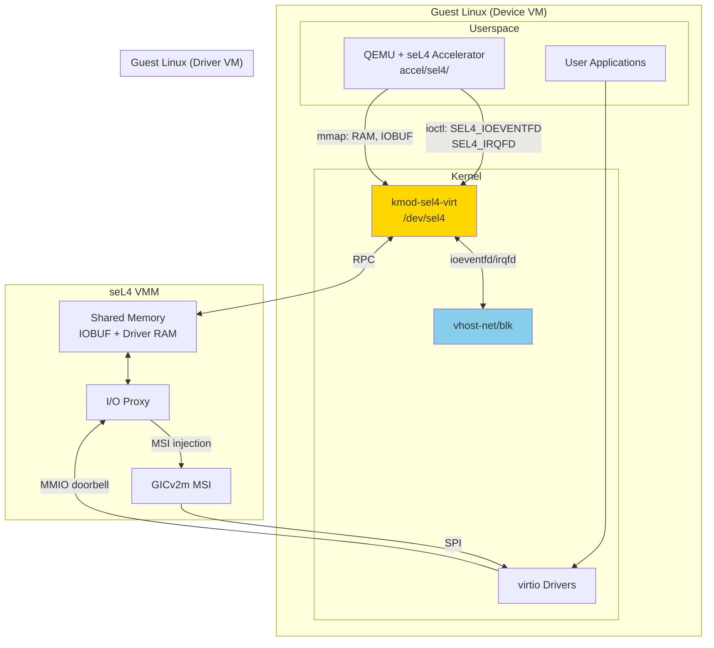
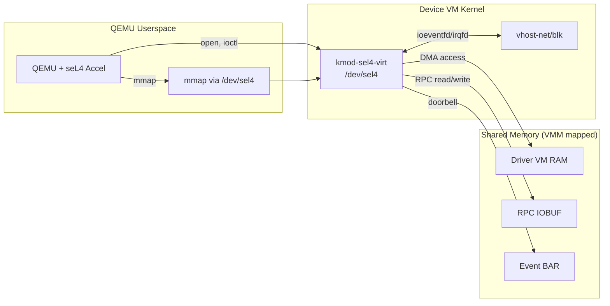
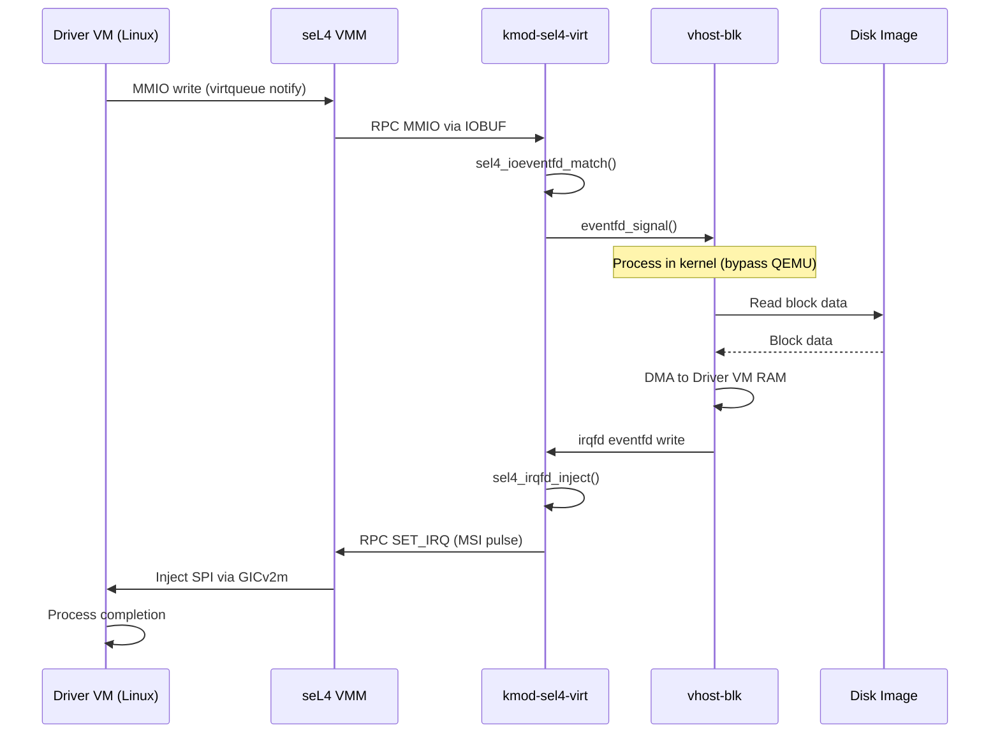

# Guest-Side Components

This document describes the software components that run inside guest Linux VMs to enable virtio communication.

## Overview

Guest-side components form the in-guest stack for virtio communication:



> **Note**: The Device VM uses `kmod-sel4-virt` to provide KVM-like ioeventfd/irqfd, enabling vhost acceleration. QEMU is only involved in control plane; the data plane runs entirely in kernel via vhost.

## vso_rpc Library

### Purpose

The `vso_rpc` library provides the RPC communication layer used by guest-side components (primarily QEMU) to communicate with the seL4 VMM.

### Header Location

```
projects/tii-sel4-vm/include/sel4/rpc.h
```

### Core Structures

```c
// Main RPC context
typedef struct vso_rpc {
    // Requests from driver to device
    vso_driver_rpc_t driver_rpc;

    // Events from device to driver
    vso_device_event_t device_event;

    // Doorbell callback
    void (*doorbell)(void *doorbell_cookie);
    void *doorbell_cookie;
} vso_rpc_t;

// Driver RPC queues
typedef struct vso_driver_rpc {
    rpcmsg_rpc_queue_t request;
    rpcmsg_rpc_queue_t response;
    rpcmsg_buffer_state_t buffer_state;
} vso_driver_rpc_t;
```

### Queue Types

| Queue ID | Name | Purpose |
|----------|------|---------|
| `queue_id_drvrpc_req` | Driver RPC Request | VMM → QEMU requests |
| `queue_id_drvrpc_req_dev` | Device Request (User) | Kernel → userspace forwarding |
| `queue_id_drvrpc_resp` | Driver RPC Response | QEMU → VMM responses |
| `queue_id_devevt` | Device Event | Device → driver events (IRQ, etc.) |

### Initialization

```c
int vso_rpc_init(vso_rpc_t *rpc,
                 vso_rpc_id_t id,
                 void *iobuf,
                 void (*doorbell)(void *doorbell_cookie),
                 void *doorbell_cookie);
```

**RPC IDs:**
- `vso_rpc_driver`: Used by VMM side (initiates requests)
- `vso_rpc_device_km`: Used by device kernel module
- `vso_rpc_device`: Used by device userspace (QEMU)

### Message Processing

**Receiving Requests:**
```c
rpcmsg_t *msg;
for_each_driver_rpc_req(msg, &rpc) {
    int op = QEMU_OP(msg->mr0);
    switch (op) {
    case QEMU_OP_MMIO:
        handle_mmio(msg);
        break;
    // ...
    }
}
```

**Sending Responses:**
```c
int driver_rpc_reply(vso_rpc_t *rpc, rpcmsg_t *msg);
```

**Sending Events:**
```c
int device_event_tx(vso_rpc_t *rpc, unsigned int op,
                    seL4_Word mr0, seL4_Word mr1,
                    seL4_Word mr2, seL4_Word mr3);
```

### Convenience Functions

| Function | Description |
|----------|-------------|
| `driver_rpc_req_mmio_start()` | Initiate MMIO request |
| `driver_rpc_ack_mmio_finish()` | Complete MMIO with response |
| `device_rpc_req_start_vm()` | Signal VM ready to start |
| `device_rpc_req_create_vpci_device()` | Register PCI device |
| `device_rpc_req_set_irqline()` | Set IRQ level high |
| `device_rpc_req_clear_irqline()` | Set IRQ level low |
| `device_rpc_req_pulse_irqline()` | Pulse (edge) IRQ |

## Device-Side Queue Implementation

This section provides detailed implementation information for how RPC queues are accessed from the device side (the VM running QEMU).

### IOBUF Memory Layout

The shared I/O buffer (`iobuf`) is a 2-page (8KB) memory region with the following layout:

```
┌────────────────────────────────────────────────────────────────────────────┐
│                         IOBUF (rpcmsg_iobuf_t)                             │
│                            Total: 2 pages (8KB)                            │
├────────────────────────────────────────────────────────────────────────────┤
│                                                                            │
│  ┌──────────────────────────────────────────────────────────────────────┐  │
│  │  rpcmsg_buffer_t buffers[2]                                          │  │
│  │                                                                      │  │
│  │  [0] drvrpc_buffer (32 messages × 32 bytes each = 1024 bytes)        │  │
│  │      - Used for MMIO request/response messages                       │  │
│  │      - Shared between VMM and device                                 │  │
│  │                                                                      │  │
│  │  [1] devevt_buffer (32 messages × 32 bytes each = 1024 bytes)        │  │
│  │      - Used for device event messages (IRQ, PCI registration)        │  │
│  │      - Written by device, read by VMM                                │  │
│  └──────────────────────────────────────────────────────────────────────┘  │
│                                                                            │
│  ┌──────────────────────────────────────────────────────────────────────┐  │
│  │  rpcmsg_queue_t queues[4]                                            │  │
│  │                                                                      │  │
│  │  [0] queue_id_drvrpc_req      - VMM kernel → Device kernel requests  │  │
│  │  [1] queue_id_drvrpc_req_dev  - Device kernel → Userspace forwarding │  │
│  │  [2] queue_id_drvrpc_resp     - Device → VMM responses               │  │
│  │  [3] queue_id_devevt          - Device → VMM async events            │  │
│  │                                                                      │  │
│  │  Each queue contains:                                                │  │
│  │  - head (rpcmsg_marker_t): Producer write position                   │  │
│  │  - tail (rpcmsg_marker_t): Consumer read position                    │  │
│  │  - buffer_id: Index into buffers[] array                             │  │
│  └──────────────────────────────────────────────────────────────────────┘  │
│                                                                            │
└────────────────────────────────────────────────────────────────────────────┘
```

### Queue Data Structures

From `rpc_queue.h`:

```c
#define RPCMSG_BUFFER_SIZE 32  // Power of 2

// Lock-free atomic marker (position + sequence count)
typedef union rpcmsg_marker {
    uint64_t raw;                // Atomic access via __atomic_* operations
    uint32_t val;                // Simple comparison (pos only)
    struct _rpcmsg_marker {
        uint32_t pos;            // Position in ring buffer (0-31)
        uint32_t count;          // Monotonic counter (ABA prevention)
    } marker;
} rpcmsg_marker_t;

// Producer/consumer bounds (head = committed, tail = claimed)
typedef struct rpcmsg_queue_bound {
    volatile rpcmsg_marker_t tail;  // Claimed position (in-progress)
    volatile rpcmsg_marker_t head;  // Committed position (visible)
} rpcmsg_queue_bound_t;

// Single queue metadata with MPMC support
typedef struct rpcmsg_queue_t {
    volatile rpcmsg_queue_bound_t prod;  // Producer bounds
    volatile rpcmsg_queue_bound_t cons;  // Consumer bounds
    uint16_t ring[RPCMSG_BUFFER_SIZE];   // Ring of message buffer indices
} rpcmsg_queue_t;

// Message buffer (ring of 32 messages × 32 bytes each)
typedef struct rpcmsg_buffer {
    rpcmsg_t messages[RPCMSG_BUFFER_SIZE];
} rpcmsg_buffer_t;

// Complete iobuf layout (fits in 2 pages)
typedef struct rpcmsg_iobuf {
    rpcmsg_buffer_t buffers[2];  // [0]=drvrpc, [1]=devevt
    rpcmsg_queue_t queues[4];    // All queue metadata
} rpcmsg_iobuf_t;
```

**Lock-Free Design Notes:**
- Two-phase commit: claim slot via `tail`, commit via `head`
- Producer and consumer have independent bounds for MPMC
- `ring[]` stores indices into `buffers[].messages[]`

### UIO Device Access from Userspace

The device VM accesses shared memory through Linux UIO devices. The `connection.ko` kernel module creates UIO devices for each cross-VM connection.

**Opening the UIO Device:**
```c
// Open the UIO device created by connection.ko
int uio_fd = open("/dev/uio0", O_RDWR);
if (uio_fd < 0) {
    perror("Failed to open UIO device");
    return -1;
}
```

**Memory Mapping the IOBUF:**
```c
// PCI BAR layout:
// BAR0: Event registers (control/status for notifications)
// BAR1: IOBUF (RPC queue shared memory)
// BAR2+: Additional dataports (memdev)

// Map BAR0 for event/doorbell access
void *event_bar = mmap(NULL, 0x1000,
                       PROT_READ | PROT_WRITE,
                       MAP_SHARED, uio_fd,
                       0 * getpagesize());  // BAR0 at offset 0

// Map BAR1 for IOBUF access
size_t iobuf_size = 2 * getpagesize();  // 8KB
void *iobuf = mmap(NULL, iobuf_size,
                   PROT_READ | PROT_WRITE,
                   MAP_SHARED, uio_fd,
                   1 * getpagesize());  // BAR1 at offset 1 page

// Map BAR2 for memdev (large shared memory for DMA)
size_t memdev_size = 256 * 1024 * 1024;  // 256MB typical
void *memdev = mmap(NULL, memdev_size,
                    PROT_READ | PROT_WRITE,
                    MAP_SHARED, uio_fd,
                    2 * getpagesize());  // BAR2 at offset 2 pages
```

### Queue Initialization Sequence

**Device-Side (QEMU) Initialization:**
```c
// 1. Open UIO device
int fd = open("/dev/uio0", O_RDWR);

// 2. Map shared memory regions
void *event_bar = mmap(..., 0 * getpagesize());  // BAR0
void *iobuf = mmap(..., 1 * getpagesize());      // BAR1

// 3. Initialize RPC context
vso_rpc_t rpc;
vso_rpc_init(&rpc, vso_rpc_device, iobuf,
             my_doorbell_callback, event_bar);

// 4. Now ready to process messages
```

**vso_rpc_init() for Device Role:**
```c
int vso_rpc_init(vso_rpc_t *rpc, vso_rpc_id_t id,
                 void *iobuf, void (*doorbell)(void *),
                 void *doorbell_cookie) {
    rpc->doorbell = doorbell;
    rpc->doorbell_cookie = doorbell_cookie;

    // For device role, set up queue pointers
    if (id == vso_rpc_device) {
        // Incoming requests from VMM
        rpc->driver_rpc.request.queue = device_drvrpc_req(iobuf);
        rpc->driver_rpc.request.buffer = drvrpc_buffer(iobuf);

        // Outgoing responses to VMM
        rpc->driver_rpc.response.queue = device_drvrpc_resp(iobuf);
        rpc->driver_rpc.response.buffer = drvrpc_buffer(iobuf);

        // Outgoing events (IRQ, PCI registration)
        rpc->device_event.queue = devevt_queue(iobuf);
        rpc->device_event.buffer = devevt_buffer(iobuf);
    }
    return 0;
}
```

### Device-Side Queue Access Macros

These macros return combined queue+buffer struct handles from an iobuf pointer:

```c
// From rpc.h - Core macro creates typed queue handle
#define iobuf_queue(_addr, _bid, _qid, _type) ({      \
    rpcmsg_iobuf_t *_iobuf = (void *)(_addr);         \
    _type _q = {                                       \
        .buffer = &_iobuf->buffers[(_bid)],           \
        .queue = &_iobuf->queues[(_qid)],             \
    };                                                 \
    _q;                                                \
})

// Device userspace (QEMU) queue access - returns rpcmsg_rpc_queue_t
#define device_drvrpc_req(iobuf) \
    iobuf_queue((iobuf), iobuf_id_drvrpc, queue_id_drvrpc_req_dev, rpcmsg_rpc_queue_t)

#define device_drvrpc_resp(iobuf) \
    iobuf_queue((iobuf), iobuf_id_drvrpc, queue_id_drvrpc_resp, rpcmsg_rpc_queue_t)

// Event queue - returns rpcmsg_event_queue_t
#define devevt_queue(iobuf) \
    iobuf_queue((iobuf), iobuf_id_devevt, queue_id_devevt, rpcmsg_event_queue_t)

// Queue handle types (pair of pointers)
typedef struct rpcmsg_rpc_queue {
    rpcmsg_buffer_t *buffer;   // Message storage
    rpcmsg_queue_t *queue;     // Queue metadata
} rpcmsg_rpc_queue_t;

typedef struct rpcmsg_event_queue {
    rpcmsg_buffer_t *buffer;
    rpcmsg_queue_t *queue;
} rpcmsg_event_queue_t;
```

**Important:** These macros return struct values (not pointers). The returned handle contains both the buffer and queue pointers needed for enqueue/dequeue operations.

### Doorbell Callback Implementation

The doorbell mechanism notifies the other side when messages are queued.

**Device → VMM Doorbell (QEMU signaling VMM):**
```c
// Doorbell callback writes to event BAR to trigger notification
static void device_doorbell(void *cookie) {
    volatile uint32_t *event_bar = (volatile uint32_t *)cookie;

    // Writing to BAR0[0] triggers PCI config space write
    // which causes seL4 VMM to receive notification
    event_bar[0] = 1;
}

// Usage in QEMU initialization
vso_rpc_t rpc;
vso_rpc_init(&rpc, vso_rpc_device, iobuf,
             device_doorbell, event_bar);
```

**Triggering Doorbell After Enqueue:**
```c
// After enqueuing a message, ring the doorbell
int device_event_tx(vso_rpc_t *rpc, unsigned int op,
                    seL4_Word mr0, seL4_Word mr1,
                    seL4_Word mr2, seL4_Word mr3) {
    rpcmsg_t msg = {
        .mr0 = BIT_FIELD_SET(0, RPC_MR0_OP, op),
        .mr1 = mr1,
        .mr2 = mr2,
        .mr3 = mr3,
    };

    // Enqueue to event queue
    int ret = rpcmsg_event_tx(&rpc->device_event, &msg);
    if (ret == 0) {
        // Ring doorbell to wake VMM
        vso_doorbell(rpc);
    }
    return ret;
}

void vso_doorbell(vso_rpc_t *rpc) {
    if (rpc->doorbell) {
        rpc->doorbell(rpc->doorbell_cookie);
    }
}
```

### Receiving VMM → Device Notifications

**IRQ Handler in Kernel Module:**
```c
// From connection.c
static irqreturn_t connector_event_handler(int irq,
                                           struct uio_info *dev_info) {
    // Event BAR layout: [0]=emit, [1]=status
    uint32_t *event_bar = dev_info->mem[0].internal_addr;

    // Check if this is our interrupt
    u32 val = readl(&event_bar[1]);
    if (val == 0) {
        return IRQ_NONE;  // Not for us
    }

    // Clear status register
    writel(0, &event_bar[1]);

    // UIO framework wakes userspace processes waiting on read()
    return IRQ_HANDLED;
}
```

**Userspace Waiting for Notification:**
```c
// QEMU or userspace app waits for VMM notification
void wait_for_notification(int uio_fd) {
    uint32_t count;

    // Blocking read - wakes when IRQ fires
    ssize_t ret = read(uio_fd, &count, sizeof(count));
    if (ret == sizeof(count)) {
        // Notification received, process queued messages
        process_incoming_messages();
    }
}

// Typical event loop in QEMU
void *rpc_thread(void *arg) {
    vso_rpc_t *rpc = arg;

    while (1) {
        // Wait for VMM to signal us
        wait_for_notification(uio_fd);

        // Process all pending MMIO requests
        rpcmsg_t *msg;
        for_each_driver_rpc_req(msg, rpc) {
            handle_mmio_request(msg);
        }
    }
}
```

### Lock-Free Queue Operations

The queue implementation uses two-phase lock-free algorithms for MPMC (multi-producer, multi-consumer) thread safety:

**Checking if Queue is Empty:**
```c
static inline bool rpcmsg_queue_empty(rpcmsg_queue_t *q) {
    // Empty when producer committed head equals consumer committed head
    return q->prod.head.val == q->cons.head.val;
}
```

**Checking if Queue is Full:**
```c
static inline bool rpcmsg_queue_full(rpcmsg_queue_t *q) {
    // Full when all slots are claimed by producers
    return (RPCMSG_BUFFER_SIZE + q->cons.tail.val - q->prod.tail.val) == 0;
}
```

**Enqueue Operation (Two-Phase Commit):**
```c
// Phase 1: Claim a producer slot
static inline int rpcmsg_acquire_prod_entry(rpcmsg_queue_t *q, uint32_t *entry) {
    rpcmsg_marker_t ot, nt;
    uint32_t entries;

    ot.raw = atomic_load_acquire(&q->prod.tail.raw);
    do {
        // Wait if head-tail distance too large
        rpcmsg_tail_wait(&q->prod, &ot);

        // Check available space
        entries = RPCMSG_BUFFER_SIZE + q->cons.head.marker.pos - ot.marker.pos;
        if (!entries) return -1;  // Full

        nt.marker.pos = ot.marker.pos + 1;
        nt.marker.count = ot.marker.count + 1;
    } while (!atomic_compare_and_swap(&q->prod.tail.raw, &ot.raw, nt.raw));

    *entry = ot.marker.pos;
    return 0;
}

// Phase 2: Commit after writing to ring[]
static inline void rpcmsg_commit_update(volatile rpcmsg_queue_bound_t *bound) {
    rpcmsg_marker_t t, oh, nh;

    oh.raw = atomic_load_acquire(&bound->head.raw);
    do {
        t.raw = atomic_load_acquire(&bound->tail.raw);
        nh.raw = oh.raw;
        if (++nh.marker.count == t.marker.count)
            nh.marker.pos = t.marker.pos;  // Advance head
    } while (!atomic_compare_and_swap(&bound->head.raw, &oh.raw, nh.raw));
}
```

**Dequeue Operation (Two-Phase Commit):**
```c
// Phase 1: Claim a consumer slot
static inline int rpcmsg_acquire_cons_entry(rpcmsg_queue_t *q, uint32_t *entry) {
    rpcmsg_marker_t ot, nt;
    uint32_t entries;

    ot.raw = atomic_load_acquire(&q->cons.tail.raw);
    do {
        rpcmsg_tail_wait(&q->cons, &ot);

        // Check available entries
        entries = q->prod.head.marker.pos - ot.marker.pos;
        if (!entries) return -1;  // Empty

        nt.marker.pos = ot.marker.pos + 1;
        nt.marker.count = ot.marker.count + 1;
    } while (!atomic_compare_and_swap(&q->cons.tail.raw, &ot.raw, nt.raw));

    *entry = ot.marker.pos;
    return 0;
}

// Phase 2: Same rpcmsg_commit_update() as enqueue
```

**Key Implementation Details:**
- `tail` is claimed first (in-progress), `head` is committed after (visible)
- `ring[]` stores message buffer indices, not messages directly
- `count` monotonically increases to prevent ABA problems
- Separate `prod`/`cons` bounds allow concurrent producers and consumers

### Complete QEMU Integration Example

```c
// Simplified QEMU seL4 accelerator integration
static int uio_fd;
static void *event_bar;
static void *iobuf;
static void *memdev;
static vso_rpc_t rpc;

int sel4_accel_init(void) {
    // 1. Open UIO device
    uio_fd = open("/dev/uio0", O_RDWR);

    // 2. Map all BARs
    event_bar = mmap(NULL, 0x1000, PROT_READ | PROT_WRITE,
                     MAP_SHARED, uio_fd, 0);
    iobuf = mmap(NULL, 8192, PROT_READ | PROT_WRITE,
                 MAP_SHARED, uio_fd, getpagesize());
    memdev = mmap(NULL, MEMDEV_SIZE, PROT_READ | PROT_WRITE,
                  MAP_SHARED, uio_fd, 2 * getpagesize());

    // 3. Initialize RPC
    vso_rpc_init(&rpc, vso_rpc_device, iobuf,
                 device_doorbell, event_bar);

    // 4. Register PCI devices with VMM
    device_rpc_req_create_vpci_device(&rpc,
        (0x1AF4 << 16) | 0x1001);  // virtio-blk

    // 5. Signal VM ready
    device_rpc_req_start_vm(&rpc);

    // 6. Start RPC processing thread
    pthread_create(&rpc_thread, NULL, rpc_thread_fn, &rpc);

    return 0;
}

static void *rpc_thread_fn(void *arg) {
    vso_rpc_t *rpc = arg;
    uint32_t irq_count;

    while (1) {
        // Block waiting for VMM notification
        read(uio_fd, &irq_count, sizeof(irq_count));

        // Process MMIO requests
        rpcmsg_t *msg;
        for_each_driver_rpc_req(msg, rpc) {
            int op = QEMU_OP(msg->mr0);

            switch (op) {
            case QEMU_OP_MMIO:
                handle_mmio(rpc, msg);
                break;
            default:
                fprintf(stderr, "Unknown op: %d\n", op);
                break;
            }
        }
    }
}

static void handle_mmio(vso_rpc_t *rpc, rpcmsg_t *msg) {
    uint64_t addr = msg->mr1;
    uint64_t data = msg->mr2;
    int direction = BIT_FIELD_GET(msg->mr0, RPC_MR0_MMIO_DIRECTION);
    int len = BIT_FIELD_GET(msg->mr0, RPC_MR0_MMIO_LENGTH);

    if (direction == RPC_MR0_MMIO_DIRECTION_READ) {
        // Read from virtio device model
        data = virtio_read(addr, len);
        msg->mr2 = data;
    } else {
        // Write to virtio device model
        virtio_write(addr, len, data);
    }

    // Send response back to VMM
    driver_rpc_reply(rpc, msg);
}
```

## Linux Kernel Module (connection.ko)

### Purpose

The `connection.ko` kernel module enables Linux processes to communicate with seL4 CAmkES components through PCI-based cross-VM connections.

### Source Location

```
projects/vm-linux/camkes-linux-artifacts/camkes-linux-modules/
    camkes-connector-modules/connection/connection.c
```

### PCI Device Matching

```c
#define PCI_CONNECTOR_DEVICE_ID 0xa111

static struct pci_device_id connector_pci_ids[] = {
    {
        .vendor =       PCI_VENDOR_ID_REDHAT_QUMRANET,  // 0x1af4
        .device =       PCI_CONNECTOR_DEVICE_ID,
        .subvendor =    PCI_ANY_ID,
        .subdevice =    PCI_ANY_ID,
    },
    {0,}
};
```

### Architecture

The Device VM uses `kmod-sel4-virt` which provides a KVM-like `/dev/sel4` interface:



### BAR Layout

| BAR | Purpose | Contents |
|-----|---------|----------|
| BAR0 | Event/Control | IRQ status, device name |
| BAR1+ | Dataports | Shared memory regions |

**Event BAR (BAR0) Registers:**
| Offset | Register | Description |
|--------|----------|-------------|
| 0x00 | Control | Event emit trigger |
| 0x04 | Status | IRQ pending flag |
| 0x08+ | Name | Device name string |

### IRQ Handling

```c
static irqreturn_t connector_event_handler(int irq, struct uio_info *dev_info)
{
    uint32_t *event_bar = dev_info->mem[0].internal_addr;
    u32 val;

    val = readl(&event_bar[1]);
    if (val == 0) {
        return IRQ_NONE;  // Not our interrupt
    }

    // Clear the register
    writel(0, &event_bar[1]);
    return IRQ_HANDLED;
}
```

### UIO Device Creation

For each PCI device detected, the driver creates `/dev/uioN` devices that userspace can:
- `open()` and `read()` to wait for events
- `mmap()` to access shared memory regions

## Userspace Applications

### String Reverse Example

Demonstrates cross-VM communication using dataports and events:

```c
// Source: camkes-connector-apps/pkgs/string_reverse/string_reverse.c

#define READY "/dev/uio0"  // Input dataport + event
#define DONE "/dev/uio1"   // Output dataport + event

int main(int argc, char *argv[]) {
    int ready = open(READY, O_RDWR);
    int done = open(DONE, O_RDWR);

    // Map dataports
    char *src_data = mmap(NULL, BUFSIZE, PROT_READ | PROT_WRITE,
                          MAP_SHARED, ready, 1 * getpagesize());
    char *emit = mmap(NULL, 0x1000, PROT_READ | PROT_WRITE,
                      MAP_SHARED, ready, 0 * getpagesize());
    char *dest_data = mmap(NULL, BUFSIZE, PROT_READ | PROT_WRITE,
                           MAP_SHARED, done, 1 * getpagesize());

    while (fgets(buf, BUFSIZE, stdin)) {
        // Copy to source dataport
        strcpy(src_data, buf);

        // Emit event (trigger CAmkES component)
        emit[0] = 1;

        // Wait for completion event
        int val;
        read(done, &val, sizeof(val));

        // Read result
        printf("%s\n", dest_data);
    }
}
```

### Available Applications

| Application | Location | Purpose |
|-------------|----------|---------|
| `string_reverse` | `pkgs/string_reverse/` | String reversal demo |
| `emit` | `pkgs/emits_event/` | Event emission |
| `wait` | `pkgs/consumes_event/` | Event waiting |
| `read` | `pkgs/dataport/` | Dataport read |
| `write` | `pkgs/dataport/` | Dataport write |
| `introspect` | `pkgs/introspect/` | System introspection |

### Dataport Read Example

```c
// pkgs/dataport/read.c
int main(int argc, char *argv[]) {
    int fd = open("/dev/uio0", O_RDWR);

    // Map dataport (BAR1, offset = 1 page)
    char *data = mmap(NULL, size, PROT_READ,
                      MAP_SHARED, fd, 1 * getpagesize());

    // Read from shared memory
    printf("%s\n", data);

    munmap(data, size);
    close(fd);
}
```

### Event Emit Example

```c
// pkgs/emits_event/emit.c
int main(int argc, char *argv[]) {
    int fd = open("/dev/uio0", O_RDWR);

    // Map event register (BAR0)
    char *event = mmap(NULL, 0x1000, PROT_READ | PROT_WRITE,
                       MAP_SHARED, fd, 0);

    // Trigger event by writing to register
    event[0] = 1;

    munmap(event, 0x1000);
    close(fd);
}
```

### Event Wait Example

```c
// pkgs/consumes_event/wait.c
int main(int argc, char *argv[]) {
    int fd = open("/dev/uio0", O_RDWR);
    int val;

    // Blocks until event occurs
    read(fd, &val, sizeof(val));

    printf("Event received!\n");
    close(fd);
}
```

## QEMU seL4 Integration

### Accelerator Files

| File | Description |
|------|-------------|
| `accel/sel4/sel4-all.c` | Main seL4 accelerator |
| `accel/sel4/sel4-vpci.c` | Virtual PCI support |
| `hw/arm/virt-sel4.c` | ARM Virt machine for seL4 |
| `hw/intc/sel4_intc.c` | Interrupt controller |

### QEMU → vso_rpc Integration

QEMU uses vso_rpc to communicate with the VMM:

```c
// In QEMU seL4 accelerator
static vso_rpc_t rpc;

void sel4_accel_init(void) {
    // Map shared memory via UIO
    int uio_fd = open("/dev/uio0", O_RDWR);
    void *iobuf = mmap(...);

    // Initialize RPC
    vso_rpc_init(&rpc, vso_rpc_device, iobuf,
                 sel4_doorbell, NULL);
}

// Handle MMIO from VMM
void sel4_handle_mmio(rpcmsg_t *msg) {
    uint64_t addr = msg->mr1;
    uint64_t data = msg->mr2;

    // Process MMIO access
    // ...

    // Send response
    driver_rpc_ack_mmio_finish(&rpc, msg, result);
}

// Send interrupt to driver VM
void sel4_set_irq(int irq, int level) {
    device_rpc_req_set_irqline(&rpc, irq);
}
```

### Virtio Thread

QEMU runs a dedicated thread for processing virtio requests:

```c
static void *virtio_thread_fn(void *arg) {
    while (1) {
        // Wait for doorbell
        doorbell_wait();

        // Process incoming MMIO requests
        rpcmsg_t *msg;
        for_each_driver_rpc_req(msg, &rpc) {
            int op = QEMU_OP(msg->mr0);
            if (op == QEMU_OP_MMIO) {
                sel4_handle_mmio(msg);
            }
        }
    }
}
```

## Communication Flow Example

Complete flow for a virtio-blk read with vhost acceleration:



> **Note**: With vhost-blk, the disk I/O path runs entirely in the Device VM kernel. QEMU only configures the device during setup; actual block operations bypass userspace entirely.

## Building Guest Components

### Kernel Module

```bash
# In Yocto build
bitbake kernel-module-sel4-virt
```

### Userspace Applications

```bash
# Build all connector apps
bitbake camkes-connector-apps
```

## Debugging

### Check UIO Devices

```bash
# List UIO devices
ls -la /dev/uio*

# Check device info
cat /sys/class/uio/uio0/name
cat /sys/class/uio/uio0/maps/map0/size
```

### Kernel Module Logs

```bash
dmesg | grep connector
```

### Trace vso_rpc

```c
// Enable in rpc.h
#define RPC_DEBUG 1
```

## Source Files

| File | Description |
|------|-------------|
| `include/sel4/rpc.h` | vso_rpc library header |
| `include/sel4/rpc_queue.h` | RPC queue implementation |
| `camkes-linux-modules/connection/connection.c` | Kernel module |
| `camkes-connector-apps/` | Userspace applications |

## Related Documentation

- [QEMU Backend](qemu-backend.md)
- [RPC Protocol](../architecture/rpc-protocol.md)
- [I/O Proxy](../components/io-proxy.md)
