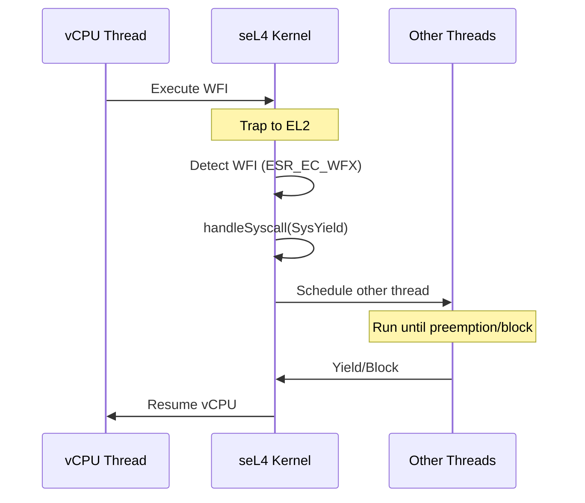

# seL4 Kernel Modifications

This document describes the TII modifications to the seL4 microkernel for improved virtualization support.

## Overview

TII made several enhancements to the seL4 kernel:

| Category | Modification | Impact |
|----------|--------------|--------|
| Hypervisor | WFI yielding | CPU efficiency |
| Debugging | Thread switch tracking | Performance analysis |
| Debugging | Function tracing | Kernel profiling |
| Performance | D-cache cleaning | Cache coherency |
| Platform | RPi4 support | Hardware enablement |

## WFI Yielding

### Problem

When a guest VM executes WFI (Wait For Interrupt), the vCPU would idle-loop in the kernel, wasting CPU cycles that could be used by other VMs or seL4 threads.

### Solution

TII modified the kernel to yield to other threads when a vCPU executes WFI:

```c
// kernel/include/arch/arm/armv/armv8-a/64/armv/vcpu.h

// Trap WFI but not WFE
// HCR_TWE commented out to only trap WFI

#define ESR_EC_WFX 0x1  // WFI/WFE trap exception class

// In armv_handleVCPUFault():
if (ESR_EC(hsr) == ESR_EC_WFX) {
    if ((hsr & 1) == 0) {
        /* WFI - yield to other threads */
        handleSyscall(SysYield);
        return true;
    }
}
```

### Behavior



### Impact

- **Before**: vCPU spins waiting for interrupt
- **After**: CPU time available for other VMs
- **Benefit**: Significantly improved CPU efficiency in multi-VM scenarios

### File Location

`kernel/include/arch/arm/armv/armv8-a/64/armv/vcpu.h`

## Thread Switch Tracking (HYPR-432)

### Purpose

Track thread context switches for performance analysis and debugging.

### Implementation

Added `Entry_Switch` to the benchmark tracking infrastructure:

```c
// kernel/libsel4/include/sel4/benchmark_track_types.h

typedef enum {
    Entry_Interrupt,
    Entry_UnknownSyscall,
    Entry_UserLevelFault,
    Entry_DebugFault,
    Entry_VMFault,
    Entry_Switch,         // NEW: Thread switch tracking
    Entry_Syscall,
    ...
} entry_type_t;

// Extended kernel_entry structure
typedef struct {
    ...
    uint64_t path: 4;     // Increased from 3 bits
    ...
    void *next;           // NEW: Next thread pointer
} kernel_entry_t;
```

Thread switch recording:

```c
// kernel/src/kernel/thread.c

void switchToThread(tcb_t *thread) {
#ifdef CONFIG_BENCHMARK_TRACK_KERNEL_ENTRIES
    ksKernelEntry.path = Entry_Switch;
    ksKernelEntry.next = thread;
#endif
    ...
}
```

### Debug Output

Enhanced debug printing includes TCB pointer:

```c
// kernel/include/api/debug.h
printf("%lx %40s\t", (unsigned long int)tcb, TCB_PTR_DEBUG_PTR(tcb)->tcbName);
```

### File Locations

- `kernel/include/api/debug.h`
- `kernel/libsel4/include/sel4/benchmark_track_types.h`
- `kernel/src/kernel/thread.c`

## Kernel Function Tracing (HYPR-53)

### Purpose

Trace kernel function entry/exit for performance analysis.

### Implementation

Uses GCC instrumentation to record function calls:

```c
// kernel/src/kernel/trace.c

typedef struct {
    unsigned long func;
} trace_entry_t;

// Per-CPU circular buffers (1024 entries each)
unsigned int te_head[CONFIG_MAX_NUM_NODES] = {0};
trace_entry_t tes[CONFIG_MAX_NUM_NODES][1024];

void __cyg_profile_func_enter(void *thisfn, void *call_site) {
    int cpu = getCurrentCPUIndex();
    tes[cpu][te_head[cpu]].func = (unsigned long)thisfn;
    te_head[cpu]++;
    te_head[cpu] &= 1023;  // Wrap at 1024
    __asm__ volatile ("dsb sy");
}

void __cyg_profile_func_exit(void *thisfn, void *call_site) {
    // Empty - only tracking entry
}
```

### Build Configuration

CMake flags enable instrumentation:

```cmake
# kernel/CMakeLists.txt
-finstrument-functions
-finstrument-functions-exclude-function-list=__cyg_profile_func_enter,__cyg_profile_func_exit,getCurrentCPUIndex
```

### Usage

Trace data can be read from `tes[]` arrays for offline analysis.

### File Locations

- `kernel/src/kernel/trace.c`
- `kernel/CMakeLists.txt`
- `kernel/src/config.cmake`

## D-Cache Cleaning

### Problem

Generic D-cache cleaning was unreliable for virtualization workloads requiring strict cache coherency.

### Solution

Implemented ARM Architecture Reference Manual algorithm:

```asm
// kernel/src/arch/arm/armv/armv8-a/64/machine_asm.S

arm_reference_clean_D_PoC:
    // ARM reference implementation for cleaning D-cache to Point of Coherency
    // Iterates through all cache levels and sets
    ...
```

### Impact

- More reliable cache coherency for DMA operations
- Follows ARM specification exactly
- Required for correct virtio data transfer

### File Location

`kernel/src/arch/arm/armv/armv8-a/64/machine_asm.S`

## Platform-Specific Changes

### SMP Spin Table Carveout (HYPR-18)

Preserves first page for SMP boot code:

```dts
// kernel/tools/dts/rpi4.dts
spintables_carveout {
    reg = < 0x00 0x00000000 0x00001000 >;
    no-map;
};
```

### RPi4 PCIe Support (HYPR-48)

Enables PCIe device passthrough to guest VMs:

```dts
// kernel/tools/dts/rpi4.dts

// Fixed DMA ranges
dma-ranges = <0xd0000000 0x00 0x10000000 0x10000000>;

// Expanded IRQ coverage for MSI
interrupts = <...>;  // 6 interrupt definitions
```

### System Timer Overrides

Prevents VideoCore interrupt conflicts:

```dts
// kernel/src/plat/bcm2711/overlay-rpi4-address-mapping.dts

// Remap system timer
// Only expose channels 1 and 3 (0 and 2 used by VideoCore)
```

### UART Pinmux Removal

Prevents conflicts with bootloader:

```dts
// kernel/tools/dts/rpi4.dts

// Removed:
// pinctrl-names = "default";
// pinctrl-0 = <0x0d>;
```

## Configuration Options

### Kernel Config

Relevant kernel configuration options:

| Option | Description |
|--------|-------------|
| `KernelArmHypervisorSupport` | Enable ARM hypervisor mode |
| `KernelRootCNodeSizeBits` | Root CNode size (18 for VMs) |
| `KernelArmDisableWFIWFETraps` | Disable WFI/WFE trapping |
| `CONFIG_BENCHMARK_TRACK_KERNEL_ENTRIES` | Enable entry tracking |

### Build-time Selection

```cmake
# settings.cmake
set(KernelArmHypervisorSupport ON)
set(KernelRootCNodeSizeBits 18)
```

## Commit History

Key TII commits:

| Commit | Title | Author |
|--------|-------|--------|
| ff856f1ce | Yield on WFI | Hannu Lyytinen |
| 7538d97ed | HYPR-432 Trace thread switches | Hannu Lyytinen |
| 4196a1cdf | HYPR-53 Implement kernel function tracing | Hannu Lyytinen |
| 2a7a0cf8a | HYPR-XX Use ARM reference cleaning D-cache | Hannu Lyytinen |
| 26676b8cf | HYPR-18 Leave SMP spin tables intact | Hannu Lyytinen |
| 7cb9355ab | HYPR-48 RPi4: PCIe on guest VM | Ivan Kuznetsov |

## Related Documentation

- [System Overview](../architecture/overview.md) - Architecture context
- [Memory Model](../architecture/memory-model.md) - Cache coherency requirements
- [Other Repository Changes](other-repos.md) - Related library modifications
