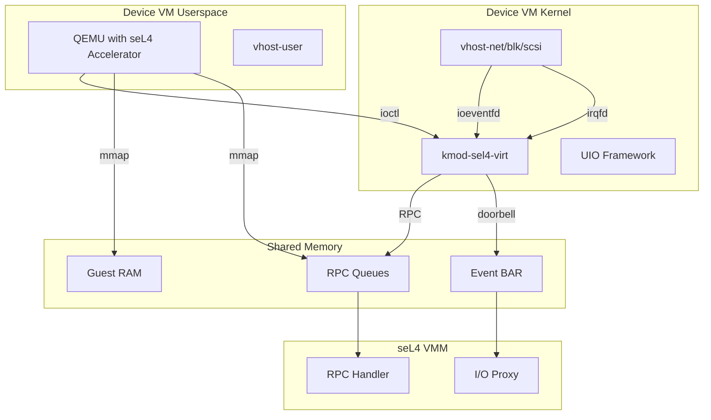
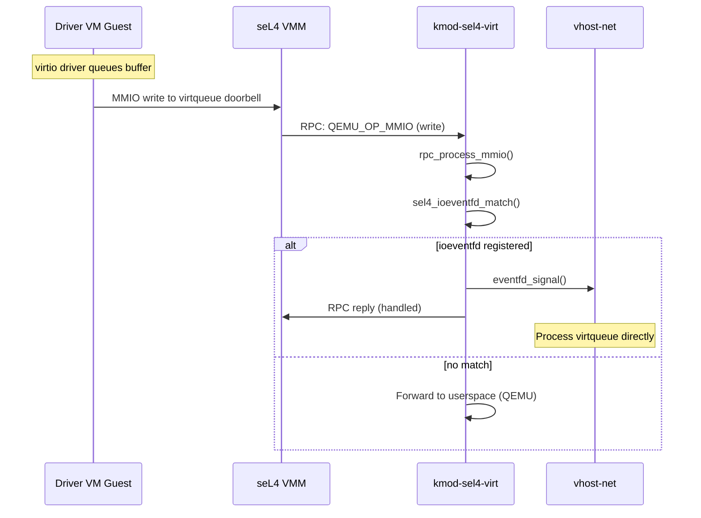
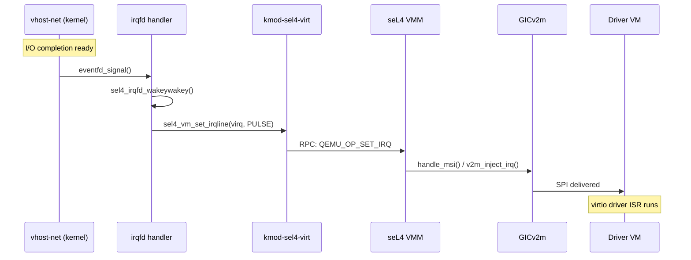
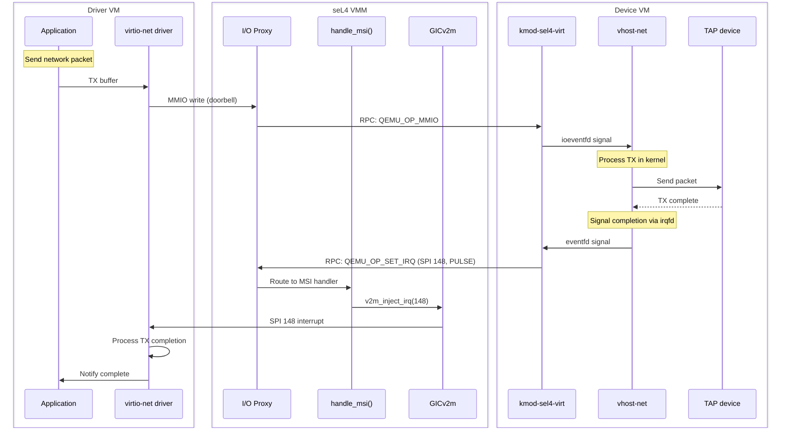

# kmod-sel4-virt Kernel Module

This document describes the `kmod-sel4-virt` kernel module that provides the bridge between QEMU and the seL4 VMM's RPC infrastructure. It implements a KVM-like API that enables vhost acceleration.

## Overview

The kernel module creates a `/dev/sel4` device that QEMU uses instead of `/dev/kvm`. It provides:

- VM creation and lifecycle management
- Shared memory mapping (RAM, RPC queues, event registers)
- **ioeventfd**: MMIO write notification for vhost virtqueue doorbells
- **irqfd**: Interrupt injection from kernel (bypassing QEMU userspace)
- RPC message forwarding between VMM and QEMU



## Source Location

```
~/tii-sel4/sources/kmod-sel4-virt/
├── sel4_core.c           # Main module, /dev/sel4 device, ioctls
├── sel4_vmm.c            # VMM allocation
├── sel4_irqfd.c          # irqfd implementation (MSI injection)
├── sel4_ioeventfd.c      # ioeventfd implementation (vhost doorbells)
├── sel4_mmap.c           # Memory mapping
├── sel4_virt_drv.h       # Internal driver header
├── pci/
│   ├── sel4_pci.c        # PCI backend
│   └── sel4_vmm_pool.c   # VMM pool management
├── include/uapi/sel4/
│   ├── sel4_virt.h       # Userspace API (ioctls)
│   ├── sel4_virt_types.h # Shared types
│   ├── rpc.h             # RPC definitions
│   └── rpc_queue.h       # RPC queue structures
└── test/                 # Unit tests
```

## Kernel Module API

### Device Creation

```c
// Open the module
int fd = open("/dev/sel4", O_RDWR);

// Create a VM
struct sel4_vm_params params = {
    .id = 1,
    .ram_size = 512 * 1024 * 1024,
};
int vmfd = ioctl(fd, SEL4_CREATE_VM, &params);
```

### Memory Mapping

The module exposes three memory regions:

| Index | Name | Purpose |
|-------|------|---------|
| `SEL4_MEM_MAP_RAM` | Guest RAM | Driver VM's memory |
| `SEL4_MEM_MAP_IOBUF` | RPC Queues | vso_rpc shared memory |
| `SEL4_MEM_MAP_EVENT_BAR` | Event BAR | Doorbell register |

```c
// Get file descriptor for memory region
int ram_fd = ioctl(vmfd, SEL4_CREATE_IO_HANDLER, SEL4_MEM_MAP_RAM);
int iobuf_fd = ioctl(vmfd, SEL4_CREATE_IO_HANDLER, SEL4_MEM_MAP_IOBUF);
int event_fd = ioctl(vmfd, SEL4_CREATE_IO_HANDLER, SEL4_MEM_MAP_EVENT_BAR);

// Map into userspace
void *ram = mmap(NULL, ram_size, PROT_READ | PROT_WRITE,
                 MAP_SHARED, ram_fd, 0);
void *iobuf = mmap(NULL, IOBUF_SIZE, PROT_READ | PROT_WRITE,
                   MAP_SHARED, iobuf_fd, 0);
void *event_bar = mmap(NULL, 4096, PROT_READ | PROT_WRITE,
                       MAP_SHARED, event_fd, 0);
```

### IOCTL Reference

| IOCTL | Value | Description |
|-------|-------|-------------|
| `SEL4_CREATE_VM` | 0x20 | Create VM, returns vmfd |
| `SEL4_START_VM` | 0x21 | Signal VM ready to start |
| `SEL4_CREATE_VPCI_DEVICE` | 0x22 | Register PCI device with VMM |
| `SEL4_DESTROY_VPCI_DEVICE` | 0x23 | Unregister PCI device |
| `SEL4_SET_IRQLINE` | 0x24 | Set/clear/pulse IRQ |
| `SEL4_IOEVENTFD` | 0x25 | Register ioeventfd |
| `SEL4_IRQFD` | 0x26 | Register irqfd |
| `SEL4_MMIO_REGION` | 0x27 | Configure MMIO region |
| `SEL4_CREATE_IO_HANDLER` | 0x30 | Get fd for memory region |
| `SEL4_WAIT_IO` | 0x31 | Block waiting for I/O requests |

## ioeventfd - vhost Doorbell Acceleration

ioeventfd allows vhost (or other kernel components) to be notified when the guest writes to specific MMIO addresses, without going through QEMU userspace.

### How It Works



### Data Structures

```c
// From sel4_ioeventfd.c
struct sel4_ioeventfd {
    struct list_head    list;
    struct eventfd_ctx  *eventfd;
    u64    addr;           // MMIO address to match
    u64    data;           // Data value to match (optional)
    u32    len;            // Access size (0 = any)
    u32    addr_space;     // AS_GLOBAL or PCI slot
    bool   wildcard;       // Match any data value
};
```

### Registration

```c
// QEMU registers ioeventfd for virtqueue doorbell
struct sel4_ioeventfd_config config = {
    .fd = eventfd,                    // eventfd to signal
    .addr = virtqueue_notify_addr,    // Doorbell MMIO address
    .addr_space = AS_GLOBAL,
    .len = 4,                         // 32-bit write
    .data = 0,
    .flags = 0,                       // No DATAMATCH
};
ioctl(vmfd, SEL4_IOEVENTFD, &config);
```

### Kernel Processing

```c
// From sel4_ioeventfd.c
int rpc_process_mmio(struct sel4_vm *vm, rpcmsg_t *req)
{
    // Only handle writes (reads go to userspace)
    if (direction == SEL4_IO_DIR_READ)
        return -1;

    // Find matching ioeventfd
    ioeventfd = sel4_ioeventfd_match(vm, addr_space, addr, len, data);
    if (!ioeventfd)
        return -1;  // Forward to userspace

    // Signal the eventfd (wakes vhost)
    eventfd_signal(ioeventfd->eventfd, 1);

    // Send RPC completion
    driver_rpc_ack_mmio_finish(&vm->vmm->rpc, req, data);
    return 0;
}
```

## irqfd - MSI Injection Acceleration

irqfd allows kernel components (like vhost) to inject interrupts to the guest by writing to an eventfd, bypassing QEMU userspace entirely.

### How It Works



### Data Structures

```c
// From sel4_irqfd.c
struct sel4_irqfd {
    struct sel4_vm      *vm;
    struct list_head    list;
    struct eventfd_ctx  *eventfd;
    wait_queue_entry_t  wait;
    struct work_struct  cleanup;
    poll_table          pt;
    u32 virq;              // Virtual IRQ (SPI number for MSI)
};
```

### Registration

```c
// QEMU registers irqfd for MSI-X vector
struct sel4_irqfd_config config = {
    .fd = eventfd,     // eventfd that vhost will signal
    .virq = msi_gsi,   // SPI number (e.g., 148 for MSI)
    .flags = 0,
};
ioctl(vmfd, SEL4_IRQFD, &config);
```

### Kernel Implementation

```c
// From sel4_irqfd.c
static void sel4_irqfd_inject(struct sel4_irqfd *irqfd)
{
    u64 cnt;
    eventfd_ctx_do_read(irqfd->eventfd, &cnt);

    // Pulse IRQ via RPC to VMM
    sel4_vm_set_irqline(irqfd->vm, irqfd->virq, SEL4_IRQ_OP_PULSE);
}

// Wake callback - called when eventfd is signaled
static int sel4_irqfd_wakeywakey(wait_queue_entry_t *wait,
                                  unsigned int mode,
                                  int sync, void *key)
{
    struct sel4_irqfd *irqfd = container_of(wait, struct sel4_irqfd, wait);
    unsigned long poll_bits = (unsigned long)key;

    if (poll_bits & POLLIN)
        sel4_irqfd_inject(irqfd);

    if (poll_bits & POLLHUP)
        queue_work(irqfd_cleanup_wq, &irqfd->cleanup);

    return 0;
}
```

## MSI Integration

### The Complete MSI Path with irqfd



### Why This Matters

Without irqfd (traditional path):
```
vhost → eventfd → QEMU userspace → ioctl → kernel → RPC → VMM
```

With irqfd (accelerated path):
```
vhost → eventfd → kernel irqfd handler → RPC → VMM
```

**Benefits:**
- Eliminates QEMU userspace context switch
- Reduces interrupt latency significantly
- Essential for high-performance vhost-net

## RPC Message Processing

### Message Flow in Kernel

```c
// From sel4_core.c
static int rpc_process(rpcmsg_t *req, void *cookie)
{
    struct sel4_vm *vm = cookie;

    switch (QEMU_OP(req->mr0)) {
    case QEMU_OP_MMIO:
        // Try ioeventfd first (kernel fast path)
        if (!rpc_process_mmio(vm, req)) {
            return 0;  // Handled in kernel
        }
        break;
    }

    // Forward to userspace (QEMU) if not handled
    return driver_rpc_request_fwd(&vm->vmm->user_rpc, req);
}

static void sel4_vm_process_ioreqs(struct sel4_vm *vm)
{
    rpcmsg_t *msg;

    // Process all pending RPC requests
    for_each_driver_rpc_req(msg, &vm->vmm->rpc) {
        rpc_process(msg, vm);
    }

    // Wake QEMU if requests forwarded
    if (sel4_ioreq_pending(vm)) {
        wake_up_interruptible(&vm->ioreq_wait);
    }
}
```

### IRQ Handler

```c
// From sel4_core.c
static irqreturn_t sel4_vm_interrupt(int irq, void *private)
{
    struct sel4_vm *vm = private;

    // Call platform-specific handler
    irqreturn_t rc = sel4_vm_call_irqhandler(vm, irq);

    if (rc == IRQ_HANDLED)
        sel4_vm_upcall_notify(vm);  // Queue work to process messages

    return rc;
}
```

## Building and Loading

### Build

```bash
cd ~/tii-sel4/sources/kmod-sel4-virt
make
```

### Load

```bash
# Load the module
insmod sel4_virt.ko

# Verify
ls -la /dev/sel4
dmesg | grep sel4
```

### Module Parameters

The module may accept parameters for configuration (check source for current options).

## Debugging

### Check Module Status

```bash
# Module loaded
lsmod | grep sel4

# Device present
ls -la /dev/sel4

# Kernel logs
dmesg | grep sel4
```

### Trace ioeventfd/irqfd

Add debug prints to the kernel module:
```c
// In sel4_ioeventfd.c
pr_debug("ioeventfd: addr=%llx len=%u\n", addr, len);

// In sel4_irqfd.c
pr_debug("irqfd: injecting virq=%u\n", irqfd->virq);
```

Enable dynamic debug:
```bash
echo 'module sel4_virt +p' > /sys/kernel/debug/dynamic_debug/control
```

## Source Files

| File | Description |
|------|-------------|
| `sel4_core.c` | Main module, device creation, ioctls |
| `sel4_vmm.c` | VMM structure allocation |
| `sel4_irqfd.c` | irqfd implementation for MSI |
| `sel4_ioeventfd.c` | ioeventfd for vhost doorbells |
| `sel4_mmap.c` | Memory region mapping |
| `sel4_virt_drv.h` | Internal driver header |
| `include/uapi/sel4/sel4_virt.h` | Userspace IOCTL definitions |

## Related Documentation

- [QEMU seL4 Accelerator](qemu-sel4-accelerator.md) - QEMU side of the bridge
- [vhost Acceleration](../architecture/vhost-acceleration.md) - Why MSI matters for vhost
- [Guest-Side Components](guest-side-components.md) - Overall guest architecture
- [RPC Protocol](../architecture/rpc-protocol.md) - RPC message format
