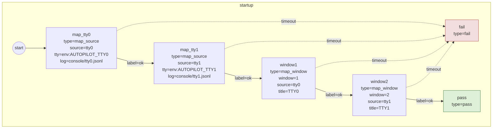

# Autopilot Chain Diagrams

Regenerate with:

```bash
python3 tools/autopilot_chain_viz.py --all --docs
```

## boot-interactive-efi

```mermaid
flowchart TD
subgraph boot_interactive_efi[boot-interactive-efi]
boot_interactive_efi_start((start))
boot_interactive_efi_start --> boot_interactive_efi__map_tty0
boot_interactive_efi__map_tty0["map_tty0<br/>type=map_source<br/>source=tty0<br/>tty=env:AUTOPILOT_TTY0<br/>log=console/tty0.jsonl"]
boot_interactive_efi__window1["window1<br/>type=map_window<br/>window=1<br/>source=tty0<br/>title=TTY0"]
boot_interactive_efi__relay_power["relay_power<br/>type=relay"]
boot_interactive_efi__boot_stock["boot_stock<br/>type=boot_menu<br/>source=tty0<br/>boot_option=1"]
boot_interactive_efi__wait_stock_prompt["wait_stock_prompt<br/>type=wait_pattern<br/>timeout_s=180"]
boot_interactive_efi__upload_efi["upload_efi<br/>type=upload_efi<br/>target_user=root<br/>target_ip={target_ip}<br/>target_path=/boot/efi/{binary_name}"]
boot_interactive_efi__reboot_efi["reboot_efi<br/>type=reboot<br/>method=ssh<br/>target_user=root<br/>target_ip={target_ip}"]
boot_interactive_efi__boot_efi["boot_efi<br/>type=boot_menu<br/>source=tty0<br/>boot_option=2"]
boot_interactive_efi__wait_efi["wait_efi<br/>type=wait_pattern<br/>timeout_s=180"]
boot_interactive_efi__interactive["interactive<br/>type=interactive_console<br/>sessions=tty0/ubuntu-22"]
boot_interactive_efi__fork_recovery_pass["fork_recovery_pass<br/>type=fork<br/>chain=recovery_boot"]
boot_interactive_efi__pass["pass<br/>type=pass"]
boot_interactive_efi__fail["fail<br/>type=fail"]
boot_interactive_efi__map_tty0 -->|label=ok| boot_interactive_efi__window1
boot_interactive_efi__map_tty0 -.->|timeout| boot_interactive_efi__fail
boot_interactive_efi__window1 -->|label=ok| boot_interactive_efi__relay_power
boot_interactive_efi__window1 -.->|timeout| boot_interactive_efi__fail
boot_interactive_efi__relay_power -->|label=ok| boot_interactive_efi__boot_stock
boot_interactive_efi__relay_power -.->|timeout| boot_interactive_efi__fail
boot_interactive_efi__boot_stock -->|label=menu, src=tty0, pat=Press any .*boot default/Press ESCAPE for boot options/Enter to continue boot| boot_interactive_efi__wait_stock_prompt
boot_interactive_efi__boot_stock -.->|timeout| boot_interactive_efi__fail
boot_interactive_efi__wait_stock_prompt -->|label=prompt, src=tty0, pat=ubuntu@tegra-ubuntu:~\\$/tegra-ubuntu login:| boot_interactive_efi__upload_efi
boot_interactive_efi__wait_stock_prompt -.->|timeout| boot_interactive_efi__fail
boot_interactive_efi__upload_efi -->|label=ok| boot_interactive_efi__reboot_efi
boot_interactive_efi__upload_efi -.->|timeout| boot_interactive_efi__fail
boot_interactive_efi__reboot_efi -->|label=ok| boot_interactive_efi__boot_efi
boot_interactive_efi__reboot_efi -.->|timeout| boot_interactive_efi__fail
boot_interactive_efi__boot_efi -->|label=menu, src=tty0, pat=Press any .*boot default/Press ESCAPE for boot options/Enter to continue boot| boot_interactive_efi__wait_efi
boot_interactive_efi__boot_efi -.->|timeout| boot_interactive_efi__fail
boot_interactive_efi__wait_efi -->|label=ok, src=tty0, pat=seL4/ELF-loader/driver-vm login:/root@driver-vm:~#| boot_interactive_efi__interactive
boot_interactive_efi__wait_efi -.->|timeout| boot_interactive_efi__fail
boot_interactive_efi__interactive -->|label=ok| boot_interactive_efi__fork_recovery_pass
boot_interactive_efi__interactive -.->|timeout| boot_interactive_efi__fail
boot_interactive_efi__fork_recovery_pass -.->|fork: recovery_boot| boot_interactive_efi_recovery_boot_start
boot_interactive_efi__fork_recovery_pass -->|label=started| boot_interactive_efi__pass
boot_interactive_efi__fork_recovery_pass -.->|timeout| boot_interactive_efi__pass
subgraph boot_interactive_efi_recovery_boot[boot-interactive-efi.recovery_boot]
boot_interactive_efi_recovery_boot_start((start))
boot_interactive_efi_recovery_boot_start --> boot_interactive_efi_recovery_boot__boot_stock
boot_interactive_efi_recovery_boot__boot_stock["boot_stock<br/>type=boot_menu<br/>source=tty0<br/>boot_option=1"]
boot_interactive_efi_recovery_boot__wait_prompt["wait_prompt<br/>type=wait_pattern<br/>timeout_s=180"]
boot_interactive_efi_recovery_boot__pass["pass<br/>type=pass"]
boot_interactive_efi_recovery_boot__fail["fail<br/>type=fail"]
boot_interactive_efi_recovery_boot__boot_stock -->|label=menu, src=tty0, pat=Press any .*boot default/Press ESCAPE for boot options/Enter to continue boot| boot_interactive_efi_recovery_boot__wait_prompt
boot_interactive_efi_recovery_boot__boot_stock -.->|timeout| boot_interactive_efi_recovery_boot__fail
boot_interactive_efi_recovery_boot__wait_prompt -->|label=prompt, src=tty0, pat=ubuntu@tegra-ubuntu:~\\$/tegra-ubuntu login:| boot_interactive_efi_recovery_boot__pass
boot_interactive_efi_recovery_boot__wait_prompt -.->|timeout| boot_interactive_efi_recovery_boot__fail
end
end
classDef pass fill:#dff0d8,stroke:#3c763d,stroke-width:1px;
classDef fail fill:#f2dede,stroke:#a94442,stroke-width:1px;
class boot_interactive_efi__pass pass;
class boot_interactive_efi__fail fail;
class boot_interactive_efi_recovery_boot__pass pass;
class boot_interactive_efi_recovery_boot__fail fail;
```



## boot-interactive

```mermaid
flowchart TD
subgraph boot_interactive[boot-interactive]
boot_interactive_start((start))
boot_interactive_start --> boot_interactive__map_tty0
boot_interactive__map_tty0["map_tty0<br/>type=map_source<br/>source=tty0<br/>tty=env:AUTOPILOT_TTY0<br/>log=console/tty0.jsonl"]
boot_interactive__window1["window1<br/>type=map_window<br/>window=1<br/>source=tty0<br/>title=TTY0"]
boot_interactive__relay_power["relay_power<br/>type=relay"]
boot_interactive__boot_stock["boot_stock<br/>type=boot_menu<br/>source=tty0<br/>boot_option=1"]
boot_interactive__wait_stock_prompt["wait_stock_prompt<br/>type=wait_pattern<br/>timeout_s=180"]
boot_interactive__interactive["interactive<br/>type=interactive_console<br/>sessions=tty0/ubuntu-22"]
boot_interactive__fork_recovery_pass["fork_recovery_pass<br/>type=fork<br/>chain=recovery_boot"]
boot_interactive__pass["pass<br/>type=pass"]
boot_interactive__fail["fail<br/>type=fail"]
boot_interactive__map_tty0 -->|label=ok| boot_interactive__window1
boot_interactive__map_tty0 -.->|timeout| boot_interactive__fail
boot_interactive__window1 -->|label=ok| boot_interactive__relay_power
boot_interactive__window1 -.->|timeout| boot_interactive__fail
boot_interactive__relay_power -->|label=ok| boot_interactive__boot_stock
boot_interactive__relay_power -.->|timeout| boot_interactive__fail
boot_interactive__boot_stock -->|label=menu, src=tty0, pat=Press any .*boot default/Press ESCAPE for boot options/Enter to continue boot| boot_interactive__wait_stock_prompt
boot_interactive__boot_stock -.->|timeout| boot_interactive__fail
boot_interactive__wait_stock_prompt -->|label=prompt, src=tty0, pat=ubuntu@tegra-ubuntu:~\\$/tegra-ubuntu login:| boot_interactive__interactive
boot_interactive__wait_stock_prompt -.->|timeout| boot_interactive__fail
boot_interactive__interactive -->|label=ok| boot_interactive__fork_recovery_pass
boot_interactive__interactive -.->|timeout| boot_interactive__fail
boot_interactive__fork_recovery_pass -.->|fork: recovery_boot| boot_interactive_recovery_boot_start
boot_interactive__fork_recovery_pass -->|label=started| boot_interactive__pass
boot_interactive__fork_recovery_pass -.->|timeout| boot_interactive__pass
subgraph boot_interactive_recovery_boot[boot-interactive.recovery_boot]
boot_interactive_recovery_boot_start((start))
boot_interactive_recovery_boot_start --> boot_interactive_recovery_boot__boot_stock
boot_interactive_recovery_boot__boot_stock["boot_stock<br/>type=boot_menu<br/>source=tty0<br/>boot_option=1"]
boot_interactive_recovery_boot__wait_prompt["wait_prompt<br/>type=wait_pattern<br/>timeout_s=180"]
boot_interactive_recovery_boot__pass["pass<br/>type=pass"]
boot_interactive_recovery_boot__fail["fail<br/>type=fail"]
boot_interactive_recovery_boot__boot_stock -->|label=menu, src=tty0, pat=Press any .*boot default/Press ESCAPE for boot options/Enter to continue boot| boot_interactive_recovery_boot__wait_prompt
boot_interactive_recovery_boot__boot_stock -.->|timeout| boot_interactive_recovery_boot__fail
boot_interactive_recovery_boot__wait_prompt -->|label=prompt, src=tty0, pat=ubuntu@tegra-ubuntu:~\\$/tegra-ubuntu login:| boot_interactive_recovery_boot__pass
boot_interactive_recovery_boot__wait_prompt -.->|timeout| boot_interactive_recovery_boot__fail
end
end
classDef pass fill:#dff0d8,stroke:#3c763d,stroke-width:1px;
classDef fail fill:#f2dede,stroke:#a94442,stroke-width:1px;
class boot_interactive__pass pass;
class boot_interactive__fail fail;
class boot_interactive_recovery_boot__pass pass;
class boot_interactive_recovery_boot__fail fail;
```



## linux-kernel-multi


## linux-kernel

```mermaid
flowchart TD
subgraph linux_kernel[linux-kernel]
linux_kernel_start((start))
linux_kernel_start --> linux_kernel__map_tty0
linux_kernel__map_tty0["map_tty0<br/>type=map_source<br/>source=tty0<br/>tty=env:AUTOPILOT_TTY0<br/>log=console/tty0.jsonl"]
linux_kernel__window1["window1<br/>type=map_window<br/>window=1<br/>source=tty0<br/>title=TTY0"]
linux_kernel__relay_power["relay_power<br/>type=relay"]
linux_kernel__boot_stock["boot_stock<br/>type=boot_menu<br/>source=tty0<br/>boot_option=1"]
linux_kernel__wait_stock_prompt["wait_stock_prompt<br/>type=wait_pattern<br/>timeout_s=180"]
linux_kernel__interactive_stock["interactive_stock<br/>type=interactive_console<br/>sessions=tty0/ubuntu-22"]
linux_kernel__upload_kernel["upload_kernel<br/>type=upload_kernel<br/>target_user=root<br/>target_ip={target_ip}<br/>target_path=/boot/Image-{kernel_release}"]
linux_kernel__reboot_test["reboot_test<br/>type=reboot<br/>method=ssh<br/>target_user=root<br/>target_ip={target_ip}"]
linux_kernel__boot_test["boot_test<br/>type=boot_menu<br/>source=tty0<br/>boot_option=2"]
linux_kernel__wait_kernel["wait_kernel<br/>type=wait_pattern<br/>timeout_s=300"]
linux_kernel__fork_recovery_pass["fork_recovery_pass<br/>type=fork<br/>chain=recovery_boot"]
linux_kernel__fork_recovery_fail["fork_recovery_fail<br/>type=fork<br/>chain=recovery_boot"]
linux_kernel__pass["pass<br/>type=pass"]
linux_kernel__fail["fail<br/>type=fail"]
linux_kernel__map_tty0 -->|label=ok| linux_kernel__window1
linux_kernel__map_tty0 -.->|timeout| linux_kernel__fail
linux_kernel__window1 -->|label=ok| linux_kernel__relay_power
linux_kernel__window1 -.->|timeout| linux_kernel__fail
linux_kernel__relay_power -->|label=ok| linux_kernel__boot_stock
linux_kernel__relay_power -.->|timeout| linux_kernel__fail
linux_kernel__boot_stock -->|label=menu, src=tty0, pat=Press any .*boot default/Press ESCAPE for boot options/Enter to continue boot| linux_kernel__wait_stock_prompt
linux_kernel__boot_stock -.->|timeout| linux_kernel__fail
linux_kernel__wait_stock_prompt -->|label=prompt, src=tty0, pat=ubuntu@tegra-ubuntu:~\\$/tegra-ubuntu login:| linux_kernel__interactive_stock
linux_kernel__wait_stock_prompt -.->|timeout| linux_kernel__fail
linux_kernel__interactive_stock -->|label=ok| linux_kernel__upload_kernel
linux_kernel__interactive_stock -.->|timeout| linux_kernel__upload_kernel
linux_kernel__upload_kernel -->|label=ok| linux_kernel__reboot_test
linux_kernel__upload_kernel -.->|timeout| linux_kernel__fail
linux_kernel__reboot_test -->|label=ok| linux_kernel__boot_test
linux_kernel__reboot_test -.->|timeout| linux_kernel__fail
linux_kernel__boot_test -->|label=menu, src=tty0, pat=Press any .*boot default/Press ESCAPE for boot options/Enter to continue boot| linux_kernel__wait_kernel
linux_kernel__boot_test -.->|timeout| linux_kernel__fail
linux_kernel__wait_kernel -->|label=panic, src=tty0, pat=Kernel panic| linux_kernel__fork_recovery_fail
linux_kernel__wait_kernel -->|label=smmu, src=tty0, pat=Unexpected global fault/callbacks suppressed| linux_kernel__fork_recovery_fail
linux_kernel__wait_kernel -->|label=shell, src=tty0, pat=ubuntu@tegra-ubuntu:~\\$/tegra-ubuntu login:| linux_kernel__fork_recovery_pass
linux_kernel__wait_kernel -.->|timeout| linux_kernel__fork_recovery_fail
linux_kernel__fork_recovery_pass -.->|fork: recovery_boot| linux_kernel_recovery_boot_start
linux_kernel__fork_recovery_pass -->|label=started| linux_kernel__pass
linux_kernel__fork_recovery_pass -.->|timeout| linux_kernel__pass
linux_kernel__fork_recovery_fail -.->|fork: recovery_boot| linux_kernel_recovery_boot_start
linux_kernel__fork_recovery_fail -->|label=started| linux_kernel__fail
linux_kernel__fork_recovery_fail -.->|timeout| linux_kernel__fail
subgraph linux_kernel_recovery_boot[linux-kernel.recovery_boot]
linux_kernel_recovery_boot_start((start))
linux_kernel_recovery_boot_start --> linux_kernel_recovery_boot__boot_stock
linux_kernel_recovery_boot__boot_stock["boot_stock<br/>type=boot_menu<br/>source=tty0<br/>boot_option=1"]
linux_kernel_recovery_boot__wait_prompt["wait_prompt<br/>type=wait_pattern<br/>timeout_s=180"]
linux_kernel_recovery_boot__pass["pass<br/>type=pass"]
linux_kernel_recovery_boot__fail["fail<br/>type=fail"]
linux_kernel_recovery_boot__boot_stock -->|label=menu, src=tty0, pat=Press any .*boot default/Press ESCAPE for boot options/Enter to continue boot| linux_kernel_recovery_boot__wait_prompt
linux_kernel_recovery_boot__boot_stock -.->|timeout| linux_kernel_recovery_boot__fail
linux_kernel_recovery_boot__wait_prompt -->|label=prompt, src=tty0, pat=ubuntu@tegra-ubuntu:~\\$/tegra-ubuntu login:| linux_kernel_recovery_boot__pass
linux_kernel_recovery_boot__wait_prompt -.->|timeout| linux_kernel_recovery_boot__fail
end
end
classDef pass fill:#dff0d8,stroke:#3c763d,stroke-width:1px;
classDef fail fill:#f2dede,stroke:#a94442,stroke-width:1px;
class linux_kernel__pass pass;
class linux_kernel__fail fail;
class linux_kernel_recovery_boot__pass pass;
class linux_kernel_recovery_boot__fail fail;
```



## sel4-efi-multi


## sel4-efi

```mermaid
flowchart TD
subgraph sel4_efi[sel4-efi]
sel4_efi_start((start))
sel4_efi_start --> sel4_efi__map_tty0
sel4_efi__map_tty0["map_tty0<br/>type=map_source<br/>source=tty0<br/>tty=env:AUTOPILOT_TTY0<br/>log=console/tty0.jsonl"]
sel4_efi__window1["window1<br/>type=map_window<br/>window=1<br/>source=tty0<br/>title=TTY0"]
sel4_efi__relay_power["relay_power<br/>type=relay"]
sel4_efi__boot_stock["boot_stock<br/>type=boot_menu<br/>source=tty0<br/>boot_option=1"]
sel4_efi__wait_stock_prompt["wait_stock_prompt<br/>type=wait_pattern<br/>timeout_s=180"]
sel4_efi__interactive_stock["interactive_stock<br/>type=interactive_console<br/>sessions=tty0/ubuntu-22"]
sel4_efi__upload_efi["upload_efi<br/>type=upload_efi<br/>target_user=root<br/>target_ip={target_ip}<br/>target_path=/boot/efi/{binary_name}"]
sel4_efi__reboot_efi["reboot_efi<br/>type=reboot<br/>method=ssh<br/>target_user=root<br/>target_ip={target_ip}"]
sel4_efi__boot_efi["boot_efi<br/>type=boot_menu<br/>source=tty0<br/>boot_option=2"]
sel4_efi__wait_sel4["wait_sel4<br/>type=wait_pattern<br/>timeout_s=180"]
sel4_efi__fork_recovery_pass["fork_recovery_pass<br/>type=fork<br/>chain=recovery_boot"]
sel4_efi__fork_recovery_fail["fork_recovery_fail<br/>type=fork<br/>chain=recovery_boot"]
sel4_efi__pass["pass<br/>type=pass"]
sel4_efi__fail["fail<br/>type=fail"]
sel4_efi__map_tty0 -->|label=ok| sel4_efi__window1
sel4_efi__map_tty0 -.->|timeout| sel4_efi__fail
sel4_efi__window1 -->|label=ok| sel4_efi__relay_power
sel4_efi__window1 -.->|timeout| sel4_efi__fail
sel4_efi__relay_power -->|label=ok| sel4_efi__boot_stock
sel4_efi__relay_power -.->|timeout| sel4_efi__fail
sel4_efi__boot_stock -->|label=menu, src=tty0, pat=Press any .*boot default/Press ESCAPE for boot options/Enter to continue boot| sel4_efi__wait_stock_prompt
sel4_efi__boot_stock -.->|timeout| sel4_efi__fail
sel4_efi__wait_stock_prompt -->|label=prompt, src=tty0, pat=ubuntu@tegra-ubuntu:~\\$/tegra-ubuntu login:| sel4_efi__interactive_stock
sel4_efi__wait_stock_prompt -.->|timeout| sel4_efi__fail
sel4_efi__interactive_stock -->|label=ok| sel4_efi__upload_efi
sel4_efi__interactive_stock -.->|timeout| sel4_efi__upload_efi
sel4_efi__upload_efi -->|label=ok| sel4_efi__reboot_efi
sel4_efi__upload_efi -.->|timeout| sel4_efi__fail
sel4_efi__reboot_efi -->|label=ok| sel4_efi__boot_efi
sel4_efi__reboot_efi -.->|timeout| sel4_efi__fail
sel4_efi__boot_efi -->|label=menu, src=tty0, pat=Press any .*boot default/Press ESCAPE for boot options/Enter to continue boot| sel4_efi__wait_sel4
sel4_efi__boot_efi -.->|timeout| sel4_efi__fail
sel4_efi__wait_sel4 -->|label=ok, src=tty0, pat=seL4/ELF-loader| sel4_efi__fork_recovery_pass
sel4_efi__wait_sel4 -->|label=panic, src=tty0, pat=Kernel panic/panic| sel4_efi__fork_recovery_fail
sel4_efi__wait_sel4 -.->|timeout| sel4_efi__fork_recovery_fail
sel4_efi__fork_recovery_pass -.->|fork: recovery_boot| sel4_efi_recovery_boot_start
sel4_efi__fork_recovery_pass -->|label=started| sel4_efi__pass
sel4_efi__fork_recovery_pass -.->|timeout| sel4_efi__pass
sel4_efi__fork_recovery_fail -.->|fork: recovery_boot| sel4_efi_recovery_boot_start
sel4_efi__fork_recovery_fail -->|label=started| sel4_efi__fail
sel4_efi__fork_recovery_fail -.->|timeout| sel4_efi__fail
subgraph sel4_efi_recovery_boot[sel4-efi.recovery_boot]
sel4_efi_recovery_boot_start((start))
sel4_efi_recovery_boot_start --> sel4_efi_recovery_boot__boot_stock
sel4_efi_recovery_boot__boot_stock["boot_stock<br/>type=boot_menu<br/>source=tty0<br/>boot_option=1"]
sel4_efi_recovery_boot__wait_prompt["wait_prompt<br/>type=wait_pattern<br/>timeout_s=180"]
sel4_efi_recovery_boot__pass["pass<br/>type=pass"]
sel4_efi_recovery_boot__fail["fail<br/>type=fail"]
sel4_efi_recovery_boot__boot_stock -->|label=menu, src=tty0, pat=Press any .*boot default/Press ESCAPE for boot options/Enter to continue boot| sel4_efi_recovery_boot__wait_prompt
sel4_efi_recovery_boot__boot_stock -.->|timeout| sel4_efi_recovery_boot__fail
sel4_efi_recovery_boot__wait_prompt -->|label=prompt, src=tty0, pat=ubuntu@tegra-ubuntu:~\\$/tegra-ubuntu login:| sel4_efi_recovery_boot__pass
sel4_efi_recovery_boot__wait_prompt -.->|timeout| sel4_efi_recovery_boot__fail
end
end
classDef pass fill:#dff0d8,stroke:#3c763d,stroke-width:1px;
classDef fail fill:#f2dede,stroke:#a94442,stroke-width:1px;
class sel4_efi__pass pass;
class sel4_efi__fail fail;
class sel4_efi_recovery_boot__pass pass;
class sel4_efi_recovery_boot__fail fail;
```



## startup



## vm-minimal

```mermaid
flowchart TD
subgraph vm_minimal[vm-minimal]
vm_minimal_start((start))
vm_minimal_start --> vm_minimal__map_tty0
vm_minimal__map_tty0["map_tty0<br/>type=map_source<br/>source=tty0<br/>tty=env:AUTOPILOT_TTY0<br/>log=console/tty0.jsonl"]
vm_minimal__map_tty1["map_tty1<br/>type=map_source<br/>source=tty1<br/>tty=env:AUTOPILOT_TTY1<br/>log=console/tty1.jsonl"]
vm_minimal__window1["window1<br/>type=map_window<br/>window=1<br/>source=tty0<br/>title=TTY0"]
vm_minimal__window2["window2<br/>type=map_window<br/>window=2<br/>source=tty1<br/>title=TTY1"]
vm_minimal__relay_power["relay_power<br/>type=relay"]
vm_minimal__boot_stock["boot_stock<br/>type=boot_menu<br/>source=tty0<br/>boot_option=1"]
vm_minimal__wait_stock_prompt["wait_stock_prompt<br/>type=wait_pattern<br/>timeout_s=180"]
vm_minimal__interactive_stock["interactive_stock<br/>type=interactive_console<br/>sessions=tty0/ubuntu-22"]
vm_minimal__upload_efi["upload_efi<br/>type=upload_efi<br/>target_user=root<br/>target_ip={target_ip}<br/>target_path=/boot/efi/{binary_name}"]
vm_minimal__reboot_efi["reboot_efi<br/>type=reboot<br/>method=ssh<br/>target_user=root<br/>target_ip={target_ip}"]
vm_minimal__boot_efi["boot_efi<br/>type=boot_menu<br/>source=tty0<br/>boot_option=2"]
vm_minimal__wait_capdl["wait_capdl<br/>type=wait_pattern<br/>timeout_s=120"]
vm_minimal__wait_vm_boot["wait_vm_boot<br/>type=wait_pattern<br/>timeout_s=120"]
vm_minimal__fork_recovery_pass["fork_recovery_pass<br/>type=fork<br/>chain=recovery_boot"]
vm_minimal__fork_recovery_fail["fork_recovery_fail<br/>type=fork<br/>chain=recovery_boot"]
vm_minimal__pass["pass<br/>type=pass"]
vm_minimal__fail["fail<br/>type=fail"]
vm_minimal__map_tty0 -->|label=ok| vm_minimal__map_tty1
vm_minimal__map_tty0 -.->|timeout| vm_minimal__fail
vm_minimal__map_tty1 -->|label=ok| vm_minimal__window1
vm_minimal__map_tty1 -.->|timeout| vm_minimal__fail
vm_minimal__window1 -->|label=ok| vm_minimal__window2
vm_minimal__window1 -.->|timeout| vm_minimal__fail
vm_minimal__window2 -->|label=ok| vm_minimal__relay_power
vm_minimal__window2 -.->|timeout| vm_minimal__fail
vm_minimal__relay_power -->|label=ok| vm_minimal__boot_stock
vm_minimal__relay_power -.->|timeout| vm_minimal__fail
vm_minimal__boot_stock -->|label=menu, src=tty0, pat=Press any .*boot default/Press ESCAPE for boot options/Enter to continue boot| vm_minimal__wait_stock_prompt
vm_minimal__boot_stock -.->|timeout| vm_minimal__fail
vm_minimal__wait_stock_prompt -->|label=prompt, src=tty0, pat=ubuntu@tegra-ubuntu:~\\$/tegra-ubuntu login:| vm_minimal__interactive_stock
vm_minimal__wait_stock_prompt -.->|timeout| vm_minimal__fail
vm_minimal__interactive_stock -->|label=ok| vm_minimal__upload_efi
vm_minimal__interactive_stock -.->|timeout| vm_minimal__upload_efi
vm_minimal__upload_efi -->|label=ok| vm_minimal__reboot_efi
vm_minimal__upload_efi -.->|timeout| vm_minimal__fail
vm_minimal__reboot_efi -->|label=ok| vm_minimal__boot_efi
vm_minimal__reboot_efi -.->|timeout| vm_minimal__fail
vm_minimal__boot_efi -->|label=menu, src=tty0, pat=Press any .*boot default/Press ESCAPE for boot options/Enter to continue boot| vm_minimal__wait_capdl
vm_minimal__boot_efi -.->|timeout| vm_minimal__fail
vm_minimal__wait_capdl -->|label=capdl, src=tty0, pat=capdl-loader/ELF-loader| vm_minimal__wait_vm_boot
vm_minimal__wait_capdl -.->|timeout| vm_minimal__fork_recovery_fail
vm_minimal__wait_vm_boot -->|label=vm, src=tty1, pat=Booting Linux/driver-vm login:/login:| vm_minimal__fork_recovery_pass
vm_minimal__wait_vm_boot -.->|timeout| vm_minimal__fork_recovery_fail
vm_minimal__fork_recovery_pass -.->|fork: recovery_boot| vm_minimal_recovery_boot_start
vm_minimal__fork_recovery_pass -->|label=started| vm_minimal__pass
vm_minimal__fork_recovery_pass -.->|timeout| vm_minimal__pass
vm_minimal__fork_recovery_fail -.->|fork: recovery_boot| vm_minimal_recovery_boot_start
vm_minimal__fork_recovery_fail -->|label=started| vm_minimal__fail
vm_minimal__fork_recovery_fail -.->|timeout| vm_minimal__fail
subgraph vm_minimal_recovery_boot[vm-minimal.recovery_boot]
vm_minimal_recovery_boot_start((start))
vm_minimal_recovery_boot_start --> vm_minimal_recovery_boot__boot_stock
vm_minimal_recovery_boot__boot_stock["boot_stock<br/>type=boot_menu<br/>source=tty0<br/>boot_option=1"]
vm_minimal_recovery_boot__wait_prompt["wait_prompt<br/>type=wait_pattern<br/>timeout_s=180"]
vm_minimal_recovery_boot__pass["pass<br/>type=pass"]
vm_minimal_recovery_boot__fail["fail<br/>type=fail"]
vm_minimal_recovery_boot__boot_stock -->|label=menu, src=tty0, pat=Press any .*boot default/Press ESCAPE for boot options/Enter to continue boot| vm_minimal_recovery_boot__wait_prompt
vm_minimal_recovery_boot__boot_stock -.->|timeout| vm_minimal_recovery_boot__fail
vm_minimal_recovery_boot__wait_prompt -->|label=prompt, src=tty0, pat=ubuntu@tegra-ubuntu:~\\$/tegra-ubuntu login:| vm_minimal_recovery_boot__pass
vm_minimal_recovery_boot__wait_prompt -.->|timeout| vm_minimal_recovery_boot__fail
end
end
classDef pass fill:#dff0d8,stroke:#3c763d,stroke-width:1px;
classDef fail fill:#f2dede,stroke:#a94442,stroke-width:1px;
class vm_minimal__pass pass;
class vm_minimal__fail fail;
class vm_minimal_recovery_boot__pass pass;
class vm_minimal_recovery_boot__fail fail;
```



## vm-qemu-virtio

```mermaid
flowchart TD
subgraph vm_qemu_virtio[vm-qemu-virtio]
vm_qemu_virtio_start((start))
vm_qemu_virtio_start --> vm_qemu_virtio__map_tty0
vm_qemu_virtio__map_tty0["map_tty0<br/>type=map_source<br/>source=tty0<br/>tty=env:AUTOPILOT_TTY0<br/>log=console/tty0.jsonl"]
vm_qemu_virtio__map_tty1["map_tty1<br/>type=map_source<br/>source=tty1<br/>tty=env:AUTOPILOT_TTY1<br/>log=console/tty1.jsonl"]
vm_qemu_virtio__window1["window1<br/>type=map_window<br/>window=1<br/>source=tty0<br/>title=TTY0"]
vm_qemu_virtio__window2["window2<br/>type=map_window<br/>window=2<br/>source=tty1<br/>title=TTY1"]
vm_qemu_virtio__relay_power["relay_power<br/>type=relay"]
vm_qemu_virtio__boot_stock["boot_stock<br/>type=boot_menu<br/>source=tty0<br/>boot_option=1"]
vm_qemu_virtio__wait_stock_prompt["wait_stock_prompt<br/>type=wait_pattern<br/>timeout_s=180"]
vm_qemu_virtio__interactive_stock["interactive_stock<br/>type=interactive_console<br/>sessions=tty0/ubuntu-22"]
vm_qemu_virtio__start_vm0["start_vm0<br/>type=send_cmd<br/>source=tty0<br/>cmd=qemu-rnd-helper"]
vm_qemu_virtio__wait_vm0_login["wait_vm0_login<br/>type=wait_pattern<br/>timeout_s=120"]
vm_qemu_virtio__send_vm0_root["send_vm0_root<br/>type=send_cmd<br/>source=tty0<br/>cmd=root"]
vm_qemu_virtio__wait_vm0_shell["wait_vm0_shell<br/>type=wait_pattern<br/>timeout_s=120"]
vm_qemu_virtio__map_vm1["map_vm1<br/>type=map_source<br/>source=vm1<br/>tty=env:AUTOPILOT_TTY1<br/>log=console/vm1.jsonl"]
vm_qemu_virtio__window_vm1["window_vm1<br/>type=map_window<br/>window=3<br/>source=vm1<br/>title=VM1"]
vm_qemu_virtio__wait_vm1_login["wait_vm1_login<br/>type=wait_pattern<br/>timeout_s=120"]
vm_qemu_virtio__send_vm1_root["send_vm1_root<br/>type=send_cmd<br/>source=vm1<br/>cmd=root"]
vm_qemu_virtio__wait_vm1_shell["wait_vm1_shell<br/>type=wait_pattern<br/>timeout_s=120"]
vm_qemu_virtio__pass["pass<br/>type=pass"]
vm_qemu_virtio__fail["fail<br/>type=fail"]
vm_qemu_virtio__map_tty0 -->|label=ok| vm_qemu_virtio__map_tty1
vm_qemu_virtio__map_tty0 -.->|timeout| vm_qemu_virtio__fail
vm_qemu_virtio__map_tty1 -->|label=ok| vm_qemu_virtio__window1
vm_qemu_virtio__map_tty1 -.->|timeout| vm_qemu_virtio__fail
vm_qemu_virtio__window1 -->|label=ok| vm_qemu_virtio__window2
vm_qemu_virtio__window1 -.->|timeout| vm_qemu_virtio__fail
vm_qemu_virtio__window2 -->|label=ok| vm_qemu_virtio__relay_power
vm_qemu_virtio__window2 -.->|timeout| vm_qemu_virtio__fail
vm_qemu_virtio__relay_power -->|label=ok| vm_qemu_virtio__boot_stock
vm_qemu_virtio__relay_power -.->|timeout| vm_qemu_virtio__fail
vm_qemu_virtio__boot_stock -->|label=menu, src=tty0, pat=Press any .*boot default/Press ESCAPE for boot options/Enter to continue boot| vm_qemu_virtio__wait_stock_prompt
vm_qemu_virtio__boot_stock -.->|timeout| vm_qemu_virtio__fail
vm_qemu_virtio__wait_stock_prompt -->|label=prompt, src=tty0, pat=tegra-ubuntu login:/ubuntu@.*:~\\$| vm_qemu_virtio__interactive_stock
vm_qemu_virtio__wait_stock_prompt -.->|timeout| vm_qemu_virtio__fail
vm_qemu_virtio__interactive_stock -->|label=ok| vm_qemu_virtio__start_vm0
vm_qemu_virtio__interactive_stock -.->|timeout| vm_qemu_virtio__start_vm0
vm_qemu_virtio__start_vm0 -->|label=ok| vm_qemu_virtio__wait_vm0_login
vm_qemu_virtio__start_vm0 -.->|timeout| vm_qemu_virtio__fail
vm_qemu_virtio__wait_vm0_login -->|label=login, src=tty0, pat=driver-vm login:/login:| vm_qemu_virtio__send_vm0_root
vm_qemu_virtio__wait_vm0_login -.->|timeout| vm_qemu_virtio__fail
vm_qemu_virtio__send_vm0_root -->|label=ok| vm_qemu_virtio__wait_vm0_shell
vm_qemu_virtio__send_vm0_root -.->|timeout| vm_qemu_virtio__fail
vm_qemu_virtio__wait_vm0_shell -->|label=shell, src=tty0, pat=root@.*:~#| vm_qemu_virtio__map_vm1
vm_qemu_virtio__wait_vm0_shell -.->|timeout| vm_qemu_virtio__fail
vm_qemu_virtio__map_vm1 -->|label=ok| vm_qemu_virtio__window_vm1
vm_qemu_virtio__map_vm1 -.->|timeout| vm_qemu_virtio__fail
vm_qemu_virtio__window_vm1 -->|label=ok| vm_qemu_virtio__wait_vm1_login
vm_qemu_virtio__window_vm1 -.->|timeout| vm_qemu_virtio__fail
vm_qemu_virtio__wait_vm1_login -->|label=login, src=vm1, pat=driver-vm login:/login:| vm_qemu_virtio__send_vm1_root
vm_qemu_virtio__wait_vm1_login -.->|timeout| vm_qemu_virtio__fail
vm_qemu_virtio__send_vm1_root -->|label=ok| vm_qemu_virtio__wait_vm1_shell
vm_qemu_virtio__send_vm1_root -.->|timeout| vm_qemu_virtio__fail
vm_qemu_virtio__wait_vm1_shell -->|label=shell, src=vm1, pat=root@.*:~#| vm_qemu_virtio__pass
vm_qemu_virtio__wait_vm1_shell -.->|timeout| vm_qemu_virtio__fail
end
classDef pass fill:#dff0d8,stroke:#3c763d,stroke-width:1px;
classDef fail fill:#f2dede,stroke:#a94442,stroke-width:1px;
class vm_qemu_virtio__pass pass;
class vm_qemu_virtio__fail fail;
```


