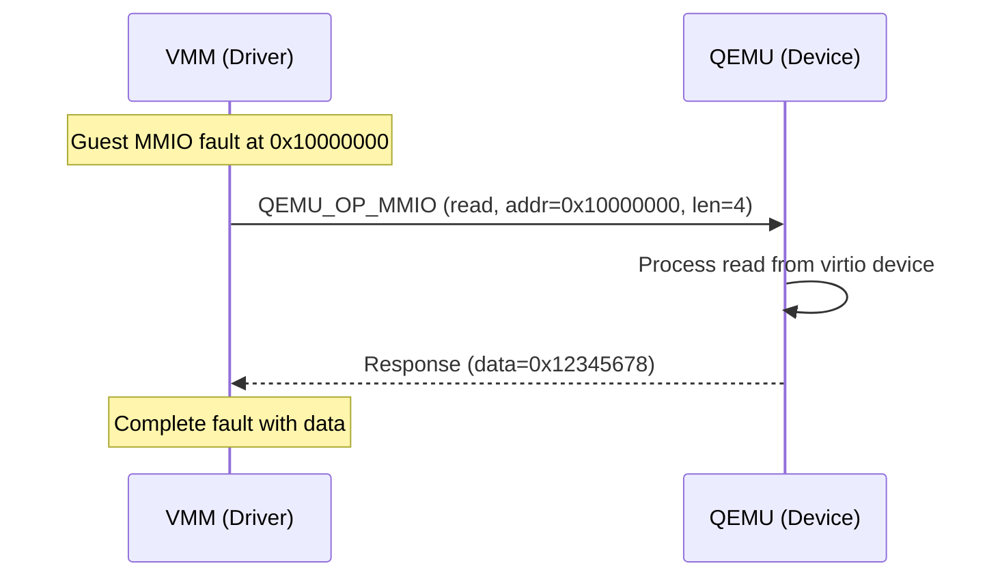
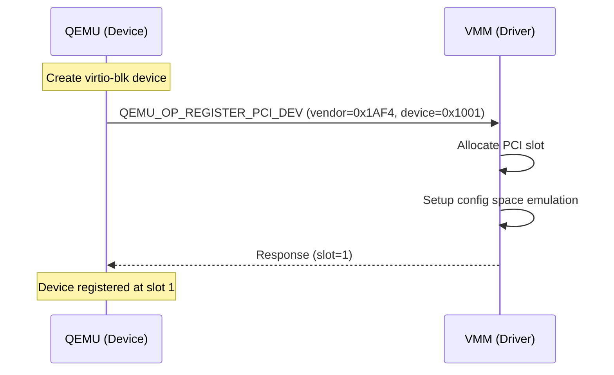
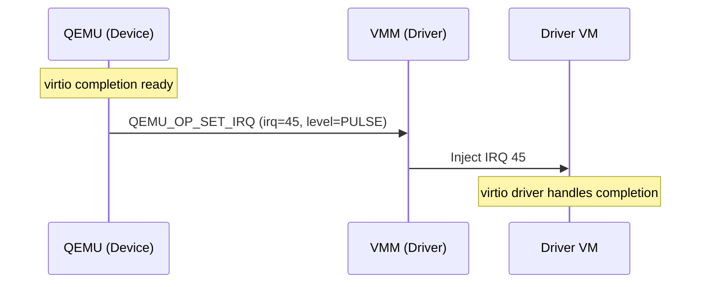

# RPC Opcodes Reference

This document provides a complete reference for all RPC operation codes used in the TII seL4 virtio system.

## Overview

RPC messages use the `mr0` field to encode the operation code and parameters:

```
mr0 bit layout:
┌─────────────────────────────────────────────────────────────────┐
│ 63                                                            0 │
├────────┬─────────┬───────────┬─────────────┬────────┬──────────┤
│ unused │ length  │ addr_space│  direction  │  slot  │  opcode  │
│        │ (4 bits)│ (8 bits)  │  (1 bit)    │(6 bits)│ (6 bits) │
└────────┴─────────┴───────────┴─────────────┴────────┴──────────┘
```

## Operation Codes

### Driver → Device Operations

Operations sent from VMM (driver) to QEMU (device):

| Opcode | Value | Description |
|--------|-------|-------------|
| `QEMU_OP_MMIO` | 0 | MMIO read/write request |
| `QEMU_OP_PUTC_LOG` | 2 | Character output to log |

### Device → Driver Operations

Operations sent from QEMU (device) to VMM (driver):

| Opcode | Value | Description |
|--------|-------|-------------|
| `QEMU_OP_SET_IRQ` | 16 | Set/clear/pulse IRQ line |
| `QEMU_OP_START_VM` | 18 | Signal VM ready to start |
| `QEMU_OP_REGISTER_PCI_DEV` | 19 | Register PCI device |
| `QEMU_OP_MMIO_REGION_CONFIG` | 20 | Configure MMIO region |

## Detailed Opcode Specifications

### QEMU_OP_MMIO (0)

Memory-mapped I/O request.

**Direction:** Driver → Device

**mr0 Encoding:**
```c
mr0 = MAKE_MR0(QEMU_OP_MMIO, slot, direction, addr_space, length);
```

| Field | Bits | Description |
|-------|------|-------------|
| opcode | 5:0 | QEMU_OP_MMIO (0) |
| slot | 11:6 | MMIO slot identifier |
| direction | 12 | 0=read, 1=write |
| addr_space | 20:13 | Address space (AS_GLOBAL or slot) |
| length | 24:21 | Access size (1, 2, 4, 8 bytes) |

**Message Fields:**
| Field | Read | Write |
|-------|------|-------|
| mr0 | Encoded as above | Encoded as above |
| mr1 | Address | Address |
| mr2 | (unused) | Data to write |
| mr3 | (unused) | (unused) |

**Response:**
| Field | Read | Write |
|-------|------|-------|
| mr2 | Data read | (ignored) |

**Example - MMIO Read:**
```c
// Request
rpcmsg_t req = {
    .mr0 = MAKE_MR0(QEMU_OP_MMIO, 0, RPC_MR0_MMIO_DIRECTION_READ, AS_GLOBAL, 4),
    .mr1 = 0x10000000,  // Address
    .mr2 = 0,
    .mr3 = 0,
};

// Response
// req.mr2 now contains read data
```

**Example - MMIO Write:**
```c
// Request
rpcmsg_t req = {
    .mr0 = MAKE_MR0(QEMU_OP_MMIO, 0, RPC_MR0_MMIO_DIRECTION_WRITE, AS_GLOBAL, 4),
    .mr1 = 0x10000000,  // Address
    .mr2 = 0xDEADBEEF,  // Data to write
    .mr3 = 0,
};
```

### QEMU_OP_PUTC_LOG (2)

Output character to debug log.

**Direction:** Driver → Device

**Message Fields:**
| Field | Description |
|-------|-------------|
| mr0 | QEMU_OP_PUTC_LOG in opcode field |
| mr1 | Character to output |
| mr2 | (unused) |
| mr3 | (unused) |

**Example:**
```c
rpcmsg_t msg = {
    .mr0 = BIT_FIELD_SET(0, RPC_MR0_OP, QEMU_OP_PUTC_LOG),
    .mr1 = 'A',
    .mr2 = 0,
    .mr3 = 0,
};
```

### QEMU_OP_SET_IRQ (16)

Set, clear, or pulse an interrupt line.

**Direction:** Device → Driver

**Message Fields:**
| Field | Description |
|-------|-------------|
| mr0 | QEMU_OP_SET_IRQ in opcode field |
| mr1 | IRQ number |
| mr2 | Level (0=clear, 1=set, 2=pulse) |
| mr3 | Source ID (for shared IRQ lines) |

**IRQ Levels:**
| Value | Constant | Description |
|-------|----------|-------------|
| 0 | `RPC_IRQ_CLR` | Clear IRQ (level low) |
| 1 | `RPC_IRQ_SET` | Set IRQ (level high) |
| 2 | `RPC_IRQ_PULSE` | Pulse IRQ (edge trigger) |

**Example - Set IRQ:**
```c
rpcmsg_t msg = {
    .mr0 = BIT_FIELD_SET(0, RPC_MR0_OP, QEMU_OP_SET_IRQ),
    .mr1 = 45,          // IRQ number
    .mr2 = RPC_IRQ_SET, // Level high
    .mr3 = 0,           // Source ID
};
```

**Example - Pulse IRQ:**
```c
rpcmsg_t msg = {
    .mr0 = BIT_FIELD_SET(0, RPC_MR0_OP, QEMU_OP_SET_IRQ),
    .mr1 = 45,            // IRQ number
    .mr2 = RPC_IRQ_PULSE, // Edge trigger
    .mr3 = 0,
};
```

### QEMU_OP_START_VM (18)

Signal that QEMU is ready for the VM to start.

**Direction:** Device → Driver

**Message Fields:**
| Field | Description |
|-------|-------------|
| mr0 | QEMU_OP_START_VM in opcode field |
| mr1 | (unused) |
| mr2 | (unused) |
| mr3 | (unused) |

**Example:**
```c
rpcmsg_t msg = {
    .mr0 = BIT_FIELD_SET(0, RPC_MR0_OP, QEMU_OP_START_VM),
    .mr1 = 0,
    .mr2 = 0,
    .mr3 = 0,
};
```

### QEMU_OP_REGISTER_PCI_DEV (19)

Register a new PCI device with the VMM.

**Direction:** Device → Driver

**Message Fields:**
| Field | Description |
|-------|-------------|
| mr0 | QEMU_OP_REGISTER_PCI_DEV in opcode field |
| mr1 | device_id \| (vendor_id << 16) |
| mr2 | subsystem_id \| (subsystem_vendor << 16) |
| mr3 | class_code \| (revision << 24) |

**Response:**
| Field | Description |
|-------|-------------|
| mr1 | Assigned PCI slot number |

**Example - Register virtio-blk:**
```c
// Request
rpcmsg_t req = {
    .mr0 = BIT_FIELD_SET(0, RPC_MR0_OP, QEMU_OP_REGISTER_PCI_DEV),
    .mr1 = 0x1001 | (0x1AF4 << 16),  // Device: virtio-blk, Vendor: Red Hat
    .mr2 = 0x0002 | (0x1AF4 << 16),  // Subsystem
    .mr3 = 0x010000,                  // Storage class
};

// Response
int slot = resp.mr1;  // Assigned slot number
```

**Common PCI Identifiers:**
| Device | Vendor ID | Device ID |
|--------|-----------|-----------|
| virtio-blk | 0x1AF4 | 0x1001 |
| virtio-net | 0x1AF4 | 0x1000 |
| virtio-console | 0x1AF4 | 0x1003 |
| virtio-rng | 0x1AF4 | 0x1005 |
| virtio-9p | 0x1AF4 | 0x1009 |

### QEMU_OP_MMIO_REGION_CONFIG (20)

Configure an MMIO region for a device.

**Direction:** Device → Driver

**Message Fields:**
| Field | Description |
|-------|-------------|
| mr0 | QEMU_OP_MMIO_REGION_CONFIG in opcode field |
| mr1 | Guest physical address |
| mr2 | Region size |
| mr3 | Flags |

**Example:**
```c
rpcmsg_t msg = {
    .mr0 = BIT_FIELD_SET(0, RPC_MR0_OP, QEMU_OP_MMIO_REGION_CONFIG),
    .mr1 = 0x10000000,  // GPA
    .mr2 = 0x1000,      // Size (4KB)
    .mr3 = 0,           // Flags
};
```

## Bit Field Definitions

### RPC_MR0 Fields

```c
#define RPC_MR0_OP_WIDTH                6
#define RPC_MR0_OP_SHIFT                0

#define RPC_MR0_MMIO_SLOT_WIDTH         6
#define RPC_MR0_MMIO_SLOT_SHIFT         6

#define RPC_MR0_MMIO_DIRECTION_WIDTH    1
#define RPC_MR0_MMIO_DIRECTION_SHIFT    12

#define RPC_MR0_MMIO_DIRECTION_READ     0
#define RPC_MR0_MMIO_DIRECTION_WRITE    1

#define RPC_MR0_MMIO_ADDR_SPACE_WIDTH   8
#define RPC_MR0_MMIO_ADDR_SPACE_SHIFT   13

#define RPC_MR0_MMIO_LENGTH_WIDTH       4
#define RPC_MR0_MMIO_LENGTH_SHIFT       21
```

### Address Space Values

```c
#define AS_GLOBAL           0xFF    // Global address space
#define AS_PCIDEV(__slot)   (__slot) // PCI device address space
```

## Message Flow Examples

### MMIO Read Sequence



### PCI Device Registration



### IRQ Injection



## Error Handling

### Common Error Conditions

| Error | Cause | Handling |
|-------|-------|----------|
| Unknown opcode | Invalid operation code | Log and ignore |
| Invalid address | MMIO outside valid range | Return 0xFFFFFFFF |
| Queue full | Too many pending messages | Retry after doorbell |
| Timeout | No response received | Reset connection |

### Error Response

For unhandled operations, the device should return a message with:
- Same opcode as request
- Error indication in mr2

## Source Files

| File | Description |
|------|-------------|
| `include/sel4/rpc.h` | Opcode definitions |
| `src/io_proxy.c` | Opcode handling |
| `src/libsel4vm_glue.c` | VMM-side processing |

## Related Documentation

- [API Reference](api-reference.md)
- [RPC Protocol](../architecture/rpc-protocol.md)
- [I/O Proxy](../components/io-proxy.md)
